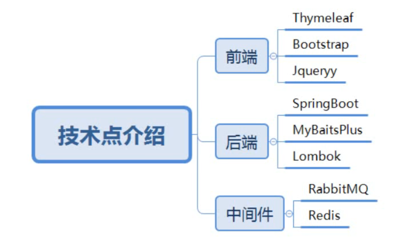

## 课程介绍

#### 技术点介绍



- 没有前后端分离，因为本项目主要是为了展示秒杀。
  - 我可以把他改成前后端分离的，体现工作量。

- 通过mybatis plus可以逆向生成代码到controller层；还可以继承swagger等。
  - 我：应该学一下
- RabittMQ做异步，队列缓冲，流量削峰；redis主要用作缓存。

#### 课程介绍


- 会做压测，查看秒杀的效果；然后针对碰到的问题再改进。
- 接口安全，把秒杀地址隐藏起来，防止黄牛。

## 学习目标


- 像搜索商品，这样的功能不会有，因为要突出秒杀功能；

## 如何设计一个秒杀系统

那么，如何才能更好地理解秒杀系统呢?我觉得作为一个程序员，你首先需要从高维度出发，从整体上思考问题。在我看来，**秒杀其实主要解决两个问题，一个是并发读，一个是并发写**。并发读的核心优化理念是尽量减少用户到服务端来"读"数据，或者让他们读更少的数据;并发写的处理原则也一样，它要求我们在数据库层面独立出来一个库，做特殊的处理。另外，我们还要针对秒杀系统做一些保护，针对意料之外的情况设计兜底方案，以防止最坏的情况发生。
其实，秒杀的整体架构可以概括为"稳、准、快"几个关键字。

所以从技术角度上看"稳、准、快”，就对应了我们架构上的**高可用、一致性和高性能**的要求

- 高性能。秒杀涉及大量的并发读和并发写，因此支持高并发访问这点非常关键。对应的方案比如动静分离方案、热点的发现与隔离、请求的削峰与分层过滤、服务端的极致优化
- 一致性。秒杀中商品减库存的实现方式同样关键。可想而知，有限数量的商品在同一时刻被很多倍的请求同时来减库存，减库存又分为"拍下减库存""付款减库存"以及预扣等几种，在大并发更新的过程中都要保证数据的准确性，其难度可想而知
- 高可用。现实中总难免出现一些我们考虑不到的情况，所以要保证系统的高可用和正确性，我们还要设计一个PlanB来兜底，以便在最坏情况发生时仍然能够从容应对。

## 项目搭建

#### 创建项目


- 还差一个mybatisplus依赖，一会直接去官网拷贝


- 删掉没用的文件夹，使项目清爽

#### 引入mybatisplus

1，访问官网：[安装 | MyBatis-Plus (baomidou.com)](https://baomidou.com/pages/bab2db/#release),选择springboot的依赖


```pom
<!--mybatisplus-->
        <dependency>
            <groupId>com.baomidou</groupId>
            <artifactId>mybatis-plus-boot-starter</artifactId>
            <version>3.4.0</version>
        </dependency>
```

- 选用了和视频教程相同的版本

2，复制进pom：


#### 编写springboot配置文件

1，把application.proiperties文件改成yml格式；其实两种配置文件都行：


2，编写yaml内容：

```yaml
spring:
  # thymeleaf配置
  thymeleaf:
    cache: false
  # 数据源配置
  datasource:
    # 如果用5.7版本的mysql，则name中没有cj
    driver-class-name: com.mysql.cj.jdbc.Driver
    url: jdbc:mysql://127.0.0.1:3306/seckill?useUnicode=true&characterEncoding=UTF-8&serverTimezone=Asia/Shanghai
    username: root
    password: 123456
    # hikari是springboot默认自带的，号称最快的连接池。连接池是什么：https://blog.csdn.net/cbmljs/article/details/87858536
    hikari:
      # 连接池名
      pool-name: DateHikariCP
      # 最小空闲连接数
      minimum-idle: 5
      # 空闲连接存活最大时间（ms），默认是10分钟
      idle-timeout: 1800000
      # 最大连接数，默认10
      maximum-pool-size: 10
      # 从连接池返回的连接自动提交
      auto-commit: true
      # 连接最大存活时间，0表示永久存活，默认1800000即30分钟
      max-lifetime: 1800000
      #连接超时时间30000即30秒
      connection-timeout: 30000
      # 类似心跳机制，查询连接是否可用的查询语句；如果查不出结果，说明连接是有问题的
      connection-test-query: SELECT 1
#mybatis-plus配置
mybatis-plus:
  # 配置mapper.xml映射文件的位置。mapper目录会放到resource下面，显得干净。
  mapper-locations: classpath*:/mapper/*Mapper.xml
  # 配置mybatis数据返回类型别名（默认别名是类名）：https://blog.csdn.net/daijiguo/article/details/82827430
  type-aliases-package: com.zhangyun.zseckill.pojo
# mybatis需要打印mysql，所以要准备一下日志。（注意要用方法接口所在的包，不是Mapper.xml所在的包）：https://blog.csdn.net/zlxls/article/details/77978281
logging:
  level:
    com.zhangyun.zsekill.mapper: debug

```

#### 把目录补充完整

1，因为mybatisplus设置了mapper-locations，所以要在resource目录下建立相应目录：


2，在springboot启动类的同级建立controller service等文件夹：


- service包下，一般还有一个用于实现的包。

#### 启动类处理

```java
package com.zhangyun.zseckill;

import org.mybatis.spring.annotation.MapperScan;
import org.springframework.boot.SpringApplication;
import org.springframework.boot.autoconfigure.SpringBootApplication;
//如果闲麻烦，不想在每个mapper上加@Mapper注解，就可以在启动类上加@MapperScan注解并标注需要编译生成实体类的路径(“cn.wenham.dao”)的注解。这样在编译之后都会生成相应的实现类。
@MapperScan("com.zhangyun.seckill.pojo")
@SpringBootApplication
public class ZseckillApplication {

    public static void main(String[] args) {
        SpringApplication.run(ZseckillApplication.class, args);
    }

}
```

#### 测试项目搭建情况

1，编写controller


```java
package com.zhangyun.zseckill.controller;

import org.springframework.stereotype.Controller;
import org.springframework.ui.Model;
import org.springframework.web.bind.annotation.RequestMapping;
import org.springframework.web.bind.annotation.RequestMethod;

//测试
@Controller
@RequestMapping("zyjava")
public class DemoController {

    /**
     * 测试页面
     **/
    @RequestMapping(value = "/helloseckill", method = RequestMethod.GET)
    public String hello(Model model) {
        model.addAttribute("name", "value");
        //我：请求/zyjava/hello会被转送到本方法，本方法做视图处理后，会返回给对应thymeleaf页面展示
        return "hello";
    }
}
```

2，编写用于测试controller的页面：


```html
<!DOCTYPE html>
<!--要加上thymeleaf的命名空间-->
<html lang="en"
      xmlns:th="http://www.thymeleaf.org">
<head>
    <meta charset="UTF-8">
    <title>测试项目</title>
</head>
<body>
<!--这里显示controller传的一个参数名为“name”的参数值-->
<p th:text="'hello  '+${name}"></p>
</body>
</html>
```

- 既然用了**thymeleaf，所有页面在tempaltes中**

3,启动项目：


4，在浏览器访问`[测试项目]http://localhost:8080/zyjava/helloseckill`，可以成功看到期待的页面，说明项目底子没错：


## 分布式会话

### 实现登录功能

#### 创建用户表

通过navicat，创建数据库，以及用户表

1，新建连接本项目专属数据库连接：


- 密码为：123456

2，新建数据库：


- 数据库名，要和yml中的datasource.url中的数据库名一致。
- uft8能存的utf8mb4都能存

3，新建表：


运行建表语句：

```mysql
CREATE TABLE t_user(
	`id` BIGINT(20) NOT NULL COMMENT '手机号码，用作用户id',
	`nickname` VARCHAR(255) NOT NULL,
	`password` VARCHAR(32) DEFAULT NULL COMMENT 'MD5(MD5(pwd明文+固定salt)+salt)',
	`salt` VARCHAR(10) DEFAULT NULL,
	`head` VARCHAR(128) DEFAULT NULL COMMENT '头像',
	`register_date` datetime DEFAULT NULL COMMENT '注册时间',
	`last_login_date` datetime DEFAULT NULL COMMENT '最后一次登录时间',
	`login_count` int(11)DEFAULT '0' COMMENT'登录次数',
PRIMARY KEY(`id`)
)
```

- 注意列名用`而不是'。
- md5加密：两层MD5加密后，才会存到数据库；
  - 两次md5加密的原因，晚点细说。
- mysql5.7之后，引擎默认是innodb，可以不用设置
- 有些字段可能不会用上，只是习惯性的列在这里

运行成功，刷新数据库可以看到新建的表：


#### 两次MD5加密

1，用两次MD5加密：

- 原因：保证安全
- 第一次加密：前端进行加密，防止网络截获明文密码
- 第二次加密：服务端进行加密，加强安全性

2，为什么不把客户端加密的密码直接存入数据库？：

- 为了保障安全性
- 因为即使有盐，MD5本身安全性不是很高；比如防止万一黑客盗用了数据库，他可以根据已经加密的密文，和salt，反推出明文密码，这是很不安全的；这样就算反编译一次，得到的还是一个md5密文。

3，引入md5依赖：

```xml
        <!--        md5依赖-->
        <dependency>
            <groupId>commons-codec</groupId>
            <artifactId>commons-codec</artifactId>
        </dependency>
        <dependency>
            <groupId>org.apache.commons</groupId>
            <artifactId>commons-lang3</artifactId>
            <version>3.6</version>
        </dependency>
```

4，准备utils包专门写工具类：


5，utils包中，编写MD5工具类

```java
package com.zhangyun.zseckill.utils;

import org.apache.commons.codec.digest.DigestUtils;
import org.springframework.stereotype.Component;

//MD5工具类
@Component
public class MD5Util {
    /*
    * 进行md5加密；
    *
    * 注意这个方法是静态的，使用的时候不需要有实例
    * */
    public static String md5(String str) {
        //注意这里的类不要引错了，要用apache.commons.codec的
        return DigestUtils.md5Hex(str);
    }

    /*
    * 准备盐
    *
    * 这个盐需要和前端加密时用的盐相同
    * */
    private static final String salt = "1a2b3c4d";

    /*
    * 进行第一次加密
    *
    * 前端发送明文密码前要做的加密；这个方法应该在前端就处理了。
    * 我：不过看老师的inputPassToDBPass方法，应该是后端直接进行了两次加密，可能就算后端模拟了前端的工作量
    * */
    public static String inputPassToFromPass(String inputPass) {
        //这里salt.charAt是随意取的，个数随意，char的位置随意
        String str = salt.charAt(0) + salt.charAt(2) + inputPass + salt.charAt(5) + salt.charAt(4);
        //被md5加密的是明文密码+盐的部分 所组成的字符串
        return md5(str);
    }

    /*
    * 进行第二次加密
    *
    * 后端把密文存入数据库前做的加密
    *
    * 这里形参里的salt，是后端拿到密文后，二次加密需要的盐；和前端加密用的盐不同；二次加密用的盐是自己随机出来的盐
    * */
    public static String fromPassToDBPass(String formPass, String salt) {
        String str = salt.charAt(0) + salt.charAt(2) + formPass + salt.charAt(5) + salt.charAt(4);
        return md5(str);
    }

    /*
    * 后端真正执行的方法
    *
    * 我：代码是做了两次加密，没有用到前端；所以老师应该是用后端也把第一次加密做了，前端直接传输的就是明文密码。
    * */
    public static String inputPassToDBPass(String inputPass, String salt) {
        String fromPass = inputPassToFromPass(inputPass);
        String dbPass = fromPassToDBPass(fromPass, salt);
        return dbPass;
    }
      //自测MD5Util
//    public static void main(String[] args) {
//        //打印第一次加密后的密码:ce21b747de5af71ab5c2e20ff0a60eea
//        System.out.println(inputPassToFromPass("123456"));
//        //打印第二次加密后的密码:0687f9701bca74827fcefcd7e743d179
//        //我理解：这里的salt最好和第一次加密的salt取不一样，但是老师这里取一样的salt
//        System.out.println(fromPassToDBPass("ce21b747de5af71ab5c2e20ff0a60eea","1a2b3c4d"));
//        //打印后端真正调用的：0687f9701bca74827fcefcd7e743d179,和第二行的打印相同，说明方法正确；这个字符串就是最后存入DB的
//        System.out.println(inputPassToDBPass("123456","1a2b3c4d"));
//
//    }
}

```

- 网友说：老师说这里是“习惯性的加上component注释”，但是其实工具类不用加@Component。工具类本来就使用方法就行了，根本不需要注入到容器里面

- 我和高赞网友：这里老师应该讲错了，老师之前讲的前端加密应该不是前端用javascript加密，而是前端明文传过来后端再进行两次加密

### 逆向工程

https://www.bilibili.com/video/BV1sf4y1L7KE?p=6&spm_id_from=pageDriver