## 介绍

#### 技术点介绍


- 没有前后端分离，因为本项目主要是为了展示秒杀。
  - 我可以把他改成前后端分离的，体现工作量。

- 通过mybatis plus可以逆向生成代码到controller层；还可以继承swagger等。
  - 我：应该学一下
- RabittMQ做异步，队列缓冲，流量削峰；redis主要用作缓存。

#### 课程介绍


- 会做压测，查看秒杀的效果；然后针对碰到的问题再改进。
- 接口安全，把秒杀地址隐藏起来，防止黄牛。

## 学习目标


- 像搜索商品，这样的功能不会有，因为要突出秒杀功能；

## 如何设计一个秒杀系统

那么，如何才能更好地理解秒杀系统呢?我觉得作为一个程序员，你首先需要从高维度出发，从整体上思考问题。在我看来，**秒杀其实主要解决两个问题，一个是并发读，一个是并发写**。并发读的核心优化理念是尽量减少用户到服务端来"读"数据，或者让他们读更少的数据;并发写的处理原则也一样，它要求我们在数据库层面独立出来一个库，做特殊的处理。另外，我们还要针对秒杀系统做一些保护，针对意料之外的情况设计兜底方案，以防止最坏的情况发生。
其实，秒杀的整体架构可以概括为"稳、准、快"几个关键字。

所以从技术角度上看"稳、准、快”，就对应了我们架构上的**高可用、一致性和高性能**的要求

- 高性能。秒杀涉及大量的并发读和并发写，因此支持高并发访问这点非常关键。对应的方案比如动静分离方案、热点的发现与隔离、请求的削峰与分层过滤、服务端的极致优化
- 一致性。秒杀中商品减库存的实现方式同样关键。可想而知，有限数量的商品在同一时刻被很多倍的请求同时来减库存，减库存又分为"拍下减库存""付款减库存"以及预扣等几种，在大并发更新的过程中都要保证数据的准确性，其难度可想而知
- 高可用。现实中总难免出现一些我们考虑不到的情况，所以要保证系统的高可用和正确性，我们还要设计一个PlanB来兜底，以便在最坏情况发生时仍然能够从容应对。

## 项目搭建

#### 创建项目


- 还差一个mybatisplus依赖，一会直接去官网拷贝


- 删掉没用的文件夹，使项目清爽

#### 引入mybatisplus

1，访问官网：[安装 | MyBatis-Plus (baomidou.com)](https://baomidou.com/pages/bab2db/#release),选择springboot的依赖


```pom
<!--mybatisplus-->
        <dependency>
            <groupId>com.baomidou</groupId>
            <artifactId>mybatis-plus-boot-starter</artifactId>
            <version>3.4.0</version>
        </dependency>
```

- 选用了和视频教程相同的版本

2，复制进pom：

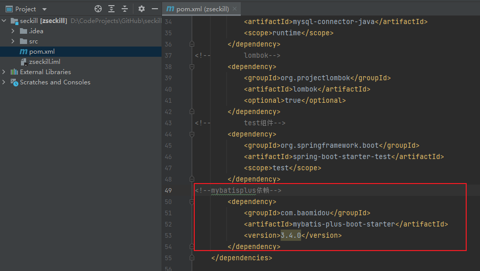

#### 编写springboot配置文件

1，把application.proiperties文件改成yml格式；其实两种配置文件都行：

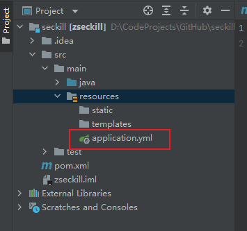

2，按照[本文](https://blog.csdn.net/weixin_44018093/article/details/88641594)内容，把idea一切可以设置编码格式的地方设置为utf8。已经乱码的中文无法拯救。

3，编写yaml内容：

```yaml
spring:
  # thymeleaf配置
  thymeleaf:
    cache: false
  # 数据源配置
  datasource:
    # 如果用5.7版本的mysql，则name中没有cj
    driver-class-name: com.mysql.cj.jdbc.Driver
    url: jdbc:mysql://127.0.0.1:3306/seckill?useUnicode=true&characterEncoding=UTF-8&serverTimezone=Asia/Shanghai
    username: root
    password: 123456
    # hikari是springboot默认自带的，号称最快的连接池。连接池是什么：https://blog.csdn.net/cbmljs/article/details/87858536
    hikari:
      # 连接池名
      pool-name: DateHikariCP
      # 最小空闲连接数
      minimum-idle: 5
      # 空闲连接存活最大时间（ms），默认是10分钟
      idle-timeout: 1800000
      # 最大连接数，默认10
      maximum-pool-size: 10
      # 从连接池返回的连接自动提交
      auto-commit: true
      # 连接最大存活时间，0表示永久存活，默认1800000即30分钟
      max-lifetime: 1800000
      #连接超时时间30000即30秒
      connection-timeout: 30000
      # 类似心跳机制，查询连接是否可用的查询语句；如果查不出结果，说明连接是有问题的
      connection-test-query: SELECT 1
#mybatis-plus配置
mybatis-plus:
  # 配置mapper.xml映射文件的位置。mapper目录会放到resource下面，显得干净。
  mapper-locations: classpath*:/mapper/*Mapper.xml
  # 配置mybatis数据返回类型别名（默认别名是类名）：https://blog.csdn.net/daijiguo/article/details/82827430
  type-aliases-package: com.zhangyun.zseckill.pojo
# mybatis需要打印mysql，所以要准备一下日志。（注意要用方法接口所在的包，不是Mapper.xml所在的包）：https://blog.csdn.net/zlxls/article/details/77978281
logging:
  level:
    com.zhangyun.zsekill.mapper: debug

```

#### 把目录补充完整

1，因为mybatisplus设置了mapper-locations，所以要在resource目录下建立相应目录：

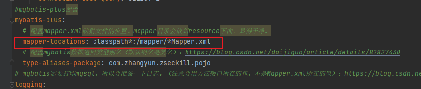


2，在springboot启动类的同级建立controller service等文件夹：


- service包下，一般还有一个用于实现的包。

#### 启动类处理

```java
package com.zhangyun.zseckill;

import org.mybatis.spring.annotation.MapperScan;
import org.springframework.boot.SpringApplication;
import org.springframework.boot.autoconfigure.SpringBootApplication;
//如果闲麻烦，不想在每个mapper上加@Mapper注解，就可以在启动类上加@MapperScan注解并标注需要编译生成实体类的路径(“cn.wenham.dao”)的注解。这样在编译之后都会生成相应的实现类。
@MapperScan("com.zhangyun.zseckill.mapper")
@SpringBootApplication
public class ZseckillApplication {

    public static void main(String[] args) {
        SpringApplication.run(ZseckillApplication.class, args);
    }

}
```

#### 测试项目搭建情况

1，编写controller


```java
package com.zhangyun.zseckill.controller;

import org.springframework.stereotype.Controller;
import org.springframework.ui.Model;
import org.springframework.web.bind.annotation.RequestMapping;
import org.springframework.web.bind.annotation.RequestMethod;

//测试
@Controller
@RequestMapping("zyjava")
public class DemoController {

    /**
     * 测试页面
     **/
    @RequestMapping(value = "/helloseckill", method = RequestMethod.GET)
    public String hello(Model model) {
        model.addAttribute("name", "value");
        //我：请求/zyjava/hello会被转送到本方法，本方法做视图处理后，会返回给对应thymeleaf页面展示
        return "hello";
    }
}
```

2，编写用于测试controller的页面：


```html
<!DOCTYPE html>
<!--要加上thymeleaf的命名空间-->
<html lang="en"
      xmlns:th="http://www.thymeleaf.org">
<head>
    <meta charset="UTF-8">
    <title>测试项目</title>
</head>
<body>
<!--这里显示controller传的一个参数名为“name”的参数值-->
<p th:text="'hello  '+${name}"></p>
</body>
</html>
```

- 既然用了**thymeleaf，所有页面在tempaltes中**

3,启动项目：

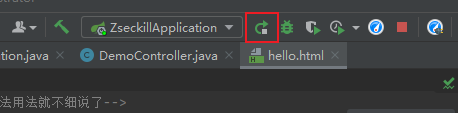

4，在浏览器访问`[测试项目]http://localhost:8080/zyjava/helloseckill`，可以成功看到期待的页面，说明项目底子没错：

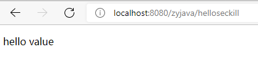

## 分布式会话

### 实现登录功能

#### 创建用户表

通过navicat，创建数据库，以及用户表

1，新建连接本项目专属数据库连接：


- 密码为：123456

2，新建数据库：

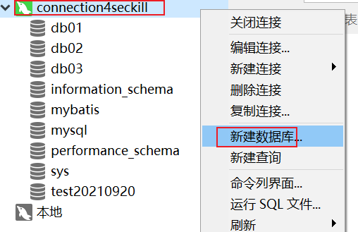

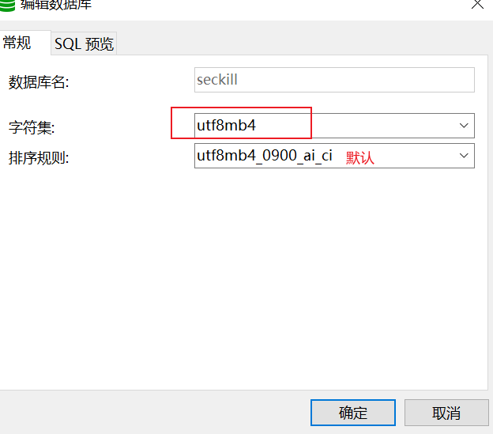

- 数据库名，要和yml中的datasource.url中的数据库名一致。
- uft8能存的utf8mb4都能存

3，新建表：

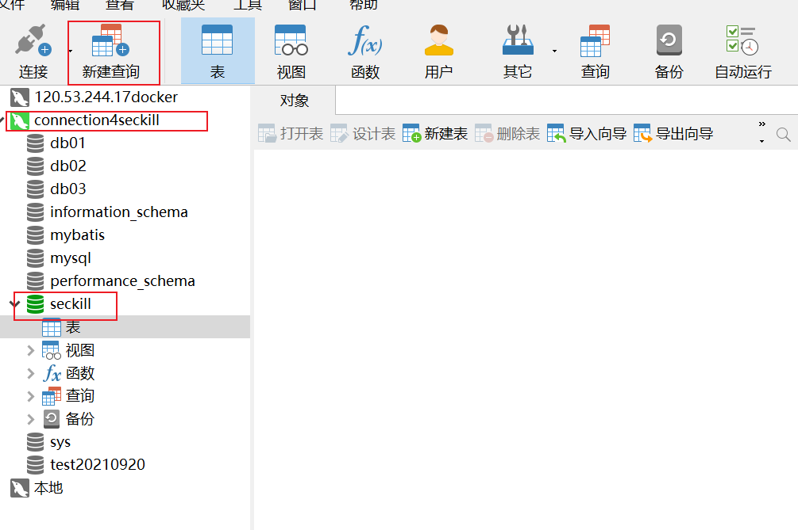

运行建表语句：

```mysql
CREATE TABLE t_user(
	`id` BIGINT(20) NOT NULL COMMENT '手机号码，用作用户id',
	`nickname` VARCHAR(255) NOT NULL,
	`password` VARCHAR(32) DEFAULT NULL COMMENT 'MD5(MD5(pwd明文+固定salt)+salt)',
	`salt` VARCHAR(10) DEFAULT NULL,
	`head` VARCHAR(128) DEFAULT NULL COMMENT '头像',
	`register_date` datetime DEFAULT NULL COMMENT '注册时间',
	`last_login_date` datetime DEFAULT NULL COMMENT '最后一次登录时间',
	`login_count` int(11)DEFAULT '0' COMMENT'登录次数',
PRIMARY KEY(`id`)
)
```

- 注意列名用`而不是'。
- md5加密：两层MD5加密后，才会存到数据库；
  - 两次md5加密的原因，晚点细说。
- mysql5.7之后，引擎默认是innodb，可以不用设置
- 有些字段可能不会用上，只是习惯性的列在这里

运行成功，刷新数据库可以看到新建的表：


#### 两次MD5加密

1，用两次MD5加密：

- 原因：保证安全
- 第一次加密：前端进行加密，防止网络截获明文密码
- 第二次加密：服务端进行加密，加强安全性

2，为什么不把客户端加密的密码直接存入数据库？：

- 为了保障安全性
- 因为即使有盐，MD5本身安全性不是很高；比如防止万一黑客盗用了数据库，他可以根据已经加密的密文，和salt，反推出明文密码，这是很不安全的；这样就算反编译一次，得到的还是一个md5密文。

3，引入md5依赖：

```xml
        <!--        md5依赖-->
        <dependency>
            <groupId>commons-codec</groupId>
            <artifactId>commons-codec</artifactId>
        </dependency>
        <dependency>
            <groupId>org.apache.commons</groupId>
            <artifactId>commons-lang3</artifactId>
            <version>3.6</version>
        </dependency>
```

4，准备utils包专门写工具类：


5，utils包中，编写MD5工具类

```java
package com.zhangyun.zseckill.utils;

import org.apache.commons.codec.digest.DigestUtils;
import org.springframework.stereotype.Component;

//MD5工具类
@Component
public class MD5Util {
    /*
    * 进行md5加密；
    *
    * 注意这个方法是静态的，使用的时候不需要有实例
    * */
    public static String md5(String str) {
        //注意这里的类不要引错了，要用apache.commons.codec的
        return DigestUtils.md5Hex(str);
    }

    /*
    * 准备盐
    *
    * 这个盐需要和前端加密时用的盐相同
    * */
    private static final String salt = "1a2b3c4d";

    /*
    * 进行第一次加密
    *
    * 前端发送明文密码前要做的加密；这个方法应该在前端就处理了。
    * 我：不过看老师的inputPassToDBPass方法，应该是后端直接进行了两次加密，可能就算后端模拟了前端的工作量
    * */
    public static String inputPassToFromPass(String inputPass) {
        //这里salt.charAt是随意取的，个数随意，char的位置随意
        String str = ""+salt.charAt(0) + salt.charAt(2) + inputPass + salt.charAt(5) + salt.charAt(4);
        //被md5加密的是明文密码+盐的部分 所组成的字符串
        return md5(str);
    }

    /*
    * 进行第二次加密
    *
    * 后端把密文存入数据库前做的加密
    *
    * 这里形参里的salt，是后端拿到密文后，二次加密需要的盐；和前端加密用的盐不同；二次加密用的盐是自己随机出来的盐
    * */
    public static String fromPassToDBPass(String formPass, String salt) {
        String str = ""+salt.charAt(0) + salt.charAt(2) + formPass + salt.charAt(5) + salt.charAt(4);
        return md5(str);
    }

    /*
    * 后端真正执行的方法
    *
    * 我：代码是做了两次加密，没有用到前端；所以老师应该是用后端也把第一次加密做了，前端直接传输的就是明文密码。
    * */
    public static String inputPassToDBPass(String inputPass, String salt) {
        String fromPass = inputPassToFromPass(inputPass);
        String dbPass = fromPassToDBPass(fromPass, salt);
        return dbPass;
    }
      //自测MD5Util
    public static void main(String[] args) {
        //打印第一次加密后的密码:d3b1294a61a07da9b49b6e22b2cbd7f9
        System.out.println(inputPassToFromPass("123456"));
        //打印第二次加密后的密码:b7797cce01b4b131b433b6acf4add449
        //我理解：这里的salt最好和第一次加密的salt取不一样，但是老师这里取一样的salt
        System.out.println(fromPassToDBPass("d3b1294a61a07da9b49b6e22b2cbd7f9","1a2b3c4d"));
        //打印后端真正调用的：b7797cce01b4b131b433b6acf4add449,和第二行的打印相同，说明方法正确；这个字符串就是最后存入DB的
        System.out.println(inputPassToDBPass("123456","1a2b3c4d"));

    }
}

```

- 网友说：老师说这里是“习惯性的加上component注释”，但是其实工具类不用加@Component。工具类本来就使用方法就行了，根本不需要注入到容器里面

- 我和高赞网友：这里老师应该讲错了，老师之前讲的前端加密应该不是前端用javascript加密，而是前端明文传过来后端再进行两次加密

### 逆向工程

要通过逆向工程，对之前生成的t_user表单，生成对应的pojo mapper mapper.xml等文件。会使用MybatisPlus附带的逆向生成工具。

#### 再次创建一个项目

这个项目就是为了实现逆向工程。建议把逆向工程单独作为一个项目，因为后期会有很多项目需要生成不同的工具；比如不同的项目中有不同的数据库，数据库中有不同的表，每张表生成的都是不一样的。把逆向工程单独做项目的话，以后每次修改一下参数，就能逆向生成！

1，新建项目：


2，删掉不要的文件：


- 注意不要删掉iml文件。

#### 项目依赖

1，去mybatisplus官网，复制mybatis-plus依赖；黏贴到pom中:

```xml
<dependency>
    <groupId>com.baomidou</groupId>
    <artifactId>mybatis-plus-boot-starter</artifactId>
    <version>3.4.0</version>
</dependency>

```

- 使用和视频教程相同版本


2，添加代码生成器依赖：

```xml
<dependency>
    <groupId>com.baomidou</groupId>
    <artifactId>mybatis-plus-generator</artifactId>
    <version>3.4.0</version>
</dependency>
```

- 使用视频教程的版本

3，添加模板引擎的依赖：

```xml
<dependency>
    <groupId>org.freemarker</groupId>
    <artifactId>freemarker</artifactId>
    <version>2.3.30</version>
</dependency>

```

- 这里采用视频教程用的freemarker引擎；版本号保持一致。
- 模板引擎定义：[浅谈模板引擎 - 木的树 - 博客园 (cnblogs.com)](https://www.cnblogs.com/dojo-lzz/p/5518474.html)

4，添加数据库的依赖：

```xml
<!--		mysql驱动的依赖;设置范围为“运行时才生效”-->
		<dependency>
			<groupId>mysql</groupId>
			<artifactId>mysql-connector-java</artifactId>
			<scope>runtime</scope>
		</dependency>
```


#### 建立并使用 “实现逆向生成的工具类”

1，一般我们可以把官网的工具类改成我们自己想要的，修改官方工具类为如下：

```java
package com.zhangyun.generator;

import com.baomidou.mybatisplus.core.exceptions.MybatisPlusException;
import com.baomidou.mybatisplus.core.toolkit.StringPool;
import com.baomidou.mybatisplus.core.toolkit.StringUtils;
import com.baomidou.mybatisplus.generator.AutoGenerator;
import com.baomidou.mybatisplus.generator.InjectionConfig;
import com.baomidou.mybatisplus.generator.config.*;
import com.baomidou.mybatisplus.generator.config.po.TableInfo;
import com.baomidou.mybatisplus.generator.config.rules.DateType;
import com.baomidou.mybatisplus.generator.config.rules.NamingStrategy;
import com.baomidou.mybatisplus.generator.engine.FreemarkerTemplateEngine;

import java.util.*;

// 演示例子，执行 main 方法控制台输入模块表名回车自动生成对应项目目录中
public class CodeGenerator {

    /**
     * <p>
     * 读取控制台内容
     * </p>
     */
    public static String scanner(String tip) {
        //控制台输入
        Scanner scanner = new Scanner(System.in);
        StringBuilder help = new StringBuilder();
        help.append("请输入" + tip + "：");
        System.out.println(help.toString());
        if (scanner.hasNext()) {
            String ipt = scanner.next();
            if (StringUtils.isNotBlank(ipt)) {
                return ipt;
            }
        }
        throw new MybatisPlusException("请输入正确的" + tip + "！");
    }

    public static void main(String[] args) {
        // 代码生成器
        AutoGenerator mpg = new AutoGenerator();

        // 全局配置
        GlobalConfig gc = new GlobalConfig();
        //获取当前项目的路径
        String projectPath = System.getProperty("user.dir");
        //设置输出路径，在当前项目路径下
        gc.setOutputDir(projectPath + "/src/main/java");
        //作者
        gc.setAuthor("zhangyun");
        //打开输出目录
        gc.setOpen(false);
        //xml开启BaseResultMap
        gc.setBaseResultMap(true);
        //xml开启BaseColumnList
        gc.setBaseColumnList(true);
        //日期格式采用Date
        gc.setDateType(DateType.ONLY_DATE);
        // gc.setSwagger2(true); 实体属性 Swagger2 注解
        mpg.setGlobalConfig(gc);

        // 数据源配置
        DataSourceConfig dsc = new DataSourceConfig();
        //这里url中的数据库名必须为本教程之前建立的本地数据库名
        dsc.setUrl("jdbc:mysql://localhost:3306/seckill?useUnicode=true&characterEncoding=utf8&serverTimeZone=Asia"+"/Shanghai");
        // dsc.setSchemaName("public");
        dsc.setDriverName("com.mysql.cj.jdbc.Driver");//我：我在包路径中加上了cj，5.7及以后的mysql不需要cj
        dsc.setUsername("root");
        dsc.setPassword("123456");
        mpg.setDataSource(dsc);

        // 包配置
        PackageConfig pc = new PackageConfig();
        //pc.setModuleName(scanner("模块名"));
        //设置我们生成的Mapper Service等分别对应在哪个包下面：我们都放在com.zhangyun.zseckill下，这是我们秒杀项目的启动类所在目录
        pc.setParent("com.zhangyun.zseckill")
                .setEntity("pojo")
                .setMapper("mapper")
                .setService("service")
                .setServiceImpl("service.impl")
                .setController("controller");
        mpg.setPackageInfo(pc);

        // 自定义配置
        InjectionConfig cfg = new InjectionConfig() {
            @Override
            public void initMap() {
                // to do nothing
                Map<String,Object> map = new HashMap<>();
                map.put("date1","1.0.0");
                this.setMap(map);
            }
        };

        // 如果模板引擎是 freemarker
        String templatePath = "/templates/mapper.xml.ftl";
        // 如果模板引擎是 velocity
        // String templatePath = "/templates/mapper.xml.vm";

        // 自定义输出配置
        List<FileOutConfig> focList = new ArrayList<>();
        // 自定义配置会被优先输出
        focList.add(new FileOutConfig(templatePath) {
            @Override
            public String outputFile(TableInfo tableInfo) {
                // 自定义输出文件名 ， 如果你 Entity 设置了前后缀、此处注意 xml 的名称会跟着发生变化！！
                return projectPath + "/src/main/resources/mapper/" +  tableInfo.getEntityName() + "Mapper" + StringPool.DOT_XML;
            }
        });
        /*
        cfg.setFileCreate(new IFileCreate() {
            @Override
            public boolean isCreate(ConfigBuilder configBuilder, FileType fileType, String filePath) {
                // 判断自定义文件夹是否需要创建
                checkDir("调用默认方法创建的目录，自定义目录用");
                if (fileType == FileType.MAPPER) {
                    // 已经生成 mapper 文件判断存在，不想重新生成返回 false
                    return !new File(filePath).exists();
                }
                // 允许生成模板文件
                return true;
            }
        });
        */
        cfg.setFileOutConfigList(focList);
        mpg.setCfg(cfg);

        // 配置模板
        TemplateConfig templateConfig = new TemplateConfig()
        // 配置自定义输出模板
        //指定自定义模板路径，注意不要带上.ftl/.vm, 会根据使用的模板引擎自动识别
                //以下代表我们的Mapper层，service层等各层
                .setEntity("templates/entity2.java")
                .setMapper("templates/mapper2.java")
                .setService("templates/service2.java")
                .setServiceImpl("templates/serviceImpl2.java")
                .setController("templates/controller2.java");

        templateConfig.setXml(null);
        mpg.setTemplate(templateConfig);

        // 策略配置
        StrategyConfig strategy = new StrategyConfig();
        //数据库表映射到实体的命名策略：下划线转驼峰
        strategy.setNaming(NamingStrategy.underline_to_camel);
        //数据库表字段映射到实体的命名策略
        strategy.setColumnNaming(NamingStrategy.underline_to_camel);
        //lombok模型：因为整个seckill要用lombok，那么CodeGenerator就会在帮我们生成的pojo上面，附带上lombok的注解
        strategy.setEntityLombokModel(true);
        //生成 @RestController 控制器
        // strategy.setRestControllerStyle(true);
        //多个表之间可以用逗号分割，就是说它可以一下子生成一个数据库中的多张表
        strategy.setInclude(scanner("表名，多个英文逗号分割").split(","));
        strategy.setControllerMappingHyphenStyle(true);
        //表前缀：生成的pojo类会把前缀去掉，比如t_user表，就只会生成User类
        strategy.setTablePrefix("t_");
        mpg.setStrategy(strategy);
        mpg.setTemplateEngine(new FreemarkerTemplateEngine());
        mpg.execute();
    }

}

```

- 注意，数据库名，和mysql连接的账号密码必须为本地mysql有的。本文“实现登录功能”那做了数据库创建。

2，启动工具类，输入表名；发生错误：

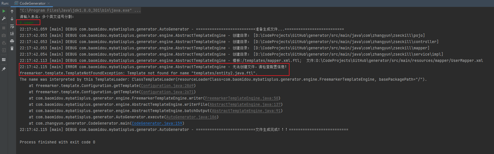

- 这是因为正常来说，template中是entity1.java mapper1.java等，但是我这设置为2；也就是说它的模板我们可以自定义，但是我们刚刚没定义好。
- 想定义好模板，就得先找到模板

3，找模板：

把项目视图调为“project”：

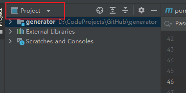

在External Libraries中可以看到templates中有对应的ftl模板（即freemarker模板引擎的模板）：


4，把项目视图切换为project files，并把模板放到resource/template目录下


5，把模板名改成CodeGenerator中写的样子；并且发现CodeGenerator中没用Mapper.xml模板，所以删掉resource/template中的Mapper.xml模板：


- 网友说不用改也行，不过我还是改了

- 网友：老师这样做的意思是我们可以自定义想要的模板

6，尝试重新运行CodeGenerator；成功：

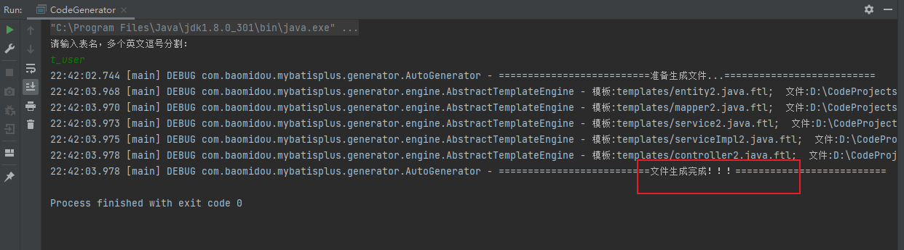

7，查看generator项目的com.zhangyun包下，能看到生成的文件：

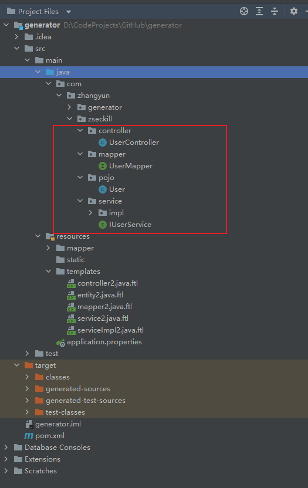

8，把上图逆向工程项目中生成的文件，拷贝进zseckill项目：

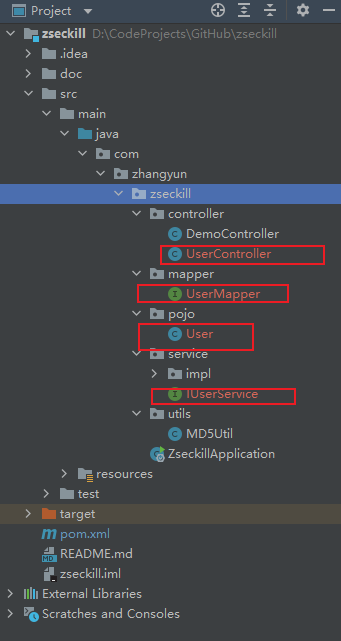

- 直接在zseckill目录下黏贴，idea会智能自动把文件放入相应文件夹。

9，不要忘记，虽然CodeGenerator的模板没有指定Mapper.xml的模板，但Mapper.xml还是生成了，把它也拷贝进zseckill项目的对应目录：

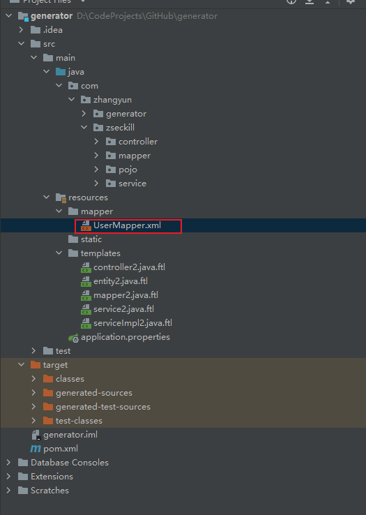

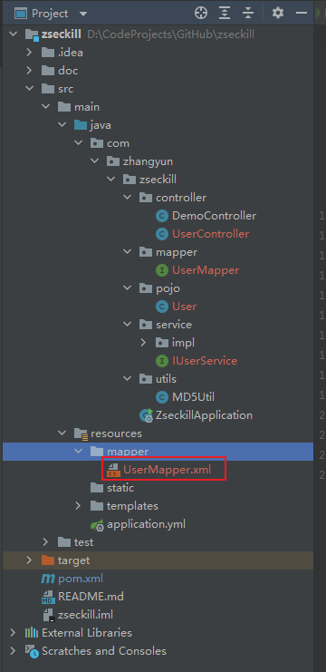

10，检查复制进zseckill中的文件，包名是否都正常

11，我和网友理解：逆向工程就是代码生成器

### 功能开发前期准备工作

#### 登录-跳转到登录页面+静态资源准备

1，创建控制器LoginController：


```java
package com.zhangyun.zseckill.controller;

import lombok.extern.slf4j.Slf4j;
import org.springframework.stereotype.Controller;
import org.springframework.web.bind.annotation.RequestMapping;

@Controller
@RequestMapping("/login")
//用于打印日志；免去一系列复杂的日志设置
@Slf4j
public class LoginController {

    //跳转登录页面
    @RequestMapping("/toLogin")
    public String toLogin(){
        return "login";
    }
    
}
```

- 生成这么多类，不一定都会用；项目完成后，用不到的类会被删掉；这里生成这么多类，只是因为逆向工程统一生成了，但是我用不一定会用。

2，准备项目的静态资源，直接从开源项目拷贝：


3，编写前端；直接复制进来，不细说；重点是后端：

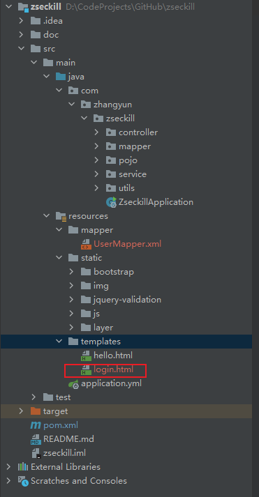

```html
<!DOCTYPE html>
<html lang="en"
      xmlns:th="http://www.thymeleaf.org">
<head>
    <meta charset="UTF-8">
    <title>登录</title>
<!--    引入一系列静态资源-->
    <!-- jquery -->
    <script type="text/javascript" th:src="@{/js/jquery.min.js}"></script>
    <!-- bootstrap -->
    <link rel="stylesheet" type="text/css" th:href="@{/bootstrap/css/bootstrap.min.css}"/>
    <script type="text/javascript" th:src="@{/bootstrap/js/bootstrap.min.js}"></script>
    <!-- jquery-validator：用于校验 -->
    <script type="text/javascript" th:src="@{/jquery-validation/jquery.validate.min.js}"></script>
    <script type="text/javascript" th:src="@{/jquery-validation/localization/messages_zh.min.js}"></script>
    <!-- layer：layui是做一些弹框的 -->
    <script type="text/javascript" th:src="@{/layer/layer.js}"></script>
    <!-- md5.js ：做加密-->
    <script type="text/javascript" th:src="@{/js/md5.min.js}"></script>
    <!-- common.js -->
    <script type="text/javascript" th:src="@{/js/common.js}"></script>
</head>
<body>
<!--表单-->
<form name="loginForm" id="loginForm" method="post" style="width:50%; margin:0 auto">

    <h2 style="text-align:center; margin-bottom: 20px">用户登录</h2>

    <div class="form-group">
        <div class="row">
            <label class="form-label col-md-4">请输入手机号码</label>
            <div class="col-md-5">
                <input id="mobile" name="mobile" class="form-control" type="text" placeholder="手机号码" required="true"
                />
                <!--             取消位数限制          minlength="11" maxlength="11"-->
            </div>
            <div class="col-md-1">
            </div>
        </div>
    </div>

    <div class="form-group">
        <div class="row">
            <label class="form-label col-md-4">请输入密码</label>
            <div class="col-md-5">
                <input id="password" name="password" class="form-control" type="password" placeholder="密码"
                       required="true"
                />
                <!--             取消位数限制            minlength="6" maxlength="16"-->
            </div>
        </div>
    </div>

    <div class="row">
        <div class="col-md-5">
            <button class="btn btn-primary btn-block" type="reset" onclick="reset()">重置</button>
        </div>
        <div class="col-md-5">
            <button class="btn btn-primary btn-block" type="submit" onclick="login()">登录</button>
        </div>
    </div>
</form>
</body>
<script>
    function login() {
        $("#loginForm").validate({
            submitHandler: function (form) {
                doLogin();
            }
        });
    }

    function doLogin() {
        //展示登录中
        g_showLoading();

        //拿到明文密码
        var inputPass = $("#password").val();
        //拿到盐
        var salt = g_passsword_salt;
        //拿到盐之后做第一次明文密码的加密
        var str = "" + salt.charAt(0) + salt.charAt(2) + inputPass + salt.charAt(5) + salt.charAt(4);
        var password = md5(str);

        //加密完成后，通过ajax调用后端的接口
        $.ajax({
            //注意url要和后端RequestMapping的完整路径一致
            url: "/login/doLogin",
            type: "POST",
            data: {
                mobile: $("#mobile").val(),
                password: password
            },
            //成功请求的话，查看后端返回的数据
            success: function (data) {
                layer.closeAll();
                //如果数据是200，说明成功，打印相关成功标识；否则打印失败
                if (data.code == 200) {
                    layer.msg("成功");
                    console.log(data);
                    document.cookie = "userTicket=" + data.object;
                    window.location.href = "/goods/toList";
                } else {
                    layer.msg(data.message);
                }
            },
            error: function () {
                layer.closeAll();
            }
        });
    }
</script>
</html>
```

- 本项目的各个html页面，依赖resource/static下导入的静态资源
- 可以看到静态资源里的common.js中的g_passsword_salt（盐）的值，和MD5加密中用得到的盐一致，这体现后端得有前端的盐。
  - 前端盐的用法，和后端也一样。
- 前端登录过程讲解：doLogin函数中有注释
  - 问答问：前端的确加密了，但是后端自己也做了两次加密是为什么？
    - 自答：可能两次加密时老师为了演示两次加密的效果；后端真实处理的时候，使用的是第二次加密的函数（而非做两次加密的函数）。


#### 登录-编写执行登录任务的准备

1，接下来应该在LoginController中编写dologin方法，dologin返回方法有返回值；不过在编写dologin之前我们要先编写公用的返回对象，在启动类同级新建vo包，vo包中有我们想要返回的一些vo对象：

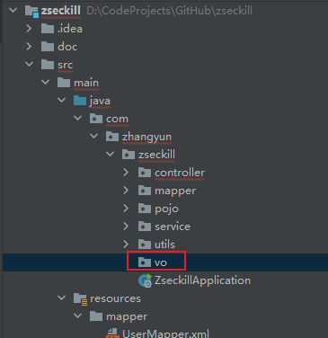

2，编写respBean，即公共返回对象：


```java
package com.zhangyun.zseckill.vo;

import lombok.AllArgsConstructor;
import lombok.Data;
import lombok.NoArgsConstructor;

//getsettostring，无参构造，有参构造
@Data
@NoArgsConstructor
@AllArgsConstructor
public class RespBean {
    private long code;
    private String message;
    //返回的时候可能需要带一个对象
    private Object obj;

    //成功返回结果，这是最简单的，后续可能会加内容
    public static RespBean success() {
        return new RespBean(RespBeanEnum.SUCCESS.getCode(), RespBeanEnum.SUCCESS.getMessage(), null);
    }
    public static RespBean success(Object object) {
        return new RespBean(RespBeanEnum.SUCCESS.getCode(), RespBeanEnum.SUCCESS.getMessage(), object);
    }
    /*
    * 失败返回结果
    *
    * 为什么成功不用传枚举，失败要传呢？：成功只有200；失败各有不同，如403 404 502等
    * */
    public static RespBean error(RespBeanEnum respBeanEnum) {
        return new RespBean(respBeanEnum.getCode(), respBeanEnum.getMessage(), null);
    }
    public static RespBean error(RespBeanEnum respBeanEnum, Object object) {
        return new RespBean(respBeanEnum.getCode(), respBeanEnum.getMessage(), object);
    }

}

```

- 本服务端执行前端的请求成功的话，会给前端返回success

3，编写公共返回对象respBean的枚举：


```java
package com.zhangyun.zseckill.vo;

import lombok.AllArgsConstructor;
import lombok.Getter;
import lombok.ToString;

//get方法,toString方法，全参构造
@Getter
@ToString
@AllArgsConstructor
public enum RespBeanEnum {
    //编写枚举成员
    SUCCESS(200,"SUCCESS"),
    ERROR(500,"服务端异常");

    //准备 状态码，状态码相应信息
    private final Integer code;
    private final String message;
}

```

- 这个枚举对整个代码是更加有帮助的一个东西
- 枚举里面的东西是状态，包含：
  - 状态码
  - 常用的信息提示

- 这里使用了lombok，如果lombok注解爆红，要在idea中安装lombok插件，并且要让项目启用插件。

- 这里枚举用了成员变量；枚举成员小括号中的值从左到右，是成员变量从上到下的顺序；可以参考[(22条消息) Java enum常见的用法_浮生夢的博客-CSDN博客_enum java](https://blog.csdn.net/echizao1839/article/details/80890490)

#### 测试跳转到登录页

1，先看看页面跳转能用吗，启动项目；报错：

```
org.springframework.beans.factory.UnsatisfiedDependencyException: Error creating bean with name 'userServiceImpl': Unsatisfied dependency expressed through field 'baseMapper'; nested exception is org.springframework.beans.factory.NoSuchBeanDefinitionException: No qualifying bean of type 'com.zhangyun.zseckill.mapper.UserMapper' available: expected at least 1 bean which qualifies as autowire candidate. Dependency annotations: {@org.springframework.beans.factory.annotation.Autowired(required=true)}

Caused by: org.springframework.beans.factory.NoSuchBeanDefinitionException: No qualifying bean of type 'com.zhangyun.zseckill.mapper.UserMapper' available: expected at least 1 bean which qualifies as autowire candidate. Dependency annotations: {@org.springframework.beans.factory.annotation.Autowired(required=true)}
```

- 报错：UserMapper没有找到，至少需要一个bean；但我们已经在启动类上加了Mapper.scan啊，这是为什么？

2，这是因为启动类的MapperScan注解中把bean偶在的包名写错了：


3，改成如下就好：


- 本文代码已同步修改

4，重新启动项目，成功：


5，访问`http://localhost:8080/login/toLogin`，但是没有返回页面，只显示了一个字符串：


6，这是因为LoginController的@restcontroller注解直接把返回值写进httpresponse中了：

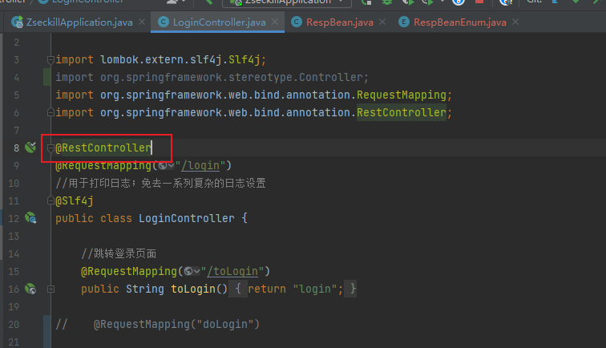

- restcontroler默认给这个类的所有方法加上responsebody，这样return就返回对象，而不是做页面跳转。

7，把注解改成前后端不分离的@Controller即可：

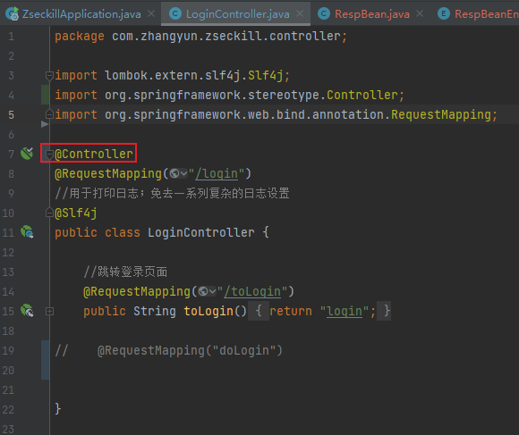

- 本文代码已同步修改

8，重启项目，访问`http://localhost:8080/login/toLogin`:

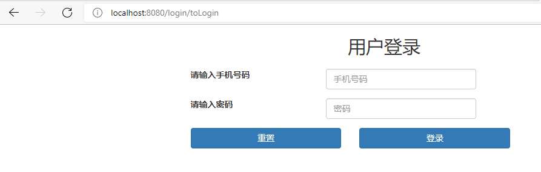

- 成功来到登录页面。

### 开发登录任务

#### dologin基本功能与前端盐的作用

1，编写dologin方法的参数所需要的vo：

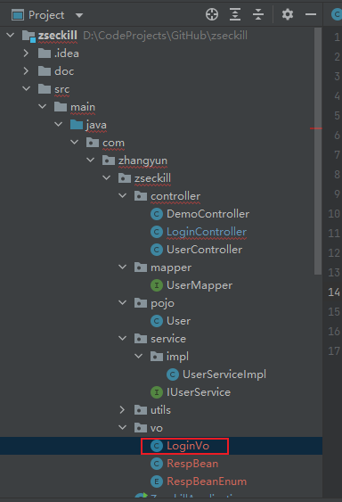

```java
package com.zhangyun.zseckill.vo;

import lombok.Data;

@Data
public class LoginVo {
    
    private String mobile;
    
    private String password;
}

```

2，编写dologin方法，先返回null，测试盐的功能：

```java
    /*
    * 用于处理账号密码登录的登录功能
    * */
    @RequestMapping("/doLogin")
    //既然是返回respbean，那么这里必须加上responsebody
    @ResponseBody
    //要传递参数如手机号和密码进来，就要编写一个参数vo
    public RespBean doLogin(LoginVo loginVo){
        //这里能直接使用log，是因为本类使用了lombok+sl4j注解
        log.info("{}",loginVo);
        return null;
    }
```

3，输入密码123456，手机号任意；点击登录：

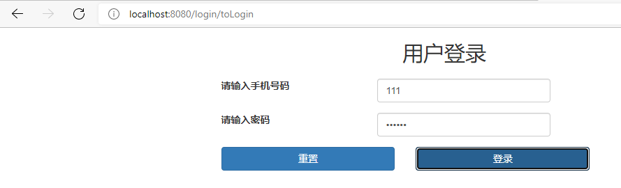

4，在idea控制台，可以看到dologin方法打印的接收到的，从前端发来的一次MD5加密后的密码：


5，打开MD5UTIL，运行自测用的main函数，看第一次加密后的密码；发现和前端不一致：

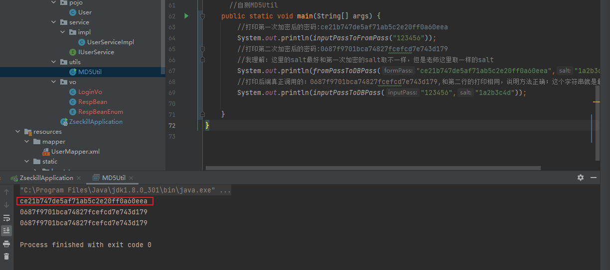

6，经过检查发现，前端拿盐加密时，最开头有一个空字符串，而后端没有：


- 网友：警惕两个char 类型的直接相加！

7，把MD5UTIL中的加密，也加上空字符串：


- 本位代码已同步更新

8，重新启动MD5UTIL的main函数测试，这回第一次加密后的密码和前端加密的结果对上了：


- 这说明前端传送的MD5加密密码，传到后端后处理应该不会有太大问题的。

#### 实现登录逻辑

1，找到service层，看到有IUserService；有它就可以直接在Controller中注入它。


2，在logincontroller中注入service层


3，修改logincontroller中的dologin方法，让他调用service层：


4，在IUserService接口中创建doLogin方法声明：

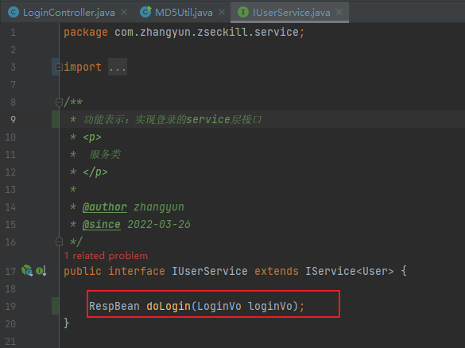

5，在service的实现类中实现service层关于dologin的方法;service层涉及了登录逻辑：

```java
package com.zhangyun.zseckill.service.impl;

import com.baomidou.mybatisplus.extension.service.impl.ServiceImpl;
import com.zhangyun.zseckill.mapper.UserMapper;
import com.zhangyun.zseckill.pojo.User;
import com.zhangyun.zseckill.service.IUserService;
import com.zhangyun.zseckill.utils.MD5Util;
import com.zhangyun.zseckill.utils.ValidatorUtil;
import com.zhangyun.zseckill.vo.LoginVo;
import com.zhangyun.zseckill.vo.RespBean;
import com.zhangyun.zseckill.vo.RespBeanEnum;
//import org.apache.commons.lang3.StringUtils;
import org.springframework.beans.factory.annotation.Autowired;
import org.springframework.stereotype.Service;
import org.springframework.util.StringUtils;

/**
 * <p>
 *  服务实现类
 * </p>
 *
 * @author zhangyun
 * @since 2022-03-26
 */
@Service
public class UserServiceImpl extends ServiceImpl<UserMapper, User> implements IUserService {

    //注入userMapper用于数据库操作
    /*
    * idea中userMapper爆红并提示“Could not autowire. No beans of 'UserMapper' type found”的话，没事，
    * 因为项目的启动类加了注解@MapperScan("com.zhangyun.zseckill.mapper")，会扫描到mapper作为bean的
    * 这个红色波浪线可以忽略
    * */
    @Autowired
    private UserMapper userMapper;

    /*
    * 登录
    * */
    @Override
    public RespBean doLogin(LoginVo loginVo) {
        String mobile = loginVo.getMobile();
        String password=loginVo.getPassword();

        /*
        * 虽然前端已经做了初步校验，但是后端还要再做一遍，因为后端是最后防线;
        * */
        // 判断用户名密码是否为空；老师用的spring框架的，我也跟着吧
        if (StringUtils.isEmpty(mobile) || StringUtils.isEmpty(password)) {
            return RespBean.error(RespBeanEnum.LOGIN_ERROR);
        }
        //判断手机号合法性
        if (!ValidatorUtil.isMobile(mobile)) {
            return RespBean.error(RespBeanEnum.MOBILE_ERROR);
        }

        /*
        * 合法性都没问题的话，就进行数据库查询了
        * */
        //根据手机号获取用户
        User user = userMapper.selectById(mobile);
        if(null==user){
            return RespBean.error(RespBeanEnum.LOGIN_ERROR);
        }
        //判断密码是否正确：即对收到的前端一次加密的密码，在本服务端再次加密，查看二次加密后的结果是否与数据库存储的二次加密效果相同
        if (!MD5Util.fromPassToDBPass(password, user.getSalt()).equals(user.getPassword())) {
            return RespBean.error(RespBeanEnum.LOGIN_ERROR);
        }

        //service层做的一切校验都ok，就返回成功
        return RespBean.success();
    }
}

```

6，在RespBeanEnum中添加，登录相关的枚举：

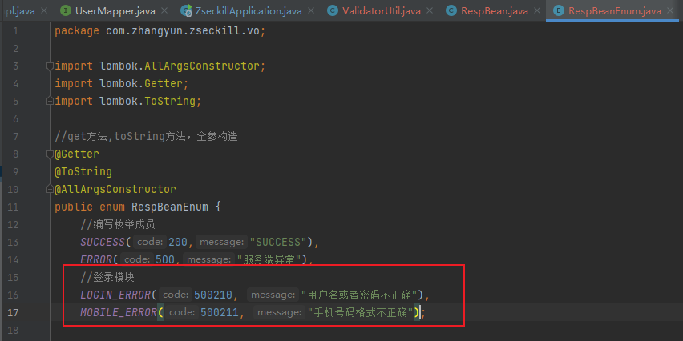

- 登录还是要显示一些登录的信息，不要直接写服务端异常，这样对用户的体验度比较好。

7，新建一个用于手机号码校验的工具类：


```java
package com.zhangyun.zseckill.utils;

import org.thymeleaf.util.StringUtils;

import java.util.regex.Matcher;
import java.util.regex.Pattern;

/**
 * 手机号码校验类
 *
 * @author: zhangyun
 * @ClassName: ValidatorUtil
 */
public class ValidatorUtil {

    //使用正则表达式限制手机号的形式
    private static final Pattern mobile_patten = Pattern.compile("[1]([3-9])[0-9]{9}$");

    /**
     * 手机号码校验
     * @author zhangyun
     * @operation add
     * @param mobile
     * @return boolean
     **/
    public static boolean isMobile(String mobile) {
        //手机为空是无法校验的
        if (StringUtils.isEmpty(mobile)) {
            return false;
        }
        //手机号不为空则用正则表达式校验
        Matcher matcher = mobile_patten.matcher(mobile);
        return matcher.matches();
    }
}

```

8，登录本地数据库，在t_user中加入一条数据：

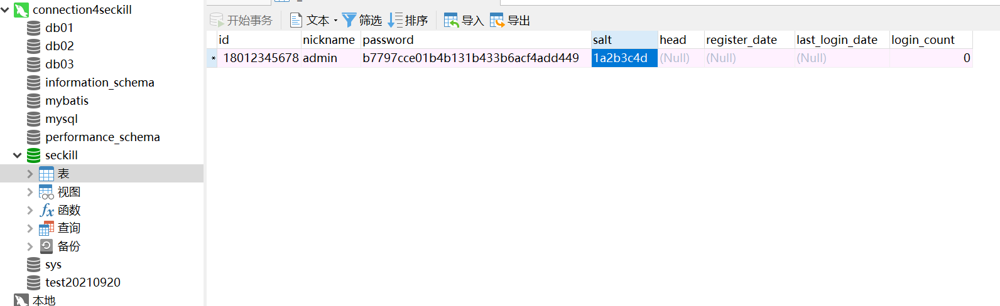

- 密码填MD5对123456二次加密后的密码`b7797cce01b4b131b433b6acf4add449`。

- 数据库这填入盐为密码在后端第二次加密时用的盐；只是本项目中第二次和第一次加密用的盐一样。

- 暂没填入的数据先不管。

- 我们相当于有了一条用户数据。

#### 测试登录功能的逻辑

1，重启项目：

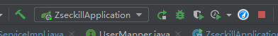

2，测试手机格式，成功：


3，测试用户名密码不匹配的情况

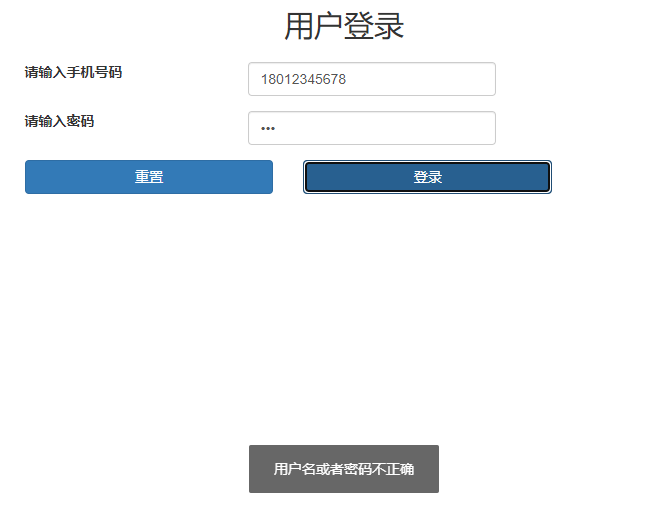

4，演示正确登录的情况；输入数据库中有的手机号，和对应的明文密码（123456）；成功登录：

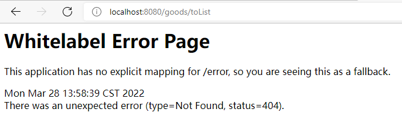

- 还没编写tolist跳转，所以404；

  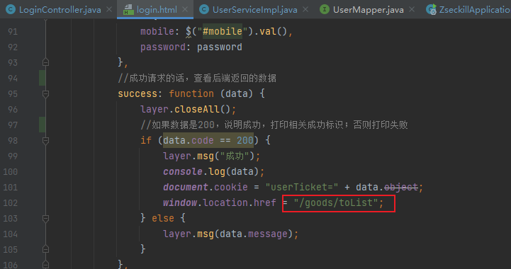

- 不过正是登录成功了才会去跳转到tolist。

5，所以登录功能是没问题的。


### 自定义注解参数校验

#### 使用非自定义注解

1，登录过程中做了很多的参数校验，可能在其他类中也可能有类似这些参数校验的健壮性判断；如果每个类都去准备这些健壮性判断的话，会显得很麻烦；所以我们用js303做参数校验，从而简化代码。

2，pom导入validation组件的依赖：

```xml
<!--        validation组件-->
        <dependency>
            <groupId>org.springframework.boot</groupId>
            <artifactId>spring-boot-starter-validation</artifactId>
        </dependency>
```

- 记住复制进依赖后，点击idea右上角的蓝色m，把依赖导入项目

3，在`LoginController.java`中，方法的参数处加上注解`@Valid`；有了这个注解后，方法的入参就会被进行相应的校验:

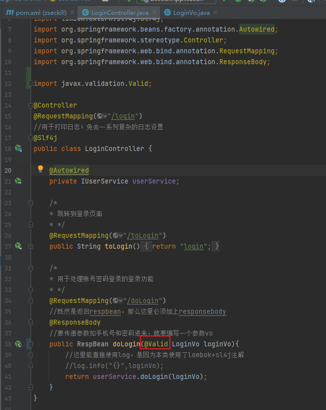

4，进入参数loginvo所属的类`LoginVo`中，添加注解：

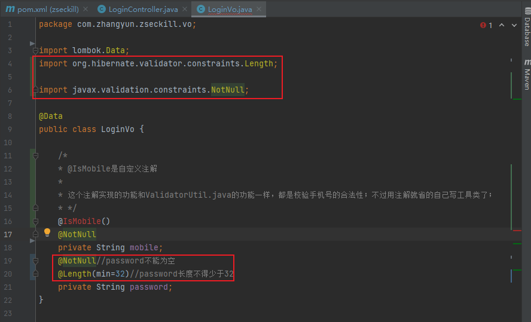

- 注意：@notnull导包的时候不要导错了。

5，constrain包点进去，可以看到有各种可用注解：


#### 自定义注解

1，现在尝试自定义注解来实现校验；在LoginVo.java的mobile参数上，加一个@IsMobile()注解；我们将实现该注解，来自动完成原先由ValidatorUtil.java完成的功能：


2，新建包，再新建注解`IsMobile`：


- 注意：注解名大写

3，自定义注解其实很简单，把@notnull注解中有用的的东西，拷贝进IsMobile注解：


- @Repeatable没用，就别拷贝来

4，编写自定义的IsMobile注解的内容：

```java
package com.zhangyun.zseckill.validator;

import javax.validation.Constraint;
import javax.validation.Payload;
import java.lang.annotation.*;

/**
 * 验证手机号
 * */
@Target({ElementType.METHOD, ElementType.FIELD, ElementType.ANNOTATION_TYPE, ElementType.CONSTRUCTOR, ElementType.PARAMETER, ElementType.TYPE_USE})
@Retention(RetentionPolicy.RUNTIME)
@Documented
@Constraint(
        //准备一个对应的校验的类，类中定义自己校验的规则
        validatedBy = {IsMobileValidator.class}
)
public @interface IsMobile {
    //自己加一个属性，要求是否必填；默认必填
    boolean required() default true;

    //消息就是报错的消息
    String message() default "手机号码格式错误";

    Class<?>[] groups() default {};

    Class<? extends Payload>[] payload() default {};
}

```

5，编写validatedBy需要的指定自定义校验规则的类IsMobileValidator：


```java
package com.zhangyun.zseckill.validator;

import com.zhangyun.zseckill.utils.ValidatorUtil;
import org.thymeleaf.util.StringUtils;

import javax.validation.ConstraintValidator;
import javax.validation.ConstraintValidatorContext;

/**
 * 手机号码校验规则
 *
 * @author: 张云
 * @ClassName: IsMobileValidator
 */
public class IsMobileValidator implements ConstraintValidator<IsMobile, String> {

    //记录是否是必填的
    private boolean required = false;

    //初始化参数，即拿到使用注解时填的参数的值
    @Override
    public void initialize(IsMobile constraintAnnotation) {
//        ConstraintValidator.super.initialize(constraintAnnotation);
        //获取到使用注解时填的required值为true或false
        required = constraintAnnotation.required();
    }

    //（根据参数）编写校验规则
    @Override
    public boolean isValid(String s, ConstraintValidatorContext constraintValidatorContext) {
        if (required) {//如果写注解时设置的是必填，那么通过之前自己编写的校验类工具ValidatorUtil来返回是否是合格手机号
            return ValidatorUtil.isMobile(s);
        } else {//非必填的话
            if (StringUtils.isEmpty(s)) {//因为是非必填，如果是空就可以直接返回true
                return true;
            } else {//非必填，但是填了，那么就需要通过之前自己编写的校验类工具ValidatorUtil来返回是否是合格手机号
                return ValidatorUtil.isMobile(s);
            }
        }
    }
}

```

6，注释掉service层关于电话号码校验的代码，因为自定义的IsMobile注解已经实现相应功能：

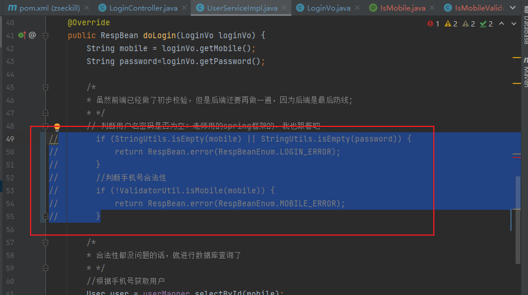

7，重启项目，输入不合法的电话号，执行登录操作：

前端可以看到doLogin请求失败了：

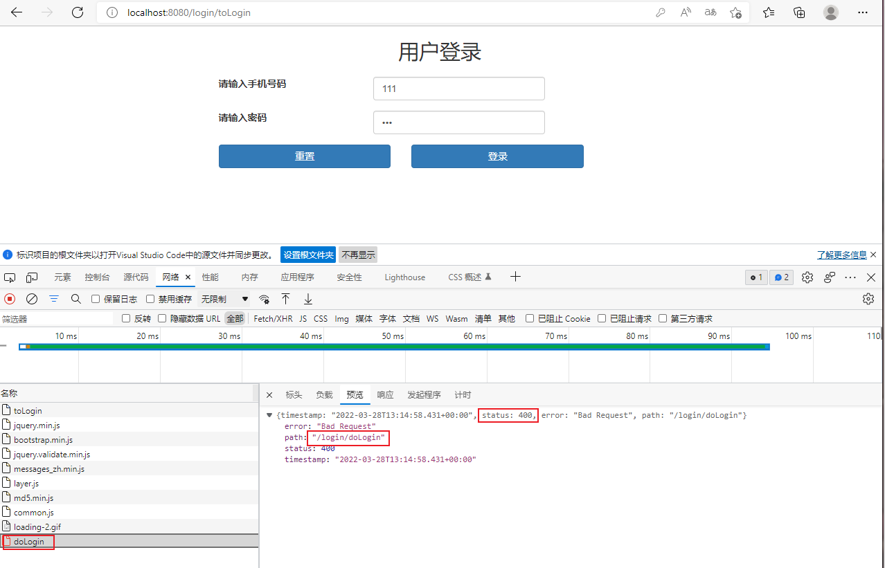

后台idea报warning，这个warning正是我们加注解的结果，打印的也是IsMobile注解规定的值：

```
2022-03-28 21:14:58.428  WARN 69052 --- [nio-8080-exec-8] .w.s.m.s.DefaultHandlerExceptionResolver : Resolved [org.springframework.validation.BindException: org.springframework.validation.BeanPropertyBindingResult: 1 errors<EOL>Field error in object 'loginVo' on field 'mobile': rejected value [111]; codes [IsMobile.loginVo.mobile,IsMobile.mobile,IsMobile.java.lang.String,IsMobile]; arguments [org.springframework.context.support.DefaultMessageSourceResolvable: codes [loginVo.mobile,mobile]; arguments []; default message [mobile],true]; default message [手机号码格式错误]]
```

8，现在错误提示没在页面上展示，而是在控制输出台展示：

- 因为异常只是普通抛出，没有正确处理并让前端显示
- 后面我们要定义异常，把这个异常信息正确地展示到前端页面

#### 异常处理

1，上一小节的BindException，应该被捕获，然后抛出对应的信息，并让前端展示；我们通过ControllerAdvice和ExceptionHandler两个组合注解来处理，因为虽然这两个组合注解只能处理控制器抛出的异常，但是这两个组合注解的自由度更大。

- 有人想用ErrorException类处理的话，也可以；errorcontroller类可以处理所有位置的异常，包括未进入控制器的异常。
- ControllerAdvice可以定义多个拦截方法，拦截不同的异常类，并抛出对应的异常信息，自由度更高。

2，创建处理异常的包exception，包中定义一个类GlobalException（全局异常）：

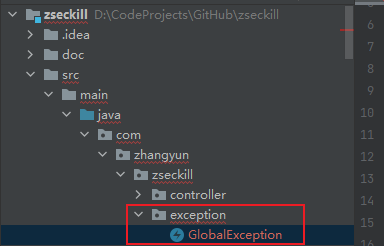

```java
package com.zhangyun.zseckill.exception;

import com.zhangyun.zseckill.vo.RespBeanEnum;
import lombok.AllArgsConstructor;
import lombok.Data;
import lombok.NoArgsConstructor;

/**
 * 全局异常
 *
 * @author: zhangyun
 * @ClassName: GlobalException
 */
@Data
@NoArgsConstructor
@AllArgsConstructor
public class GlobalException extends RuntimeException {

    //全局异常中放返回的responsebean的枚举，因为该枚举里存了相应的状态码和对应的信息，有它就够了。
    private RespBeanEnum respBeanEnum;

}
```

2，创建异常处理类GlobalExceptionHandler：

```java
package com.zhangyun.zseckill.exception;

import com.zhangyun.zseckill.vo.RespBean;
import com.zhangyun.zseckill.vo.RespBeanEnum;
import org.springframework.validation.BindException;
import org.springframework.web.bind.annotation.ExceptionHandler;
import org.springframework.web.bind.annotation.RestControllerAdvice;


/**
 * 全局异常处理类
 *
 * @author: zhangyun
 * @ClassName: GlobalExceptionHandler
 */
//类上加了@RestControllerAdvice，那么返回的就是一个responsebody，就不用在方法上具体返回
@RestControllerAdvice
//我：类名虽然叫GlobalExceptionHandler，但我认为它除了GlobalException，也会在Controller层处理其他所有各种异常
public class GlobalExceptionHandler {

    //@ExceptionHandler()括号中填入要处理的异常的类；这里选Exception.class（所有异常的父类），表示处理所有异常
    @ExceptionHandler(Exception.class)
    public RespBean ExceptionHandler(Exception e) {
        //如果捕捉到的异常，属于刚刚定义的全局的异常，就返回该全局异常中的存的RespBeanEnum
        if (e instanceof GlobalException) {
            GlobalException exception = (GlobalException) e;
            return RespBean.error(exception.getRespBeanEnum());
        } else if (e instanceof BindException) {//如果捕捉到的异常是绑定异常，就返回该绑定异常的信息
            BindException bindException = (BindException) e;//把e强制转换为BindException，好从BindException中获取前端需要的错误提示信息“手机号码格式错误”
            //拿到一个bind_error对应的respbean；但是这个信息不够，这里的信息只是RespBeanEnum中绑定的信息“参数校验异常”，不是很符合；我们想把绑定异常抛出来的信息“手机号码格式错误”拿到
            RespBean respBean = RespBean.error(RespBeanEnum.BIND_ERROR);
            //之前报错提示“1 errors”，所以直接get(0)可以得到第一个也即是唯一的异常；getDefaultMessage()可以获取到默认的信息即报错打印的“手机号码格式错误”；这样就把respBean存的信息详细化了
            respBean.setMessage("参数校验异常：" + bindException.getBindingResult().getAllErrors().get(0).getDefaultMessage());
            //我推测：让controller层的LoginController类的doLogin，把含有BindException中的提示信息的respBean，返回给前端
            return respBean;
        }
        //如果之前的异常匹配都没匹配上，就抛出RespBeanEnum中定义的默认ERROR异常（500异常是个框，服务器有问题都可以往里装）
        System.out.println("异常信息" + e);
        return RespBean.error(RespBeanEnum.ERROR);
    }
}

```

- 我强调：ExceptionHandler会在controller层处理 所有层发生的所有异常，前提是异常要被传到controller层。
- ExceptionHandler的处理异常的能力来源于@RestControllerAdvice
- 我推测：调用doLogin导致的错误，所以会让controller层的LoginController类的doLogin，把含有BindException中的提示信息的respBean，返回给前端；让前端展示错误提示。

3，RespBeanEnum中添加BIND_ERROR：


4，之前UserServiceImpl代码，负责业务逻辑，也可以对他做修改：

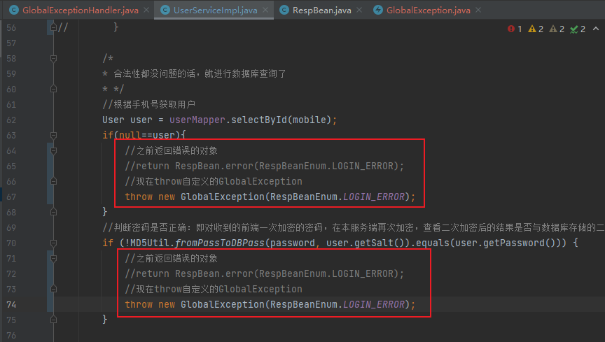

- 但是这两处修改与bindexception无关；所以这两处修改与使用注解校验手机号后，前端无法显示Ismobile的message无关

5，测试，使用错误电话号：

前端收到对应message：

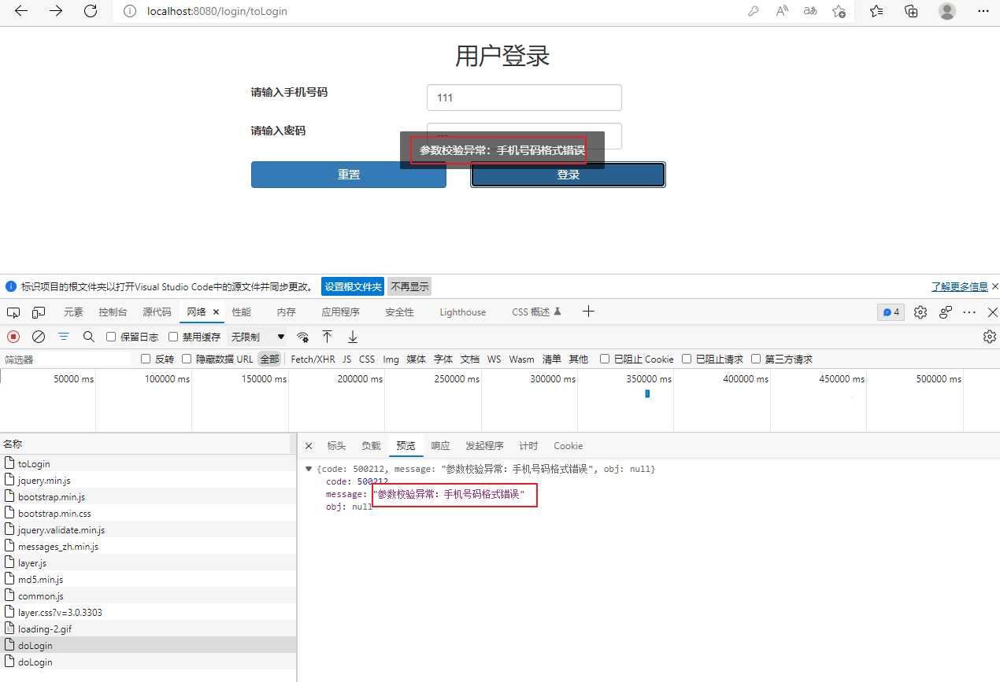

因为代码ExceptionHandler处理了异常，后端控制台不会打印异常：


6，测试，使用正确电话号+错误密码：

前端收到对应message：

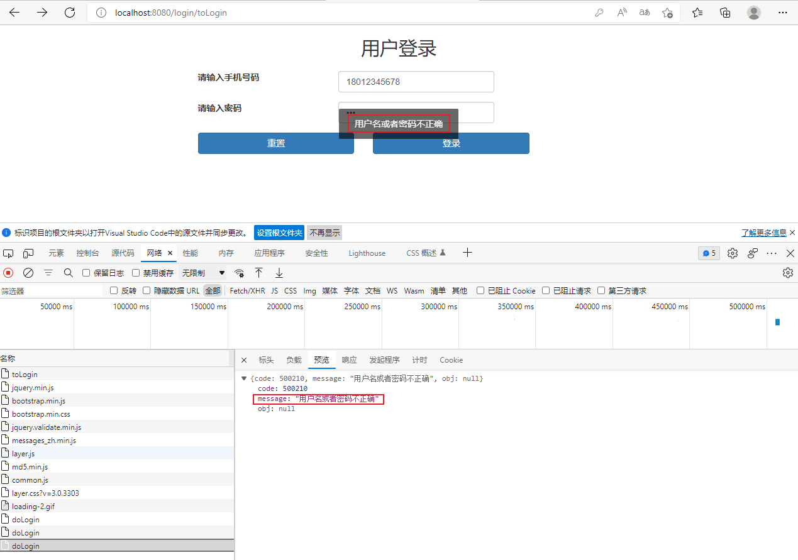

后端也没打印异常。

7，我分析：

- 之前前端无法显示message，并报bindingexception，所以在GlobalExceptionHandler中人为处理了bindingexception异常；
- 发生bindingexception时，且bindingexception被传到controller层时，ExceptionHandler会返回一个message被修改过的respBean；修改的内容就是为了在message中加上之前报错提示的“手机号码格式错误“；
- 调用doLogin引发bindingexception，导致ExceptionHandler返回的respBean，会被doLogin返回给前端，这样前端就能从respBean中解读出信息并显示在自己的页面上了。
  - 之前bindingexception发生后，没有被处理，所以bindingexception的message无法被装进respBean传递给前端，所以前端没有错误提示。
  - 不使用注解而只使用ValidatorUtil时，`!ValidatorUtil.isMobile(mobile)`判断手机号不合法时，会直接返回包含`RespBeanEnum.MOBILE_ERROR`信息的respBean给前端，所以前端能展示提示。
  - 所以**重点**是：前端登录页面必须收到后端发的respBean才能正确打印各类提示信息；如果由于发生bindingexception导致respbean无法发送的话，就会导致前端无法显示，所以要手动处理bindingexception使发生bindingexception时也能给前端返回respbean。


### 完善登录功能

#### cookie处理

1，商品秒杀抢购页面需要判断当前用户是否登录了，没登录则不让参与秒杀；所以登陆成功后要给用户一个状态，最简单的实现就是给cookie一个Session。

2，编写cookie工具类：


```java
package com.zhangyun.zseckill.utils;

import javax.servlet.http.Cookie;
import javax.servlet.http.HttpServletRequest;
import javax.servlet.http.HttpServletResponse;
import java.io.UnsupportedEncodingException;
import java.net.URLDecoder;
import java.net.URLEncoder;

/**
 * Cookie工具类
 *
 * @author: zhangyun
 * @ClassName: CookieUtil
 */
public final class CookieUtil {

    /**
     * 得到Cookie的值, 不编码
     *
     * @param request
     * @param cookieName
     * @return
     */
    public static String getCookieValue(HttpServletRequest request, String cookieName) {
        return getCookieValue(request, cookieName, false);
    }

    /**
     * 得到Cookie的值,
     *
     * @param request
     * @param cookieName
     * @return
     */
    public static String getCookieValue(HttpServletRequest request, String cookieName, boolean isDecoder) {
        Cookie[] cookieList = request.getCookies();
        if (cookieList == null || cookieName == null) {
            return null;
        }
        String retValue = null;
        try {
            for (int i = 0; i < cookieList.length; i++) {
                if (cookieList[i].getName().equals(cookieName)) {
                    if (isDecoder) {
                        retValue = URLDecoder.decode(cookieList[i].getValue(), "UTF-8");
                    } else {
                        retValue = cookieList[i].getValue();
                    }
                    break;
                }
            }
        } catch (UnsupportedEncodingException e) {
            e.printStackTrace();
        }
        return retValue;
    }

    /**
     * 得到Cookie的值,
     *
     * @param request
     * @param cookieName
     * @return
     */
    public static String getCookieValue(HttpServletRequest request, String cookieName, String encodeString) {
        Cookie[] cookieList = request.getCookies();
        if (cookieList == null || cookieName == null) {
            return null;
        }
        String retValue = null;
        try {
            for (int i = 0; i < cookieList.length; i++) {
                if (cookieList[i].getName().equals(cookieName)) {
                    retValue = URLDecoder.decode(cookieList[i].getValue(), encodeString);
                    break;
                }
            }
        } catch (UnsupportedEncodingException e) {
            e.printStackTrace();
        }
        return retValue;
    }

    /**
     * 设置Cookie的值 不设置生效时间默认浏览器关闭即失效,也不编码
     */
    public static void setCookie(HttpServletRequest request, HttpServletResponse response, String cookieName,
                                 String cookieValue) {
        setCookie(request, response, cookieName, cookieValue, -1);
    }

    /**
     * 设置Cookie的值 在指定时间内生效,但不编码
     */
    public static void setCookie(HttpServletRequest request, HttpServletResponse response, String cookieName,
                                 String cookieValue, int cookieMaxage) {
        setCookie(request, response, cookieName, cookieValue, cookieMaxage, false);
    }

    /**
     * 设置Cookie的值 不设置生效时间,但编码
     */
    public static void setCookie(HttpServletRequest request, HttpServletResponse response, String cookieName,
                                 String cookieValue, boolean isEncode) {
        setCookie(request, response, cookieName, cookieValue, -1, isEncode);
    }

    /**
     * 设置Cookie的值 在指定时间内生效, 编码参数
     */
    public static void setCookie(HttpServletRequest request, HttpServletResponse response, String cookieName,
                                 String cookieValue, int cookieMaxage, boolean isEncode) {
        doSetCookie(request, response, cookieName, cookieValue, cookieMaxage, isEncode);
    }

    /**
     * 设置Cookie的值 在指定时间内生效, 编码参数(指定编码)
     */
    public static void setCookie(HttpServletRequest request, HttpServletResponse response, String cookieName,
                                 String cookieValue, int cookieMaxage, String encodeString) {
        doSetCookie(request, response, cookieName, cookieValue, cookieMaxage, encodeString);
    }

    /**
     * 删除Cookie带cookie域名
     */
    public static void deleteCookie(HttpServletRequest request, HttpServletResponse response,
                                    String cookieName) {
        doSetCookie(request, response, cookieName, "", -1, false);
    }

    /**
     * 设置Cookie的值，并使其在指定时间内生效
     *
     * @param cookieMaxage cookie生效的最大秒数
     */
    private static final void doSetCookie(HttpServletRequest request, HttpServletResponse response,
                                          String cookieName, String cookieValue, int cookieMaxage, boolean isEncode) {
        try {
            if (cookieValue == null) {
                cookieValue = "";
            } else if (isEncode) {
                cookieValue = URLEncoder.encode(cookieValue, "utf-8");
            }
            Cookie cookie = new Cookie(cookieName, cookieValue);
            if (cookieMaxage > 0)
                cookie.setMaxAge(cookieMaxage);
            if (null != request) {// 设置域名的cookie
                String domainName = getDomainName(request);
                System.out.println(domainName);
                if (!"localhost".equals(domainName)) {
                    cookie.setDomain(domainName);
                }
            }
            cookie.setPath("/");
            response.addCookie(cookie);
        } catch (Exception e) {
            e.printStackTrace();
        }
    }

    /**
     * 设置Cookie的值，并使其在指定时间内生效
     *
     * @param cookieMaxage cookie生效的最大秒数
     */
    private static final void doSetCookie(HttpServletRequest request, HttpServletResponse response,
                                          String cookieName, String cookieValue, int cookieMaxage, String encodeString) {
        try {
            if (cookieValue == null) {
                cookieValue = "";
            } else {
                cookieValue = URLEncoder.encode(cookieValue, encodeString);
            }
            Cookie cookie = new Cookie(cookieName, cookieValue);
            if (cookieMaxage > 0) {
                cookie.setMaxAge(cookieMaxage);
            }
            if (null != request) {// 设置域名的cookie
                String domainName = getDomainName(request);
                System.out.println(domainName);
                if (!"localhost".equals(domainName)) {
                    cookie.setDomain(domainName);
                }
            }
            cookie.setPath("/");
            response.addCookie(cookie);
        } catch (Exception e) {
            e.printStackTrace();
        }
    }

    /**
     * 得到cookie的域名
     */
    private static final String getDomainName(HttpServletRequest request) {
        String domainName = null;
        // 通过request对象获取访问的url地址
        String serverName = request.getRequestURL().toString();
        if (serverName == null || serverName.equals("")) {
            domainName = "";
        } else {
            // 将url地下转换为小写
            serverName = serverName.toLowerCase();
            // 如果url地址是以http://开头  将http://截取
            if (serverName.startsWith("http://")) {
                serverName = serverName.substring(7);
            }
            int end = serverName.length();
            // 判断url地址是否包含"/"
            if (serverName.contains("/")) {
                //得到第一个"/"出现的位置
                end = serverName.indexOf("/");
            }

            // 截取
            serverName = serverName.substring(0, end);
            // 根据"."进行分割
            final String[] domains = serverName.split("\\.");
            int len = domains.length;
            if (len > 3) {
                // www.xxx.com.cn
                domainName = domains[len - 3] + "." + domains[len - 2] + "." + domains[len - 1];
            } else if (len <= 3 && len > 1) {
                // xxx.com or xxx.cn
                domainName = domains[len - 2] + "." + domains[len - 1];
            } else {
                domainName = serverName;
            }
        }

        if (domainName != null && domainName.indexOf(":") > 0) {
            String[] ary = domainName.split("\\:");
            domainName = ary[0];
        }
        return domainName;
    }
}

```

3，编写uuid工具类，本工具类用来生成cookie：

```java
package com.zhangyun.zseckill.utils;

import java.util.UUID;

/**
 * UUID工具类
 *
 * @author: zhangyun
 * @ClassName: UUIDUtil
 */
public class UUIDUtil {

    //生成uuid，并把-替换掉
    public static String uuid() {
        return UUID.randomUUID().toString().replace("-", "");
    }
}

```

4，在service层，添加逻辑服务的代码：

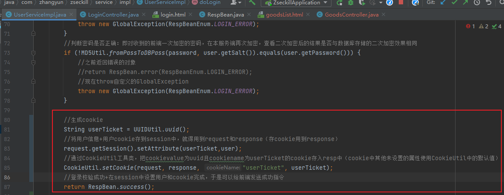

- 前端收到代表成功的respBean时，就能根据respBean中的message和code做前端的工作。
- 问答问：像cookie和session等信息，是往req中传还是往resp中？
  - 我：我记得是放到resp返回给客户端


5，在LoginController中添加添加两个入参req resp，好把用户信息+用户cookie存入session：

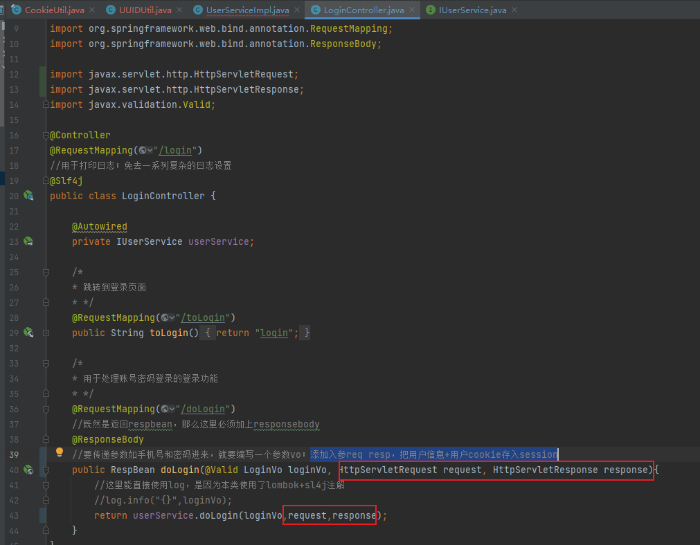

同时修改IUserService接口的内容：

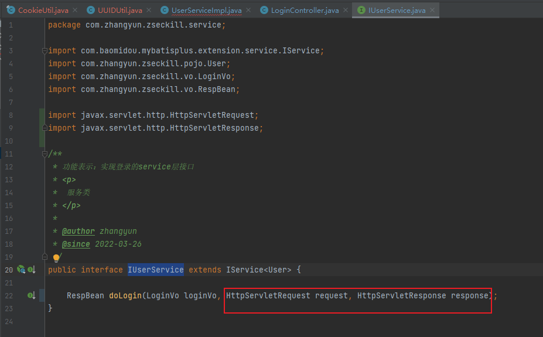

#### 跳往商品页

1，登录成功后就到商品列表页面，点击“选中商品”就可以去进行秒杀的活动

2，在前端的login.html加上登录成功后的跳转请求：

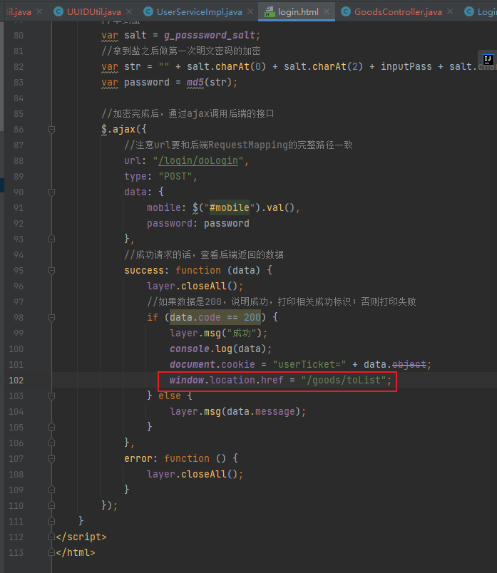

3，既然要跳往商品页，就需要新建一个GoodsController来处理`/goods/toList`请求：


```java
package com.zhangyun.zseckill.controller;

import com.zhangyun.zseckill.pojo.User;
import org.springframework.stereotype.Controller;
import org.springframework.ui.Model;
import org.springframework.web.bind.annotation.CookieValue;
import org.springframework.web.bind.annotation.RequestMapping;
import org.thymeleaf.util.StringUtils;

import javax.servlet.http.HttpSession;

@Controller
@RequestMapping("/goods")
public class GoodsController {

    /**
     * 跳转到商品列表页
     * */
    @RequestMapping("/toList")
    //session获取用户信息和cookie；model做页面跳转时，把商品信息传给前端；传入userTicket即为cookieValue,可以通过@CookieValue拿到，@CookieValue括号中指定的是cookieName
    public String toList(HttpSession session, Model model,@CookieValue("userTicket") String userTicket){
        /*
        * 刚刚登录的时候，把相应的用户信息存储起来了，这里就可以获取用户信息
        * */
        //如果ticket为空就登录（防止用户直接访问toList尝试来到商品页）
        if(StringUtils.isEmpty(userTicket)){
            return "login";
        }
        /*
        * session中通过kv存储了userTicket（即cookieValue）和User，这里通过userTicket拿到user；
        * 我推测：getAttribute拿到的object本身就是一个User，所以才能强转为User
        *
        * session中没有用户的值，即用户未登录，跳往登录页面
        * */
        User user = (User)session.getAttribute(userTicket);
        if(user==null){
            return "login";
        }

        //把用户信息传入到前端
        model.addAttribute("user",user);
        return "goodsList";
    }
}

```

- 注意：`return "goodsList";`不要写成`return "goodList";`，否则goodsList页面会显示”无法识别user“

4，编写商品列表页（极简实例）：


```html
<!DOCTYPE html>
<html lang="en"
      xmlns:th="http://www.thymeleaf.org">
<head>
    <meta charset="UTF-8">
    <title>商品列表</title>
</head>
<body>
    <p th:text="'hello'+${user.nickname}"></p>
</body>
</html>
```

#### 测试

1，启动项目，输入本地数据库中存在数据，点击登录；成功把数据库中的内容展示到前端：

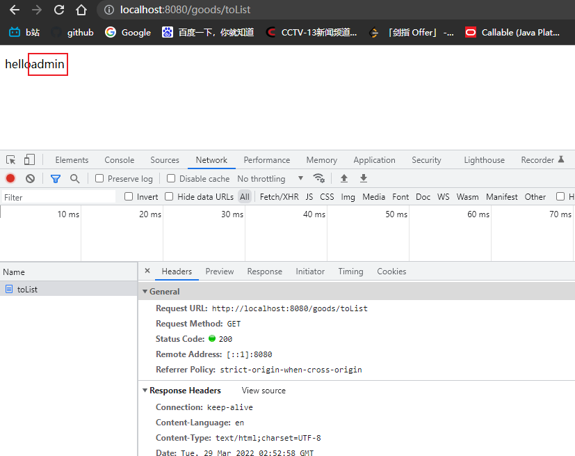

- 我记得好像：user会被自动被转成json传给前端，前端就能自动识别user结构，并根据前端指令从user中拿到nickname。

### 分布式session问题

#### 问题定义与解决思路

1，一个tomcat可以承担几百条的访问量，但是秒杀可能有几十万的瞬时访问量，所以就要用多台tomcat，并用Nginx做请求转发（Nginx默认负载均衡策略为轮询）；Nginx可能请求转发给tomcat1让tomcat1上有用户的登录session，但是过会把请求转发给tomcat2，此时tomcat2上没有用户的session，就得重新登录，很麻烦；这就是所谓的“分布式session问题”。


2，分布式session的解决方案：

- Session复制
  - 优点
    - 无需修改代码，只需要修改Tomcat配置。
  - 缺点
    - Session同步传输占用内网带宽
    - 多台Tomcat同步性能指数级下降 
    - Session占用内存，无法有效水平扩展
- 前端存储
  - 优点
    - 不占用服务端内存。
  - 缺点
    - 存在安全风险:cookie在前端且是明文。
    - 数据大小受cookie限制
    - 占用外网带宽（前端传到后端，发送cookie存的session对象，占用外网带宽）
- Session粘滞
  - 网友：粘滞就是一致性hash
  - 优点
    - 无需修改代码
    - 服务端可以水平扩展。
  - 缺点
    - 增加新机器，会重新Hash，导致重新登录
    - 应用重启，需要重新登录

- 后端集中存储。 
  - 优点
    - 安全(不用把数据存在前端，前端看不到)
    - 容易水平扩展。
  - 缺点
    - 增加复杂度
    - 需要修改代码
- redis

3，本项目解决分布式Session问题：使用redis！

- redis是在内存里存储数据结构，操作速度比关系型数据库如MySQL oracle高。
- redis可以做数据库，缓存，消息中间件
- 本项目redis只有单体，没做集群（可以后期自己改进）。

#### Ubuntu安装redis

1，要安装redis5.0.5，原因：

- 5版本是比较主流的
- 虽然6版本引入了多线程，但是6版本的多线程是针对网络传输套接字，对数据操作没太大影响；用5就性能不错了。
  - [参考阅读Redis单线程为什么这么快？看完秒懂了... - 小姜姜 - 博客园 (cnblogs.com)](https://www.cnblogs.com/linkeke/p/15683355.html)

2，**ubuntu安装参考**[(22条消息) Ubuntu安装Redis及使用_hzlarm的博客-CSDN博客_ubuntu安装redis](https://blog.csdn.net/hzlarm/article/details/99432240)：

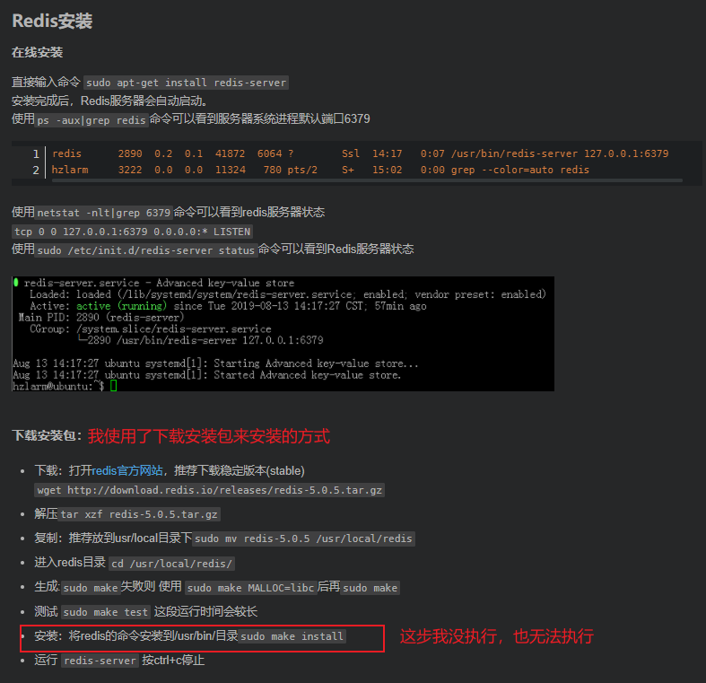

- 我没能执行教程的最后一步sudo make install（看报错提示应该是”目录已存在，不能再执行“的意思），就能在`/usr/local/redis`运行redisserver。经过前后对比，发现`/usr/local/bin`中生成了redisserver rediscli。我感觉不在redisserver目录下也能运行redisserver很**神奇**，目前还不知道原因。不过redis.conf在`/usr/local/redis`中。

  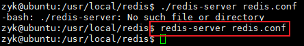

  - 不过注意现在不能在启动redisserver的命令的redis-server前带`./`，因为redisserver文件不在本目录中。

3，redis.conf的配置倒是可以参考“centos安装redis”

> ubuntu系统的话，禁止做下面的Centos的安装步骤！！！而应该参考本节中的安装方式。

> !!!!!!!!!!!!!!!!!!!!!!!!!!!!!!!!!!!!!!!!!!!!!!!!!!!!!!

#### centos安装redis

1，在Centos系统安装redis的话，登录[官网](https://download.redis.io/releases/)下载


2，把压缩包通过xshell上传到本地虚拟机，并解压`tar zxvf redis-5.0.5.tar.gz `：


3，redis是c编写的，所以要先安装一些依赖：

```
yum -y install gcc-c++ automake autoconf
```

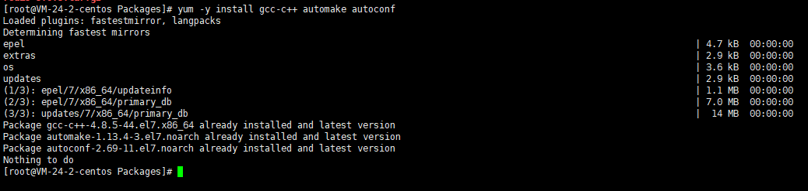

4，编译：

```
make
```

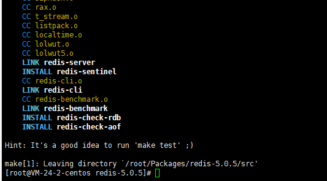

5，自定义安装目录地安装redis：

```
 make PREFIX=/usr/local/redis install
```


6，进入安装了redis的位置，再进入bin目录，可以看到很多关于启动的命令：


- 重点关注redisserver

7，到redis解压文件，复制`redis.conf`到redis安装目录：


```
cp redis.conf /usr/local/redis/bin
```

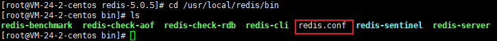

8，修改redis.conf：

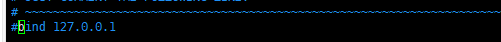

- 学习阶段不绑定网络

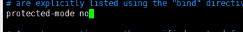

- 关闭保护模式


- 设置redis为后台启动

其他的部分就不修改了`ESC`退出输入模式，`:wq`保存并退出。

9，让redisserver以redisconf规定的方式启动：

```
./redis-server redis.conf
```


- 启动后没有图标，说明是按照redisconf配置的后台启动方式启动。

10，可以用下面命令检查redis是否启动成功：

```
ps -ef|grep redis
```


11，使用rediscli去连接已经启动的redisserver：

```
./redis-cli
```


- redisserver回复了pong，说明连接成功

12，[安装](http://docs.redisdesktop.com/en/docs/install/)redis可视化客户端工具“redis desktop manager”：

略。。官方版本要钱。

#### redis操作命令

1，略，详情见redis转门的笔记。

2，注意：

- redis的nx xx命令，可以设置分布式锁。

#### SpringSession实现分布式Session

1，可以通过redis实现分布式session，有两种方案：

- 第一种为springsession：简单，且不太需要变更代码。

- 第二种：redis存储用户信息

本节先使用第一种springsession的方法！

2，项目pom中添加依赖，

```xml
<!--        spring data redis的依赖：因为我们要通过redis实现分布式session，这个是必备的！-->
        <dependency>
            <groupId>org.springframework.boot</groupId>
            <artifactId>spring-boot-starter-data-redis</artifactId>
        </dependency>
<!--        对象池的依赖。redis2.0使用lettuce的客户端，lettuce是线程安全的，lettuce需要对象池-->
        <dependency>
            <groupId>org.apache.commons</groupId>
            <artifactId>commons-pool2</artifactId>
        </dependency>
<!--        springsession的依赖；springsession默认用的就是redis，其实用jdbc和mongodb也可以，原理都一样：把session存在一个单独的第三方去处理-->
        <dependency>
            <groupId>org.springframework.session</groupId>
            <artifactId>spring-session-data-redis</artifactId>
        </dependency>
```

3，引入了SpringSession的依赖，就要去yml配置它:

```yml
spring:
  # redis配置
  redis:
    # 服务器地址
    host: 192.168.187.128
    # 端口号
    port: 6379
    # 默认操作的数据库号
    database: 0
    # 超时时间
    timeout: 10000ms
    # 对lettuce连接池配置
    lettuce:
      pool:
        #最大连接数 默认8
        max-active: 8
        #最大连接阻塞等待时间，默认-1
        max-wait: 1000ms
        #最大空闲连接，默认8
        max-idle: 200
        # 最小空闲连接，默认0
        min-idle: 5
```

- 由于远程服务器中毒，后面改用本地虚拟机；这里填本地虚拟机的ip可以在xshell的连接设置中看到，**不一定是127.0.0.1**！！

4，**确保redisserver已启动**

5，执行登录操作，可以看到helloadmin，说明session已经存起来了：


6，来到使用rediscli连接redisserver，查看redisserver中存的键值对；可以看到本地程序成功把session存入到远程服务器上的redisserver中：


#### redis存储用户信息

1，现在用第二种方式实现分布式session；

- 其实也不叫实现分布式session，因为它压根就不会再用到session，更多的就像把用户信息从session中提取出来，存到redis中
- 之前把我能的用户信息存到session中，然后去不同的地方获取session；现在我们直接把用户信息存在redis中，这样不管哪一个用户要用到用户信息，都从同一个redis中获取，这样也是变相地解决了分布式session的问题。
- 想要让用户信息存入redis，就相当于用代码操作redis

2，清空redisserver存的东西，让它干净：


3，注释掉项目中Springsession的依赖；相当于现在直接使用springdataredis：


4，redis的yml配置不用改

5，之前不做任何配置的时候，存入redis的数据是2进制的；存的是session其实还好，但是现在要存用户对象，我们最好对对象进行相应的序列化。

6，序列化很简单，先创建一个包，再创建RedisConfig：


```java
package com.zhangyun.zseckill.config;

import org.springframework.context.annotation.Bean;
import org.springframework.context.annotation.Configuration;
import org.springframework.core.io.ClassPathResource;
import org.springframework.data.redis.connection.RedisConnectionFactory;
import org.springframework.data.redis.core.RedisTemplate;
import org.springframework.data.redis.core.script.DefaultRedisScript;
import org.springframework.data.redis.serializer.GenericJackson2JsonRedisSerializer;
import org.springframework.data.redis.serializer.StringRedisSerializer;

/**
 * redis配置类，最主要的功能就是为了实现存入redis的数据序列化
 * */
@Configuration
public class RedisConfig {

    /*
    * 实现序列化主要就是通过redisTemplate方法
    *
    * key一般是String类型，要存用户对象的话value是Object类型
    *
    * redisTemplate需要传入RedisConnectionFactory（连接工厂）
    * */
    @Bean
    public RedisTemplate<String, Object> redisTemplate(RedisConnectionFactory redisConnectionFactory) {
        //拿到redisTemplate
        RedisTemplate<String, Object> redisTemplate = new RedisTemplate<>();

        //设置redis 的key 的序列化
        redisTemplate.setKeySerializer(new StringRedisSerializer());
        /*
        * 设置redis 的value 的序列化；这里不能用String了，因为value是object，得用 GenericJackson2JsonRedisSerializer；
        *
        * redis默认使用jdk的序列化（jdk序列化产出的是2进制，产生的数据比较长）；
        * Jackson2JsonRedisSerializer产生的是java字符串，需传入类对象；
        * GenericJackson2JsonRedisSerializer是通用的json转换，它序列化完成后也是序列化数据，但是不需要传入类对象（所以一般选择这个序列化器）
        * */
        redisTemplate.setValueSerializer(new GenericJackson2JsonRedisSerializer());
        //虽然hash本质也是kv形式，但是对hash类型要单独做keyvalue序列化
        redisTemplate.setHashKeySerializer(new StringRedisSerializer());
        redisTemplate.setHashValueSerializer(new GenericJackson2JsonRedisSerializer());

        //在拿到的redistemplate中设置连接工厂，即刚刚注入的redisConnectionFactory
        redisTemplate.setConnectionFactory(redisConnectionFactory);

        return redisTemplate;
    }
    
}

```

- 这样redistemplate序列化就配置好了

7，现在该service层的业务代码UserServiceImpl；之前把用户信息放在session中，现在我们把用户信息放到redis中：

注入redistemplate：


把用户信息存入远程redis：


8，IUserService接口中再添加一个方法getUserByCookie：


- getUserByCookie中传入request和response主要是为了优化，为了当用户不为空，我把cookie重新设置一下

9，在UserServiceImpl中实现getUserByCookie方法：


10，在GoodsController中编写代码：

注入Service层接口，从而使用service的服务；controller-》service-》dao为（mvc）调用顺序：


调用service层的服务，根据cookievalue拿到user：


11，启动项目测试：

- 如果启动碰到错误：

  ```
  nested exception is io.lettuce.core.RedisConnectionException: Unable to conn
  ```

  - [参考解决方案Unable to connect to Redis; nested exception is io.lettuce.core.RedisConnectionException：解决方法 - upupup-999 - 博客园 (cnblogs.com)](https://www.cnblogs.com/upupup-999/p/14858140.html)

  - 我用的是执行了`/sbin/iptables -I INPUT -p tcp --dport 6379 -j ACCEPT`，redis默认端口号6379是不允许进行远程连接的，所以在防火墙中设置6379开启远程服务；

登录；能看到admin说明数据库的用户信息能被后端拿到：


查看redis，可以看到以"user+cookievalue"为键的redis kv键值对；根据k查看v，这个v就是json格式的用户数据：


12，总结：

可以发现redis存储用户信息也能解决分布式session的问题。不论是用springsession还是直接用redis存用户信息，原理都是都一个单独存放信息的服务器，程序就不会去tomcat找信息了，而是在单独存放的redis中找信息，这样信息就同步了！

#### 优化登录功能

回顾拦截器

1，当登录完成后，在后端做的每个操作，都要判断用户是否已登录：

- 每一个接口都要判断ticket（即cookievalue）有没有；根据这个ticket去redis中获取用户的信息，再判断用户存不存在。如果这两步都没有问题才会执行当前接口要执行的方法。
- 比如登录完成后到商品列表页，用户点击商品要进入商品详情页，此时又要做如上两步判断一次用户的登录情况，太麻烦重复臃肿了。
- 可以优化！

2，如果不想在每个接口中做判断用户是否已登录的操作，可以不往方法传`HttpServletRequest request, HttpServletResponse response, @CookieValue("userTicket") String userTicket`，而改为直接传一个user对象，直接在方法中处理业务逻辑


- 传入的user对象的获取，和用户是否已登录的判断在哪做呢？：在传到本接口之间就进行相应的判断了。这就涉及到参数的问题
- 所以在本函数（RequestMapping指定的url接口对应的函数）接收参数之前，系统就应该已经获取到了user，并对user做了一层非空的校验；校验通过后，本函数才能正确地接收到参数user，然后就可以处理函数的业务操作。

3，编写实现了HandlerMethodArgumentResolver接口的类UserArgumentResolver（该类实现了自定义用户参数），准备给WebConfig中的addArgumentResolvers使用：

```java
package com.zhangyun.zseckill.config;

import com.zhangyun.zseckill.pojo.User;
import com.zhangyun.zseckill.service.IUserService;
import com.zhangyun.zseckill.utils.CookieUtil;
import org.springframework.beans.factory.annotation.Autowired;
import org.springframework.core.MethodParameter;
import org.springframework.stereotype.Component;
import org.springframework.util.StringUtils;
import org.springframework.web.bind.support.WebDataBinderFactory;
import org.springframework.web.context.request.NativeWebRequest;
import org.springframework.web.method.support.HandlerMethodArgumentResolver;
import org.springframework.web.method.support.ModelAndViewContainer;

import javax.servlet.http.HttpServletRequest;
import javax.servlet.http.HttpServletResponse;

/**
 * 自定义用户参数
 *
 * @author: 张云
 * @ClassName: UserArgumentResolver
 */
//不要忘记Component注解，因为本类要被WebConfig中的addArgumentResolvers使用
@Component
public class UserArgumentResolver implements HandlerMethodArgumentResolver {
    //注入userService，从而借助它可以拿到用户信息
    @Autowired
    private IUserService iUserService;

    /*
    * 本函数相当于是做一层条件的判断（可以看到返回类型是布尔类型），只有符合supportsParameter方法的条件（此方法返回false）之后，
    * 才会执行下面的resolveArgument方法。所以我们在supportsParameter中做一层条件的判断。
    * */
    @Override
    public boolean supportsParameter(MethodParameter parameter) {
        //获取参数parameter的类型
        Class<?> parameterType = parameter.getParameterType();
        //看参数parameter的类型是不是User。如果返回true，说明本方法的入参是User，进而才会走到下面的resolveArgument方法
        return parameterType == User.class;
    }

    /*
    * 本方法主要做原先controller中判断用户是否已登录的那些操作，比如 if(StringUtils.isEmpty(userTicket))和 if(user==null)
    * */
    @Override
    public Object resolveArgument(MethodParameter parameter, ModelAndViewContainer mavContainer, NativeWebRequest webRequest, WebDataBinderFactory binderFactory) throws Exception {
        //从webRequest中获取request和response
        HttpServletRequest request = webRequest.getNativeRequest(HttpServletRequest.class);
        HttpServletResponse response = webRequest.getNativeResponse(HttpServletResponse.class);
        //getCookieValue需要request，但是resolveArgument的参数里没有直接的request；不过可以从webRequest中获取request和response。这一步从request中拿到了cookievalue
        String userTicket = CookieUtil.getCookieValue(request, "userTicket");

        //ticket（即cookievalue）为空则直接返回null
        if (StringUtils.isEmpty(userTicket)) {
            return null;
        }
        //如果ticket不为空，则可以根据ticket从redis中获取用户的数据（即返回一个user对象）
        return iUserService.getUserByCookie(userTicket, request, response);
    }

}

```

- 我和网友：这个类实现了，只要请求的函数的参数里有User类，那么这些请求都被supportsParameter拦截并送到resolveArgument中进行进一步处理，体现了mvc参数解析器也有拦截功能；resolveArgument会做一系列处理，并返回一个被supportsParameter拦截的参数类型的对象，该返回对象会传递给被拦截的需要User类做参数的函数。
  - 这个类实现了，在每个Controller的方法参数入参之前就做好了校验；相当于进一步解耦了一些东西。

4，现在开始实现“1 2”说的功能，在config包下，创建一个MVC配置类WebConfig：

```java
package com.zhangyun.zseckill.config;

import org.springframework.beans.factory.annotation.Autowired;
import org.springframework.context.annotation.Configuration;
import org.springframework.web.method.support.HandlerMethodArgumentResolver;
import org.springframework.web.servlet.config.annotation.EnableWebMvc;
import org.springframework.web.servlet.config.annotation.WebMvcConfigurer;

import java.util.List;

/**
 * MVC配置类
 * */
@Configuration
@EnableWebMvc
//因为本类是MVC的配置类，所以本类要实现WebMvcConfigurer接口
public class WebConfig implements WebMvcConfigurer {
    //注入编写好的UserArgumentResolver类的bean对象，供给resolvers
    @Autowired
    private UserArgumentResolver userArgumentResolver;

    /*
    * WebMvcConfigurer接口中有很多方法，我们现在要做的是自定义参数；想自定义参数就得用addArgumentResolvers，咱重写该方法
    *
    * HandlerMethodArgumentResolver是我们用到的自定义参数的解析器
    * */
    @Override
    public void addArgumentResolvers(List<HandlerMethodArgumentResolver> resolvers) {
        //resolvers是一个存储HandlerMethodArgumentResolver的数组，所以我们要往resolvers中add实现了HandlerMethodArgumentResolver接口的对象
        resolvers.add(userArgumentResolver);
    }
}

```

- 我理解：这个配置类中定义了各种配置，其中addArgumentResolvers方法专门负责定义与参数解析相关的配置；addArgumentResolvers方法的resolvers数组中存的每一个HandlerMethodArgumentResolver都是一个参数解析方案，本例中是针对参数User的解析方案。

5，修改GoodsGoodsController，在Controller中不再需要做任何检查用户是否已登录的校验，把相关代码注释掉：


- 我理解：toList的参数user是从UserArgumentResolver.resolveArgument接收的。

6，启动项目，访问登录页``，输入mysql数据库中有的账号密码来登录；前端成功拿到admin：


- 前端能拿到admin说明刚刚用UserArgumentResolver自定义参数是没问题的

#### 分布式会话总结

在前面都讲过，略

## 秒杀功能

### 表创建与表数据准备

#### 创建商品表和订单表

1，本项目重点在秒杀，所以表的设计会比较简单，但是表该有的会有。

2，建立商品表：

```mysql
CREATE TABLE `t_goods` (
`id` BIGINT(20) NOT NULL AUTO_INCREMENT COMMENT '商品ID',
`goods_name` VARCHAR(16) DEFAULT NULL COMMENT '商品名称',
`goods_title` VARCHAR(64) DEFAULT NULL COMMENT '商品标题',
`goods_img` VARCHAR(64) DEFAULT NULL COMMENT '商品图片',
`goods_detail` LONGTEXT COMMENT '商品详情',
`goods_price` DECIMAL(10,2) DEFAULT '0.00' COMMENT '商品价格',
`goods_stock` INT(11) DEFAULT '0' COMMENT '商品库存，-1表示没有限制',
PRIMARY KEY(`id`)
)ENGINE = INNODB AUTO_INCREMENT=3 DEFAULT CHARSET= utf8mb4;
```

- 商品id就是主键
- 有些字段随便写的，可能会用不上。
- 数据库中涉及到价格用Decimal，java中涉及价格用BigDecimal，可以保证精度。
- 商品库存为-1的话，说明数量管够，随便卖，不看数目了。


3，建立订单表：

```mysql
CREATE TABLE `t_order`(
`id` BIGINT(20) NOT NULL AUTO_INCREMENT COMMENT '订单ID',
`user_id` BIGINT(20) DEFAULT NULL COMMENT '用户ID',
`goods_id` BIGINT(20) DEFAULT NULL COMMENT '商品ID',
`delivery_addr_id` BIGINT(20) DEFAULT NULL COMMENT '收货地址ID',
`goods_name` VARCHAR(16) DEFAULT NULL COMMENT '冗余过来的商品名称',
`goods_count` INT(11) DEFAULT '0' COMMENT '商品数量',
`goods_price` DECIMAL(10,2) DEFAULT '0.00' COMMENT '商品单价',
`order_channel` TINYINT(4) DEFAULT '0' COMMENT '1pc,2android,3ios',
`status` TINYINT(4) DEFAULT '0' COMMENT '订单状态，0新建未支付，1已支付，2已发货，3已收货，4已退款，5己完成',
`create_date` datetime DEFAULT NULL COMMENT '订单的创建时间',
`pay_date` datetime DEFAULT NULL COMMENT '支付时间',
PRIMARY KEY( `id` )
)ENGINE = INNODB AUTO_INCREMENT=12 DEFAULT CHARSET= utf8mb4;
```


#### 创建秒杀商品表和秒杀订单表

1，为什么要有秒杀商品表，而不直接在商品表中用一个“是否秒杀”的字段标记？

- 可能商品同时有两个链接，一个原价，一个秒杀价不好控制，所以一般会分出秒杀商品表。

2，秒杀商品表会和商品的主键id做一个外键的关联，方便后期做处理

- 有了秒杀商品表，同理也要有秒杀订单表。

3，编写秒杀商品表：

```mysql
CREATE TABLE `t_seckill_goods`(
`id` BIGINT(20) NOT NULL AUTO_INCREMENT COMMENT '秒杀商品ID',
`goods_id` BIGINT(20) DEFAULT NULL COMMENT '商品ID',
`seckill_price` DECIMAL(10,2) DEFAULT '0.00' COMMENT '秒杀价',
`stock_count` INT(10) DEFAULT NULL COMMENT '库存数量',
`start_date` datetime DEFAULT NULL COMMENT '秒杀开始时间',
`end_date` datetime DEFAULT NULL COMMENT '秒杀结束时间',
PRIMARY KEY(`id`)
)ENGINE = INNODB AUTO_INCREMENT=3 DEFAULT CHARSET= utf8mb4;
```

- 秒杀商品表中要有“商品id”，做商品表的“商品id”做外键关联
  - 网友：直接通过秒杀表中的商品ID，获取其他数据就行。
- 秒杀商品表中的“秒杀商品id”，应该称为“主键id”更确切一点，不过还是就叫“秒杀商品id”吧。
- 三个重点表项：
  - 商品ID
  - 库存数量
  - 秒杀开始和结束的时间


4，编写秒杀订单表：

```mysql
CREATE TABLE `t_seckill_order`(
`id` BIGINT(20) NOT NULL AUTO_INCREMENT COMMENT '秒杀订单ID',
`user_id` BIGINT(20) DEFAULT NULL COMMENT '用户ID',
`order_id` BIGINT (20) DEFAULT NULL COMMENT '订单ID',
`goods_id` BIGINT(20) DEFAULT NULL COMMENT'商品ID',
PRIMARY KEY(id )
)ENGINE = INNODB AUTO_INCREMENT=3 DEFAULT CHARSET= utf8mb4;
```


#### 为商品表和秒杀商品表创建数据

1，订单表和秒杀订单表是秒杀的时候才会处理的，先不用为他们创建数据。

2，为商品表简单插入2条数据：

```mysql
INSERT INTO `t_goods` VALUES
(1,'IPHONE12','IPHONE12 64GB','/img/iphone12.png','IPHONE 12 64GB','6299.00',100) ,
(2, 'IPHONE12 PR0','IPHONE12 PRO 128GB','/img/iphone12pro.png','IPHONE12 PRO 128GB','9299.00',100);
```


3，为秒杀商品表简单插入2条数据：

```mysql
INSERT INTO `t_seckill_goods` VALUES
(1,1, '629',10, '2020-11-01 08:00:00', '2020-11-01 09:00.00'),
(2,2, '929',10, '2020-11-01 08:00.00', '2020-11-01 09:00:00');
```

- 规范：秒杀的库存要低于商品库存


### 实现商品列表页

秒杀功能有三个页面：登录页-》商品列表页-》商品详情页（进行秒杀，暂省略第三方支付的内容）-》订单页

#### 通过逆向工程得到一系列文件

1，这里用mybatisplus逆向工程，生成pojo等文件：

2，先**清空**之前逆向生成的文件。

3，运行自己的逆向工程中自定义的CodeGenerator类：


4，在控制台输入，各种表名并回车：


5，查看在逆向工程中生成的文件们；并把生成的文件复制到自己的工程中：


6，检查逆向工程复制到本项目的文件们有没有问题：

把Controller中所有请求URL有横杠的改成驼峰：


#### ControllerServiceDao编写

1，因为仅靠seckillgood查不到完整的商品信息，要单独准备一个VO对象；这个VO对象包含秒杀页展示商品需要的所有能一次性展示出来的信息：

```java
package com.zhangyun.zseckill.vo;

import com.zhangyun.zseckill.pojo.Goods;
import lombok.AllArgsConstructor;
import lombok.Data;
import lombok.NoArgsConstructor;

import java.math.BigDecimal;
import java.util.Date;

/**
 * 商品返回对象
 * */
@Data
@AllArgsConstructor
@NoArgsConstructor
//继承goods后，得到goods的所有属性；只需要在GoodVo中添加goods中没有但是goodsvo需要的属性
public class GoodsVo extends Goods {
    /**
     * 秒杀价格
     **/
    private BigDecimal seckillPrice;

    /**
     * 剩余数量
     **/
    private Integer stockCount;

    /**
     * 开始时间
     **/
    private Date startDate;

    /**
     * 结束时间
     **/
    private Date endDate;
}

```

- 注意这里继承Goods，可以让GoodsVo少写参数。
  - 关于子类到底能否继承父类的private属性，[参考Java的private成员变量的继承问题 - FishLight - 博客园 (cnblogs.com)](https://www.cnblogs.com/yulianggo/p/10417229.html)；所以其实是能用父类private，知识不能直接用。
- 单独查秒杀表，信息是不全的，因为秒杀商品表中没有商品的详细信息，需要用商品id去关联商品表中做相应的查询。

2，在Controller层的GoodsController中，添加返回给前端商品列表的功能：


- 注意：类中要使用bean时，一定要通过autowired注入bean，否则使用bean时会报空指针异常！

- 网友：前后端分离后就只需要传json了

3，为了支持GoodsController能获取商品列表，IGoodsService接口中添加查找goods信息的方法声明，这里的goods信息以GoodsVo实例化对象的方式返回：

```java
package com.zhangyun.zseckill.service;

import com.baomidou.mybatisplus.extension.service.IService;
import com.zhangyun.zseckill.pojo.Goods;
import com.zhangyun.zseckill.vo.GoodsVo;

import java.util.List;

/**
 * <p>
 *  服务类
 * </p>
 *
 * @author zhangyun
 * @since 2022-03-31
 */
public interface IGoodsService extends IService<Goods> {
    /**
     * 返回商品列表
     *
     * @param
     * @return java.util.List<com.zhangyun.zseckill.vo.GoodsVo>
     * @operation add
     **/
    List<GoodsVo> findGoodsVo();

}
```

- 牢记controller-service-dao（mapper）的从上往下的框架结构！

4，GoodsServiceImpl类中实现IGoodsService接口中的findGoodsVo方法：

```java
package com.zhangyun.zseckill.service.impl;

import com.baomidou.mybatisplus.extension.service.impl.ServiceImpl;
import com.zhangyun.zseckill.mapper.GoodsMapper;
import com.zhangyun.zseckill.pojo.Goods;
import com.zhangyun.zseckill.service.IGoodsService;
import com.zhangyun.zseckill.vo.GoodsVo;
import org.springframework.beans.factory.annotation.Autowired;
import org.springframework.stereotype.Service;

import java.util.List;

/**
 * <p>
 *  服务实现类
 * </p>
 *
 * @author zhangyun
 * @since 2022-03-31
 */
@Service
public class GoodsServiceImpl extends ServiceImpl<GoodsMapper, Goods> implements IGoodsService {
    //获取dao层的bean，从而可以与数据库交互
    @Autowired
    private GoodsMapper goodsMapper;

    @Override
    public List<GoodsVo> findGoodsVo() {
        //这里就不做健壮性判断了，直接返回拿到的goodsvo
        return goodsMapper.findGoodsVo();
    }
}

```

5，在GoodsMapper.java中实现添加findGoodsVo()的声明：

```java
package com.zhangyun.zseckill.mapper;

import com.baomidou.mybatisplus.core.mapper.BaseMapper;
import com.zhangyun.zseckill.pojo.Goods;
import com.zhangyun.zseckill.vo.GoodsVo;

import java.util.List;

/**
 * <p>
 *  Mapper 接口
 * </p>
 *
 * @author zhangyun
 * @since 2022-03-31
 */
public interface GoodsMapper extends BaseMapper<Goods> {

    /**
     * 返回商品列表
     * @param
     * @return java.util.List<com.zhangyun.zseckill.vo.GoodsVo>
     **/
    List<GoodsVo> findGoodsVo();
}
```

6，GoodsMapper.xml中添加sql语句去实现GoodsMapper.java中声明的findGoodsVo()的功能：

```mysql
<?xml version="1.0" encoding="UTF-8"?>
<!DOCTYPE mapper PUBLIC "-//mybatis.org//DTD Mapper 3.0//EN" "http://mybatis.org/dtd/mybatis-3-mapper.dtd">
<mapper namespace="com.zhangyun.zseckill.mapper.GoodsMapper">

    <!-- 通用查询映射结果 -->
    <resultMap id="BaseResultMap" type="com.zhangyun.zseckill.pojo.Goods">
        <id column="id" property="id" />
        <result column="goods_name" property="goodsName" />
        <result column="goods_title" property="goodsTitle" />
        <result column="goods_img" property="goodsImg" />
        <result column="goods_detail" property="goodsDetail" />
        <result column="goods_price" property="goodsPrice" />
        <result column="goods_stock" property="goodsStock" />
    </resultMap>

    <!-- 通用查询结果列 -->
    <sql id="Base_Column_List">
        id, goods_name, goods_title, goods_img, goods_detail, goods_price, goods_stock
    </sql>

    <select id="findGoodsVo" resultType="com.zhangyun.zseckill.vo.GoodsVo">
        SELECT g.id,
               g.goods_name,
               g.goods_title,
               g.goods_img,
               g.goods_price,
               g.goods_stock,
               sg.seckill_price,
               sg.stock_count,
               sg.start_date,
               sg.end_date
        FROM t_goods g
                 LEFT JOIN t_seckill_goods sg on g.id = sg.goods_id
    </select>

</mapper>

```

- 推荐在mysql客户端上写好语句，测试成功后再黏贴进xml。
- 注意：resultType的包路径不要写错，或写成别人的。
- 网友问问问：这里为什么要用 left join  不应该用 inner join 吗  left  会多出来一行的？

#### 前端内容编写

1，编写goodsList.html:


```html
<!DOCTYPE html>
<html lang="en"
      xmlns:th="http://www.thymeleaf.org">
<head>
    <meta charset="UTF-8">
    <title>商品列表</title>
    <!-- jquery -->
    <script type="text/javascript" th:src="@{/js/jquery.min.js}"></script>
    <!-- bootstrap -->
    <link rel="stylesheet" type="text/css" th:href="@{/bootstrap/css/bootstrap.min.css}"/>
    <script type="text/javascript" th:src="@{/bootstrap/js/bootstrap.min.js}"></script>
    <!-- layer -->
    <script type="text/javascript" th:src="@{/layer/layer.js}"></script>
    <!-- common.js -->
    <script type="text/javascript" th:src="@{/js/common.js}"></script>
</head>
<body>
<div class="panel panel-default">
    <div class="panel-heading">秒杀商品列表</div>
    <table class="table" id="goodslist">
        <tr>
            <td>商品名称</td>
            <td>商品图片</td>
            <td>商品原价</td>
            <td>秒杀价</td>
            <td>库存数量</td>
            <td>详情</td>
        </tr>
        <tr th:each="goods,goodsStat : ${goodsList}">
            <td th:text="${goods.goodsName}"></td>
            <td></td>
            <td th:text="${goods.goodsPrice}"></td>
            <td th:text="${goods.seckillPrice}"></td>
            <td th:text="${goods.stockCount}"></td>
            <td><a th:href="'/goodsDetail.html?goodsId='+${goods.id}">详情</a></td>
        </tr>
    </table>
</div>
</body>
</html>
```

2，把其余相关静态资源拷贝进项目


- 秒杀时的商品列表页的库存是秒杀库存，而不是商品表中的库存。

#### 运行测试

1，因为redis中存储了用户的登录信息，**确保远程redis已开启**的前提下，启动项目；有可能会无法加载图片：


- 因为老师用的是@EnableMvc完全接管的方式，如果不使用@EnableMvc的话这默认使用约定的配置

2，来到yaml文件，查看“static-path-pattern”，可以看到默认是`/**`，即所有static路径下的静态资源都会被打包:


3，但是本项目又有配置文件又有配置类（本例为WebConfig）的情况下，配置类是大于配置文件并优先加载的！所以Spring会默认到WebConfig中找static的位置，但是又找不到！

- 网友：这里是因为老师用的是@EnableMvc完全接管的方式，如果不标的话这默认使用约定的配置；亲测拿掉@EnableMvc就能显示图片。
  - 网友：配置类大于配置文件
- [参考文章](https://hengyun.tech/spring-boot-enablewebmvc-static-404/)

4，解决这个问题有两种方法：

1. 拿掉WebConfig类上的注解@EnableMvc，即关闭掉”MVC完全接管项目“：

   

2. 在WebConfig中加入配置静态资源位置：


- 网友：如果修改了还是没有的，在数据库的goods_img字段前加上/static试试，我就是这样才有

5，我采用注释掉`@EnableMvc`的方法解决了静态资源访问的问题，修改项目后重新编译打包运行，成功展示了商品列表页：


### 实现商品详情页

#### 商品详情的基本信息展示

1，在本项目中，商品详情页和商品列表页实现方法类似，商品列表页是查询所有商品，商品详情页是查询指定的一个商品（根据商品id指定）。

2，查看请求“商品详情页”的前端代码：


- 后端准备好针对`/goods/toDetail/{goods.id}`请求的接口，并且可以利用上前端通过url传递的goods.id，通过goods.id来精准查询一个商品。

2，在controller层的GoodsController编写处理请求详情页的接口：

```java
    /*
    * 跳往商品详情页
    * */
    @RequestMapping("/toDetail/{goodsId}")
    //使用@PathVariable指定url路径中参数作为本形参的输入。
    public String toDetail(Model model, User user,@PathVariable Long goodsId){
        //把用户信息传入到前端
        model.addAttribute("user",user);
        //把商品信息传入前端
        model.addAttribute("goods", goodsService.findGoodsVoByGoodsId(goodsId));
        //由controller指定跳往的前端页面，跳转的时候model携带了要给前端的参数
        return "goodsDetail";
    }
```

- 问问问：前端不需要这个用户信息，需要往model里加吗？controller中的函数接收User主要是为了判断请求的用户有没有登录，是不是还得把user传会前端好更新cookie？还没细看。

3，编写Service层接口中的方法声明：


4，编写Service层接口中的方法实现：


5，在Dao层接口中编写方法声明：


6，在Dao层的xml中编写实现查询的sql语句：

```xml
<!--    获取商品详情-->
    <select id="findGoodsVoByGoodsId" resultType="com.zhangyun.zseckill.vo.GoodsVo">
        SELECT g.id,
               g.goods_name,
               g.goods_title,
               g.goods_img,
               g.goods_price,
               g.goods_stock,
               sg.seckill_price,
               sg.stock_count,
               sg.start_date,
               sg.end_date
        FROM t_goods g
                 LEFT JOIN t_seckill_goods sg on g.id = sg.goods_id
        where g.id=#{goodsId}
    </select>
```

7，从文档拷贝前端页面，把前端页面多余的内容先删掉，看最简介的页面，主要观察能否展示后端传来的商品数据：

```html
<!DOCTYPE html>
<html lang="en"
      xmlns:th="http://www.thymeleaf.org">
<head>
    <meta charset="UTF-8">
    <title>商品详情</title>
    <!-- jquery -->
    <script type="text/javascript" th:src="@{/js/jquery.min.js}"></script>
    <!-- bootstrap -->
    <link rel="stylesheet" type="text/css" th:href="@{/bootstrap/css/bootstrap.min.css}"/>
    <script type="text/javascript" th:src="@{/bootstrap/js/bootstrap.min.js}"></script>
    <!-- layer -->
    <script type="text/javascript" th:src="@{/layer/layer.js}"></script>
    <!-- common.js -->
    <script type="text/javascript" th:src="@{/js/common.js}"></script>
</head>
<body>
<div class="panel panel-default">
    <div class="panel-heading">秒杀商品详情</div>
    <div class="panel-body">
        <span th:if="${user eq null}"> 您还没有登录，请登陆后再操作<br/></span>
        <span>没有收货地址的提示。。。</span>
    </div>
    <table class="table" id="goods">
        <tr>
            <td>商品名称</td>
            <td colspan="3" th:text="${goods.goodsName}"></td>
        </tr>
        <tr>
            <td>商品图片</td>
            <td colspan="3"></td>
        </tr>
        <tr>
            <td>秒杀开始时间</td>
        </tr>
        <tr>
            <td>商品原价</td>
            <td colspan="3" th:text="${goods.goodsPrice}"></td>
        </tr>
        <tr>
            <td>秒杀价</td>
            <td colspan="3" th:text="${goods.seckillPrice}"></td>
        </tr>
        <tr>
            <td>库存数量</td>
            <td colspan="3" th:text="${goods.stockCount}"></td>
        </tr>
    </table>
</div>
</body>
<script>
</script>
</html>
```

- ` <span th:if="${user eq null}">`可以明白controller往前端传user的原因，即user为空的话说明用户未登录，提示用户登录！

  - 问答问：这里是不是做了重复判断？controller都能正常返回，说明针对User的参数解析器成功传递了User，说明没登录的话都看不到这个页面？

    - 这是静态资源html，可以直接通过url访问（不一定是由Controller跳来的）。如下就是通过访问url`http://localhost:8080/goods/toDetail/2`直接来到的商品详情页，页面就会侦测到用户未登录并提示请登录：

      

8，重启项目，重新登录登录：

来到商品列表页：


点击“详情”来到商品详情页：


9，这只是商品详情的最基本信息展示，还需要实现：秒杀按钮控制，开始/结束时间。

#### 秒杀倒计时处理

1，直接把能显示倒计时的完整的goodsDetail.html前端代码拷过来：

```html
<!DOCTYPE html>
<html lang="en"
      xmlns:th="http://www.thymeleaf.org">
<head>
    <meta charset="UTF-8">
    <title>商品详情</title>
    <!-- jquery -->
    <script type="text/javascript" th:src="@{/js/jquery.min.js}"></script>
    <!-- bootstrap -->
    <link rel="stylesheet" type="text/css" th:href="@{/bootstrap/css/bootstrap.min.css}"/>
    <script type="text/javascript" th:src="@{/bootstrap/js/bootstrap.min.js}"></script>
    <!-- layer -->
    <script type="text/javascript" th:src="@{/layer/layer.js}"></script>
    <!-- common.js -->
    <script type="text/javascript" th:src="@{/js/common.js}"></script>
</head>
<body>
<div class="panel panel-default">
    <div class="panel-heading">秒杀商品详情</div>
    <div class="panel-body">
        <span th:if="${user eq null}"> 您还没有登录，请登陆后再操作<br/></span>
        <span>没有收货地址的提示。。。</span>
    </div>
    <table class="table" id="goods">
        <tr>
            <td>商品名称</td>
            <td colspan="3" th:text="${goods.goodsName}"></td>
        </tr>
        <tr>
            <td>商品图片</td>
            <td colspan="3"></td>
        </tr>
        <tr>
            <td>秒杀开始时间</td>
            <td th:text="${#dates.format(goods.startDate,'yyyy-MM-dd HH:mm:ss')}"></td>
            <td id="seckillTip">
                <input type="hidden" id="remainSeconds" th:value="${remainSeconds}">
                <span th:if="${secKillStatus eq 0}">秒杀倒计时: <span id="countDown" th:text="${remainSeconds}"></span>秒
                </span>
                <span th:if="${secKillStatus eq 1}">秒杀进行中</span>
                <span th:if="${secKillStatus eq 2}">秒杀已结束</span>
            </td>
            <td>
                <form id="secKillForm" method="post" action="/seckill/doSeckill">
                    <input type="hidden" name="goodsId" th:value="${goods.id}">
                    <button class="btn btn-primary btn-block" type="submit" id="buyButton">立即秒杀</button>
                </form>
            </td>
        </tr>
        <tr>
            <td>商品原价</td>
            <td colspan="3" th:text="${goods.goodsPrice}"></td>
        </tr>
        <tr>
            <td>秒杀价</td>
            <td colspan="3" th:text="${goods.seckillPrice}"></td>
        </tr>
        <tr>
            <td>库存数量</td>
            <td colspan="3" th:text="${goods.stockCount}"></td>
        </tr>
    </table>
</div>
</body>
<script>
    $(function () {
        countDown();
    });

    function countDown() {
        var remainSeconds = $("#remainSeconds").val();
        var timeout;
        //秒杀还未开始
        if (remainSeconds > 0) {
            $("#buyButton").attr("disabled", true);
            timeout = setTimeout(function () {
                $("#countDown").text(remainSeconds - 1);
                $("#remainSeconds").val(remainSeconds - 1);
                countDown();
            }, 1000);
            // 秒杀进行中
        } else if (remainSeconds == 0) {
            $("#buyButton").attr("disabled", false);
            if (timeout) {
                clearTimeout(timeout);
            }
            $("#seckillTip").html("秒杀进行中")
        } else {
            $("#buyButton").attr("disabled", true);
            $("#seckillTip").html("秒杀已经结束");
        }
    };

</script>
</html>
```

- 简单解释下前端：
  - \<head>处引入了各种前端需要的资源，尤其是common.js，可以利用common.js的`dates.format`把后端传来的日期格式化输出。
  - 后端往前端传递的model中存储了secKillStatus ,能被前端的`<span th:if="${secKillStatus eq 0}">`使用，用于栈实不同的秒杀阶段
  - `<form id="secKillForm" method="post" action="/seckill/doSeckill">`是下一小节“秒杀按钮”的处理，这里不讲解
  - `function countDown()`实现的是倒计时的功能；` $("#countDown").text(remainSeconds - 1);`表示修改页面显示的秒数，`$("#remainSeconds").val(remainSeconds - 1);`表示修改前端的秒数变量本体，两者互相依赖缺一不可才能正确展示倒计时。
  - `timeout`为setTimeout的返回值，为一个整数表示倒计时计时器的id；setTimeout表示每1000ms执行一下匿名函数；当remianSeconds==0时，会`if (timeout)`判断一下倒计时计时器是否还存在，存在的话就会清除倒计时计时器。[参考 setTimeout 和 clearTimeout_Tarafireworks的博客-CSDN博客_settimeout和cleartimeout](https://blog.csdn.net/weixin_44760073/article/details/119889308)
- 高赞网友：秒杀倒计时确实应该在前端，后端做秒杀状态即可；服务端控制秒杀给前端传数据还要浪费时间，时间来自后端也会导致服务器卡吧。
  - 网友反驳：如果这个倒计时没有业务，是可以前端写，如果有业务，就不行
- 我和高赞网友：这个代码有个问题，就是开始秒杀后，前端不再进行remainSeconds的减少，导致无法自动展示“秒杀已结束”。必须手动刷新页面，让后端给前端返回remainSeconds，前端才能判断出“秒杀已结束”。这个bug应该后续会改。
  - 我：把timeout = setTimeout那几行执行倒计时的代码，也放到“秒杀进行中”的代码块中，也不能解决问题，因为remain从0开始减为负数，导致系统瞬间就结束了秒杀。


2，编写后端代码，为前端提供`secKillStatus`，`remainSeconds`：


- 注意：往model传的key的string内容，要和前端的接收参数一致。

- 我理解控制时间的思想：
  - 请求后端的toDetails方法后，后端给前端返回一个初始时间；前端在这个初始时间的基础上，使用前端自己的语法（js）功能做倒计时；前端倒计时为0时会显示“秒杀进行中”。
  - 在秒杀前才需要倒计时，在秒杀中和秒杀后都不需要！

3，换了台电脑没有本地数据库没法测试，所以数据库和redis一样，最好安装在远程。。

4，到了本地有数据库的电脑操作；把数据库的时间调整法为当前时间的30s之后，成功看到倒计时的效果；且开始秒杀后倒计时会消失：


#### 秒杀按钮的处理

前一小节代码中的与按钮有关的代码我没删，所以本节的前端代码就是前一小节的前端代码；本小节不涉及后段代码。

1，页面中添加按钮：


- 用form表单收集要秒杀的商品的信息，尤其是本商品的goodsid；goodsid用一个设置为不可见的input组件来承载。

- 网友问：这个form要是放在最外层是不是方便点
  - 网友答：肯定放table里面啊，并排显示的

2，js编写：


- 注意button的disabled属性不要写成disable！

3，测试效果见前一小节。

### 秒杀功能实现

#### 后端代码编写

1，秒杀在真实电商中有很多判断，这个项目就简单做两个判断：

- 库存够不够
- 每个用户只能秒杀购买一件商品，防止黄牛。

2，Controller层新建一个SecKillController：

```java
package com.zhangyun.zseckill.controller;

import com.baomidou.mybatisplus.core.conditions.query.QueryWrapper;
import com.zhangyun.zseckill.pojo.Order;
import com.zhangyun.zseckill.pojo.SeckillOrder;
import com.zhangyun.zseckill.pojo.User;
import com.zhangyun.zseckill.service.IGoodsService;
import com.zhangyun.zseckill.service.impl.OrderServiceImpl;
import com.zhangyun.zseckill.service.impl.SeckillOrderServiceImpl;
import com.zhangyun.zseckill.vo.GoodsVo;
import com.zhangyun.zseckill.vo.RespBeanEnum;
import org.springframework.beans.factory.annotation.Autowired;
import org.springframework.stereotype.Controller;
import org.springframework.ui.Model;
import org.springframework.web.bind.annotation.RequestMapping;

@Controller
@RequestMapping("/seckill")
public class SecKillController {
    //service层为controller层提供查询商品数据的服务
    @Autowired
    private IGoodsService goodsService;
    //service层为controller层提供查询秒杀订单数据的服务
    @Autowired
    private SeckillOrderServiceImpl seckillOrderService;
    //
    @Autowired
    private OrderServiceImpl orderService;

    @RequestMapping("doSeckill")
    public String doSeckill(Model model, User user, Long goodsId) {
        //如果用户不存在，跳往登录页面
        if (user == null) {
            return "login";
        }
        //如果用户存在，传给前端，让前端能知道前端被展示的时候是否是用户已登录的状态
        model.addAttribute("user", user);
        GoodsVo goods = goodsService.findGoodsVoByGoodsId(goodsId);
        //判断库存。用户可以自己修改前端，所以我们只能根据id自己去表里查真实的内存，而不能依赖前端返回的库存数据
        if (goods.getStockCount() < 1) {
            //前端收到后端传递来的“错误信息”，会做前端自己的处理。
            model.addAttribute("errmsg", RespBeanEnum.EMPTY_STOCK.getMessage());
            return "seckillFail";
        }
        /*
        * 判断订单是否重复抢购：抓住userid和goodsid
        *
        * QueryWrapper是mybatisplus的包装类
        * */
        SeckillOrder seckillOrder = seckillOrderService.getOne(new
                QueryWrapper<SeckillOrder>().eq("user_id", user.getId()).eq(
                "goods_id",
                goodsId));
        if (seckillOrder != null) {//订单表中显示同一人抢了同一款商品（如iphone12），应拒绝本次秒杀请求
            model.addAttribute("errmsg", RespBeanEnum.REPEATE_ERROR.getMessage());
            return "seckillFail";
        }
        //如果库存够，且没有出现黄牛行为，则允许秒杀
        Order order = orderService.seckill(user, goods);
        model.addAttribute("order",order);
        model.addAttribute("goods",goods);

        //秒杀成功后去前端的订单页
        return "orderDetail";
    }

}

```

- 想法：秒杀完后直接跳到订单页；正式来说秒杀完要去第三方支付和各种处理，本项目重点是秒杀，所以直接跳订单详情页，其他的步骤忽略掉。
- 网友问：为何要写在这里，这不是service层该做的事吗
  - 网友答：+1 可能是老师觉得方便就直接写了，后面可以自己移动一下
  - 网友：确实，controll层逻辑不宜太多。
- 本类中QueryWrapper的用法：[参考文章 mybatis plus 条件构造器queryWrapper学习_bird_tp的博客-CSDN博客_querywrapper](https://blog.csdn.net/bird_tp/article/details/105587582)
- 注意RequestMapping标记的代码的url请求中，驼峰命名的字母大小写和前端的请求是否一致，否则会404。

3，给RespBeanEnum枚举中加入空库存“EMPTY_STOCK”和“REPEATE_ERROR”：


4，在OrderService中声明方法seckill，这个方法会做秒杀：


5，OrderServiceImpl中实现seckill方法：

```java
package com.zhangyun.zseckill.service.impl;

import com.baomidou.mybatisplus.core.conditions.query.QueryWrapper;
import com.baomidou.mybatisplus.extension.service.impl.ServiceImpl;
import com.zhangyun.zseckill.mapper.OrderMapper;
import com.zhangyun.zseckill.pojo.Order;
import com.zhangyun.zseckill.pojo.SeckillGoods;
import com.zhangyun.zseckill.pojo.SeckillOrder;
import com.zhangyun.zseckill.pojo.User;
import com.zhangyun.zseckill.service.IOrderService;
import com.zhangyun.zseckill.service.ISeckillGoodsService;
import com.zhangyun.zseckill.vo.GoodsVo;
import org.springframework.beans.factory.annotation.Autowired;
import org.springframework.stereotype.Service;

import java.util.Date;

/**
 * <p>
 *  服务实现类
 * </p>
 *
 * @author zhangyun
 * @since 2022-03-31
 */
@Service
public class OrderServiceImpl extends ServiceImpl<OrderMapper, Order> implements IOrderService {

    //注入操作秒杀商品表的服务，用于减少库存
    @Autowired
    private ISeckillGoodsService seckillGoodsService;
    //注入操作订单表的mapper bean，用于修改order表
    @Autowired
    private OrderMapper orderMapper;
    //注入操作秒杀订单表的service层服务
    @Autowired
    private SeckillOrderServiceImpl seckillOrderService;


    /**
     * 秒杀
     * */
    @Override
    public Order seckill(User user, GoodsVo goodsVo) {
        /*
        * 秒杀首先要减少库存，减少的是秒杀商品表中的库存
        *
        * 先获取某id的秒杀商品的bean，修改bean中记录的库存后，把bean传入updateById方法来更新秒杀商品表的库存；这么做的好处是免了自己写mapper.xml也能做crud了。
        * ISeckillGoodsService继承了IService，所以seckillGoodsService才能用getone方法。
        * */
        SeckillGoods seckillGoods = seckillGoodsService.getOne(new QueryWrapper<SeckillGoods>().eq("goods_id", goodsVo.getId()));
        seckillGoods.setStockCount(seckillGoods.getStockCount() - 1);
        //更新秒杀商品表中的库存。
        seckillGoodsService.updateById(seckillGoods);
        //生成订单
        Order order = new Order();
        order.setUserId(user.getId());
        order.setGoodsId(goodsVo.getId());
        order.setDeliveryAddrId(0L);
        order.setGoodsName(goodsVo.getGoodsName());
        order.setGoodsCount(1);
        order.setGoodsPrice(seckillGoods.getSeckillPrice());
        order.setOrderChannel(1);
        order.setStatus(0);
        order.setCreateDate(new Date());
        orderMapper.insert(order);
        /*
        * 除了生成订单之外，还要生成秒杀订单。之所以要先生成订单，是因为秒杀订单中有一个字段“订单id”是和订单做关联的
        * */
        //生成秒杀订单。id字段是自增的不用管，其他的几个字段要填一下。
        SeckillOrder tSeckillOrder = new SeckillOrder();
        tSeckillOrder.setUserId(user.getId());
        tSeckillOrder.setOrderId(order.getId());
        tSeckillOrder.setGoodsId(goodsVo.getId());
        seckillOrderService.save(tSeckillOrder);

        //后端的订单相关处理完毕，把订单信息返回给前端展示
        return order;
    }
}

```

- 我疑问：整体做了什么我能理解，但是秒杀的操作难道不是应该放到SeckillOrderServiceImpl.java中吗，这里秒杀的两个表和常规的两个表的处理界限不是很清楚。

- 网友吐槽：是真的混乱，service层调用service层
  - 网友反驳：本来就能业务调业务啊。

- 网友问：没有事务和锁怎么解决超卖
  - 网友答：后面40集会优化这个问题；会逐步深入，目前缺事务+多线程+缓存

#### 前端代码编写

1，拷贝OrderDetail.html页面（秒杀成功展示的订单页）进项目：


```html
<!DOCTYPE HTML>
<html xmlns:th="http://www.thymeleaf.org">
<head>
    <title>订单详情</title>
    <meta http-equiv="Content-Type" content="text/html; charset=UTF-8" />
    <!-- jquery -->
    <script type="text/javascript" th:src="@{/js/jquery.min.js}"></script>
    <!-- bootstrap -->
    <link rel="stylesheet" type="text/css" th:href="@{/bootstrap/css/bootstrap.min.css}" />
    <script type="text/javascript" th:src="@{/bootstrap/js/bootstrap.min.js}"></script>
    <!-- layer -->
    <script type="text/javascript" th:src="@{/layer/layer.js}"></script>
    <!-- common.js -->
    <script type="text/javascript" th:src="@{/js/common.js}"></script>
</head>
<body>
<div class="panel panel-default">
    <div class="panel-heading">秒杀订单详情</div>
    <table class="table" id="order">
        <tr>
            <td>商品名称</td>
            <td th:text="${goods.goodsName}" colspan="3"></td>
        </tr>
        <tr>
            <td>商品图片</td>
            <td colspan="2"></td>
        </tr>
        <tr>
            <td>订单价格</td>
            <td colspan="2" th:text="${order.goodsPrice}"></td>
        </tr>
        <tr>
            <td>下单时间</td>
            <td th:text="${#dates.format(order.createDate, 'yyyy-MM-dd HH:mm:ss')}" colspan="2"></td>
        </tr>
        <tr>
            <td>订单状态</td>
            <td >
                <span th:if="${order.status eq 0}">未支付</span>
                <span th:if="${order.status eq 1}">待发货</span>
                <span th:if="${order.status eq 2}">已发货</span>
                <span th:if="${order.status eq 3}">已收货</span>
                <span th:if="${order.status eq 4}">已退款</span>
                <span th:if="${order.status eq 5}">已完成</span>
            </td>
            <td>
                <button class="btn btn-primary btn-block" type="submit" id="payButton">立即支付</button>
            </td>
        </tr>
        <tr>
            <td>收货人</td>
            <td colspan="2">XXX  18012345678</td>
        </tr>
        <tr>
            <td>收货地址</td>
            <td colspan="2">上海市浦东区世纪大道</td>
        </tr>
    </table>
</div>

</body>
</html>
```

2，拷贝OrderDetail.html页面（秒杀成功展示的订单页）进项目：


```html
<!DOCTYPE html>
<html xmlns:th="http://www.thymeleaf.org">
<head>
    <meta charset="UTF-8">
    <title>Title</title>
</head>
<body>
秒杀失败：<p th:text="${errmsg}"></p>
</body>
</html>
```

#### 测试

1，启动项目，登录，商品详情页进行秒杀：


2，秒杀目前只涉及了order seckilloder seckillgoods三个表，没有涉及goods表；点击秒杀按钮前先查看涉及的三个表的重点数据：


3，点击秒杀

4，成功跳转到“订单页”，且“订单状态”为”未支付“：


5，刷新数据库，查看数据库的order seckilloder seckillgoods三个表；三个表都没有被更新，说明后端没成功更新数据库：


6，现在来排错

7，在关键函数seckill打断点，debug：


8，重新登录页面，来到商品列表页，神奇的发现库存是9，说明数据库数据没错：


9，之前navicat中点击“刷新”可能没刷新展示成功，我重启了navicat，再进去果然发现数据都是已经正常更新了，所以是navicat软件的展示问题，我的代码是正常的；所以debug了一个寂寞（）。。：


10，回到秒杀页面，再次点击秒杀；后台会识别到是同一用户对同类商品的再次下单，会拒绝请求（防黄牛）：


11，把本地数据库的的秒杀商品表的库存减为0，并保存修改；再点击秒杀，会看到库存不足的提示（防超卖）：


- 因为代码中，判断库存在判断黄牛之前；所以虽然已有订单，但是还来不及触发防黄牛，就在防超卖的代码处禁止了本次秒杀行为。


### 秒杀功能总结

#### 表

1，为什么要准备4个表，尤其是为什么要准备“秒杀商品表”？：

- 主要是为了方便后期的处理

- 我们如果只是单纯的在秒杀表里加字段的话，后期处理会很麻烦；现在电商，进场推出 秒杀 大促 包邮 等活动很频繁，要加的字段就很多

- 一张表后面不好维护：

  - 因为有秒杀的价格和非秒杀的价格

  - 可能商品，同时有秒杀的链接和非秒杀的链接，比较难处理。

#### 页面

1，页面跳转路线：

```
登录页--商品列表页--商品详情页(即秒杀页)--订单页（秒杀成功页）
								  --秒杀失败页面 
```

2，秒杀页面倒计时显示。

3，秒杀按钮处理：

- 只有在秒杀期间才能按

#### 后端

1，秒杀前的两个判断

- 商品数量是否非0
- 是否有同人+同类商品的订单已存在，（防黄牛）

2，秒杀步骤：

1. 秒杀商品表减少库存
2. 生成订单
3. 生成秒杀订单


## 压测

### JMeter简单使用

#### 简介

1，Jmeter是Apache基于java的一个压力测试工具，可以用来对软件做一些压力测试。官网介绍：[Apache JMeter - Apache JMeter™](https://jmeter.apache.org/)

2，运维要求熟练掌握，java后端不要求深入掌握JMeter。

#### 下载安装

1，官网下载[Apache JMeter - Download Apache JMeter](https://jmeter.apache.org/download_jmeter.cgi)：


- 下载binary不用编译。上面是linux版，下面是windows版。
- 我：老师用的5.3，我在官网只找到5.4.3，只使用基本功能应该差不多。

2，下载后解压，点进项目目录，可以看到是一个Jmeter比较标准的java工程：


3，在bin目录下，双击打开jmeter.bat；会弹出cmd和Jmeter软件（稍等2s）：


4，把语言调成中文：


#### JMeter配置文件修改

1，关闭jmeter（叉掉cmd页面即可），修改jmeter的配置文件：


2，把默认语言改成中文：


3，搜索`sampleresult.default.encoding`，修改编码方式为utf8，防止中文乱码：


4，修改完毕后记得点击保存！：

5，重新运行Jmeter，就会按照配置文件指定的方式启动了：


#### 高并发测试的一些概念

1，一般准确来说，描述系统对并发的承受性时，应该问：在并发数为XX时，QPS是多少，或TPS是多少？

- QPS：每秒查询率，即一台服务器每秒能做的查询的次数。

- TPS：每秒事务数；这里的事务不是数据库那种事务，这里的事务指“客户机发起请求时开始计时，收到服务器响应后结束计时”，用这个时间差来计算使用的时间以及完成的一个事务的个数。 

- TPS和QPS的区别：这个问题开始，我认为这两者应该是同一个东西,但在知乎上看到他们的英文名，现在我认为：
  - QPS 每秒能处理查询数目，但现在一般也用于单服务接口每秒能处理请求数。
  - TPS 每秒处理的事务数目，如果完成该事务仅为单个服务接口，我们也可以认为它就是QPS。
  - 参考[(22条消息) 压力测试概念及方法(TPS/并发量)_Andy____Li的博客-CSDN博客_压测tps](https://blog.csdn.net/m0_37263637/article/details/88749318)

#### 开始测试

1，JMeter添加线程组：


2，线程组设置：


- 线程数：写几就为几个线程
- Ramp-Up：在几秒内启动指定的线程数
  - 设定为0，表示让软件自己选择。

- 循环：
  - 设定为1，表示循环一次，执行10个线程；
  - 如果设定为10，则10个线程会循环10次，最终请求服务器的线程数会达到100个。

3，线程组这再右键，添加配置元件；本例选择“http请求默认值”：


- 这样后面所有的请求，这里提前给请求配置默认值，这个默认值都是相同的，不需要一点点去动了

4，配置Http请求默认值：


5，再在线程组-右键，添加取样器：


6，编写http请求取样器；配置好后，我们的请求就有了：


- 这里的“协议 端口号 ”等，因为之前准备了“http请求默认值”，就不需要再配置了。

- 在“路径”填写查询商品列表的接口`/goods/toList`

7，既然有了请求，那么肯定有相应的返回的结果，我们也得查看这个输出的结果；右键“线程组”，选择监听器，添加如下三个监听器：


8，以防万一，把三个监听器的默认内容都清除一遍：


9，启动项目，来到商品列表页：


10，来到jmeter，点击启动箭头；会弹出弹框问要不要保存线程组的计划，点击no：


- 因为这里知识windows系统下的小测试，不保存它；等到真正得linux系统的正式测试时，再保存！所以点击“No”。
  - 后面会把JMeter安装在服务器中，然后通过服务器做一些压测。

11，JMeter会展示测试结果，先看“查看结果树”：


- 响应的是一个页面

12，查看聚合报告：


- 样本==10，因为我们一共请求了10次
- 吞吐量可以简单地理解为QPS

13，用表格查看结果，这里有每一个请求对应的相应的比较详细的数据：


### Ubuntu Linux安装Mysql

#### 安装

1，安装方式有很多种，可以下载包解压安装，但是比较麻烦，要配置很多环境变量；这里使用在线安装的方式，在线安装的最大好处就是可以自动配置很多环境变量。

2，老师是centos的系统，安装方式不一样，我参考网上的方法来安装；注意**一定要是Ubuntu系统**的安装教程才行！！！两步轻松安装：

```
sudo apt-get update 
apt-get install mysql-server mysql-common
```

- 安装过程中会让设置密码，mysql用户`root`，对应密码`123456`。
- [参考教程](https://blog.csdn.net/weixin_42209572/article/details/98983741)
  - 解压安装的方式太坑了，，还是一步到位舒服，之前至少浪费了1个小时各种debug；不过主要还是错用了centos版本的安装教程，后悔！！！。
  - 本次安装都是根据本参考教程做的。

3，启动和关闭mysql服务器：

```
service mysql start
service mysql stop
```

启动：


#### 查看是否安装成功

1，确认是否启动成功，mysql节点处于LISTEN状态表示启动成功

```
sudo netstat -tap | grep mysql
```

- 使用sudo的话，会验证linux登录用户的密码


#### 进入mysql shell界面

1，任何位置输入语句：

```
mysql -u root -p
```

- root是mysql数据库的用户名；会提示输入密码，输入123456即对应密码


#### 解决利用sqoop导入MySQL中文乱码的问题

1，解决利用sqoop导入MySQL中文乱码的问题（可以插入中文，但不能用sqoop导入中文）导致导入时中文乱码的原因是character_set_server默认设置是latin1，如下图：


2，可以单个设置修改编码方式set character_set_server=utf8;但是重启会失效，建议按以下方式修改编码方式。

1. 编辑配置文件。`sudo vim /etc/mysql/mysql.conf.d/mysqld.cnf`
2. 在[mysqld]下添加一行`character_set_server=utf8`。如下图：


3，重启MySQL服务。`service mysql restart`


4，登陆MySQL，并查看MySQL目前设置的编码。`show variables like "char%";`


5，完成编码方式的修改后，即解决了sqoop导入MySQL中文乱码的问题。至此，ubuntu系统上顺利完成安装mysql数据库。

#### navicat连接虚拟机中的数据库

1，navicat新建连接，点击测试连接；密码为123456，主机名填xshell访问本地虚拟机时连的ip：


- mysql不允许连接，要设置远程访问。mysql设置远程访问，虽然是本机，但是ip不是127.0.0.1这种，就还是当做了远程访问：

2，root用户设置远程访问安全性太差，新建mysql用户：

```
create user 'zhangyun'@'%' identified by '1234';
```

- 用户zhangyun的密码是1234


- %表示任何的ip地址都能访问，像之前的

root是localhost的，所以不能访问


3，给用户zhangyun授权：

```
grant all on *.* to 'zhangyun'@'%';
```

- `all`：表示所有权限
- `on *.*` ：表示权限关于所有的数据库的所有表

- `'zhangyun'@'%' `：表示给zhangyun用户从所有的主机ip上来都能访问。


4，回到navicat，不用mysql的root用户连接了，改成用zhangyun用户连接，密码时设置的1234：


- 发现还是连接不上，应该有别的问题。

5，[参考文章](https://blog.csdn.net/delphi308/article/details/106360636)，类似redis得注释掉bind127.0.0.1：


- 老师的系统是centos，安装方式也不一样，所以他没注释掉bind也可能是被允许的。

6，重新测试连接，成功！：


7，在ubuntu的mysql服务中新建数据库：


8，导出window下的mysql服务的内容，包含表和数据，导出到桌面：


9，在ubuntu的seckill数据库中，执行sql，从而导入表和数据：


- 发现导入错误，在查询界面赋值sql语句看看详情


10，[参考][(22条消息) 解决Unknown collation: ‘utf8mb4_0900_ai_ci‘_跨行过来写代码的的博客-CSDN博客](https://blog.csdn.net/weixin_50007878/article/details/122192340)：


修改文件为如下：

```mysql
/*
 Navicat Premium Data Transfer

 Source Server         : connection4seckill
 Source Server Type    : MySQL
 Source Server Version : 80026
 Source Host           : localhost:3306
 Source Schema         : seckill

 Target Server Type    : MySQL
 Target Server Version : 80026
 File Encoding         : 65001

 Date: 02/04/2022 21:53:15
*/

SET NAMES utf8;
SET FOREIGN_KEY_CHECKS = 0;

-- ----------------------------
-- Table structure for t_goods
-- ----------------------------
DROP TABLE IF EXISTS `t_goods`;
CREATE TABLE `t_goods`  (
  `id` bigint NOT NULL AUTO_INCREMENT COMMENT '商品ID',
  `goods_name` varchar(16) CHARACTER SET utf8 COLLATE utf8_general_ci NULL DEFAULT NULL COMMENT '商品名称',
  `goods_title` varchar(64) CHARACTER SET utf8 COLLATE utf8_general_ci NULL DEFAULT NULL COMMENT '商品标题',
  `goods_img` varchar(64) CHARACTER SET utf8 COLLATE utf8_general_ci NULL DEFAULT NULL COMMENT '商品图片',
  `goods_detail` longtext CHARACTER SET utf8 COLLATE utf8_general_ci NULL COMMENT '商品详情',
  `goods_price` decimal(10, 2) NULL DEFAULT 0.00 COMMENT '商品价格',
  `goods_stock` int NULL DEFAULT 0 COMMENT '商品库存，-1表示没有限制',
  PRIMARY KEY (`id`) USING BTREE
) ENGINE = InnoDB AUTO_INCREMENT = 3 CHARACTER SET = utf8 COLLATE = utf8_general_ci ROW_FORMAT = Dynamic;

-- ----------------------------
-- Records of t_goods
-- ----------------------------
INSERT INTO `t_goods` VALUES (1, 'IPHONE12', 'IPHONE12 64GB', '/img/iphone12.png', 'IPHONE 12 64GB', 6299.00, 100);
INSERT INTO `t_goods` VALUES (2, 'IPHONE12 PR0', 'IPHONE12 PRO 128GB', '/img/iphone12pro.png', 'IPHONE12 PRO 128GB', 9299.00, 100);

-- ----------------------------
-- Table structure for t_order
-- ----------------------------
DROP TABLE IF EXISTS `t_order`;
CREATE TABLE `t_order`  (
  `id` bigint NOT NULL AUTO_INCREMENT COMMENT '订单ID',
  `user_id` bigint NULL DEFAULT NULL COMMENT '用户ID',
  `goods_id` bigint NULL DEFAULT NULL COMMENT '商品ID',
  `delivery_addr_id` bigint NULL DEFAULT NULL COMMENT '收货地址ID',
  `goods_name` varchar(16) CHARACTER SET utf8 COLLATE utf8_general_ci NULL DEFAULT NULL COMMENT '冗余过来的商品名称',
  `goods_count` int NULL DEFAULT 0 COMMENT '商品数量',
  `goods_price` decimal(10, 2) NULL DEFAULT 0.00 COMMENT '商品单价',
  `order_channel` tinyint NULL DEFAULT 0 COMMENT '1pc,2android,3ios',
  `status` tinyint NULL DEFAULT 0 COMMENT '订单状态，0新建未支付，1已支付，2已发货，3已收货，4已退款，5己完成',
  `create_date` datetime NULL DEFAULT NULL COMMENT '订单的创建时间',
  `pay_date` datetime NULL DEFAULT NULL COMMENT '支付时间',
  PRIMARY KEY (`id`) USING BTREE
) ENGINE = InnoDB AUTO_INCREMENT = 13 CHARACTER SET = utf8 COLLATE = utf8_general_ci ROW_FORMAT = Dynamic;

-- ----------------------------
-- Records of t_order
-- ----------------------------
INSERT INTO `t_order` VALUES (12, 18012345678, 1, 0, 'IPHONE12', 1, 629.00, 1, 0, '2022-04-02 00:48:43', NULL);

-- ----------------------------
-- Table structure for t_seckill_goods
-- ----------------------------
DROP TABLE IF EXISTS `t_seckill_goods`;
CREATE TABLE `t_seckill_goods`  (
  `id` bigint NOT NULL AUTO_INCREMENT COMMENT '秒杀商品ID',
  `goods_id` bigint NULL DEFAULT NULL COMMENT '商品ID',
  `seckill_price` decimal(10, 2) NULL DEFAULT 0.00 COMMENT '秒杀价',
  `stock_count` int NULL DEFAULT NULL COMMENT '库存数量',
  `start_date` datetime NULL DEFAULT NULL COMMENT '秒杀开始时间',
  `end_date` datetime NULL DEFAULT NULL COMMENT '秒杀结束时间',
  PRIMARY KEY (`id`) USING BTREE
) ENGINE = InnoDB AUTO_INCREMENT = 3 CHARACTER SET = utf8 COLLATE = utf8_general_ci ROW_FORMAT = Dynamic;

-- ----------------------------
-- Records of t_seckill_goods
-- ----------------------------
INSERT INTO `t_seckill_goods` VALUES (1, 1, 629.00, 9, '2022-04-01 20:14:00', '2022-04-02 20:08:00');
INSERT INTO `t_seckill_goods` VALUES (2, 2, 929.00, 10, '2020-11-01 08:00:00', '2020-11-01 09:00:00');

-- ----------------------------
-- Table structure for t_seckill_order
-- ----------------------------
DROP TABLE IF EXISTS `t_seckill_order`;
CREATE TABLE `t_seckill_order`  (
  `id` bigint NOT NULL AUTO_INCREMENT COMMENT '秒杀订单ID',
  `user_id` bigint NULL DEFAULT NULL COMMENT '用户ID',
  `order_id` bigint NULL DEFAULT NULL COMMENT '订单ID',
  `goods_id` bigint NULL DEFAULT NULL COMMENT '商品ID',
  PRIMARY KEY (`id`) USING BTREE
) ENGINE = InnoDB AUTO_INCREMENT = 4 CHARACTER SET = utf8 COLLATE = utf8_general_ci ROW_FORMAT = Dynamic;

-- ----------------------------
-- Records of t_seckill_order
-- ----------------------------
INSERT INTO `t_seckill_order` VALUES (3, 18012345678, 12, 1);

-- ----------------------------
-- Table structure for t_user
-- ----------------------------
DROP TABLE IF EXISTS `t_user`;
CREATE TABLE `t_user`  (
  `id` bigint NOT NULL COMMENT '手机号码，用作用户id',
  `nickname` varchar(255) CHARACTER SET utf8 COLLATE utf8_general_ci NOT NULL,
  `password` varchar(32) CHARACTER SET utf8 COLLATE utf8_general_ci NULL DEFAULT NULL COMMENT 'MD5(MD5(pwd明文+固定salt)+salt)',
  `salt` varchar(10) CHARACTER SET utf8 COLLATE utf8_general_ci NULL DEFAULT NULL,
  `head` varchar(128) CHARACTER SET utf8 COLLATE utf8_general_ci NULL DEFAULT NULL COMMENT '头像',
  `register_date` datetime NULL DEFAULT NULL COMMENT '注册时间',
  `last_login_date` datetime NULL DEFAULT NULL COMMENT '最后一次登录时间',
  `login_count` int NULL DEFAULT 0 COMMENT '登录次数',
  PRIMARY KEY (`id`) USING BTREE
) ENGINE = InnoDB CHARACTER SET = utf8 COLLATE = utf8_general_ci ROW_FORMAT = Dynamic;

-- ----------------------------
-- Records of t_user
-- ----------------------------
INSERT INTO `t_user` VALUES (18012345678, 'admin', 'b7797cce01b4b131b433b6acf4add449', '1a2b3c4d', NULL, NULL, NULL, 0);

SET FOREIGN_KEY_CHECKS = 1;

```

11，执行查询，成功！：


12，刷新ubuntu的mysql服务，可以看到引入的表和数据：


- 我理解：
  - 一个mysql用户可以在navicat建立一个于mysql的连接，该用户可以在mysql中建立很多数据库；
  - ubuntu用`service mysql start`启动mysql服务后，可以允许多个用户来连接；这也体现启动的是mysqlserver，不同用户可以连接它。

#### 调整后端代码-运行

1，因为现在是ubuntu的mysql服务的`zhangyun 1234`用户有表，我们调整代码为该连接：


2，启动项目，访问登录；能成功来到详情页，说明代码没问题：


- 这里库存为10是因为我手动把ubuntu中的seckill数据库的secgoods表的商品数从9改成10了

#### 调整后端代码--为打包进ubuntu准备

1，ubuntu内部，使用的是127.0.0.1访问数据库，所以改为：


2，现在mysql放入ubuntu+程序访问ubuntu的mysql都成功了；接下来我们就要把项目打包发布到ubuntu中，并把JMeter也打包进ubuntu，最后我们会在Ubuntu环境中用JMeter去压测本zseckill项目！

### Linux操作JMeter

#### 把相关资料上传到ubuntu

1，要先把项目打包，然后上传到linux上；打包的前提是pom中有`spring-boot-maven-plugin`（即maven）的依赖，如果没有这个插件，打包出来的东西会有问题：


2，先Maven clean：


3，再package，就进行了打包：


- 网友：package的时候注释掉test的话，可以避免测试连接数据库


4，在项目的target目录下，找到打成得的jar包：


5，启动本机虚拟机，xshell连接本机虚拟机，把打成的jar包传入虚拟机；把本地下载的JMeter linux版也传入ubuntu：


#### 测试jar包在ubuntu中能否正常运行

1，确保ubuntu安装了jdk，没有的自行安装一下；因为jar包和Jmeter都是需要jdk才能运行：

- [参考](https://www.cnblogs.com/lighten/p/6105463.html)
  - 他的jdk链接坏了，自己手动去oracle下载[jdk-8u321-linux-x64.tar.gz](https://www.oracle.com/java/technologies/downloads/#license-lightbox)后上传到ubuntu

2，运行jar包试试：

```bash
java -jar zseckill-0.0.1-SNAPSHOT.jar 
```


3，测试jar包的功能；访问网页，登录，查看功能：


- ip不是localhost了，要改成ubuntu服务器的地址。

能看到页面，但是秒杀详情页显示未登录：


- 网友：这里无法跳转的原因是cookie没存上，而cookie没存上的原因是CookieUtil这个类中的doSetCookie放法只对xxx.xxx.xxx和xxx.xxx进行了域名分析，没有对四个的分析。
  - 问问问我：但是我查看了redis数据库，登录后cookie存进去了，应该是没拿到；暂时不管了。

#### ubuntu中安装+配置jmeter

1，保持jar的运行，新开一个窗口，把jmeter解压：

```bash
tar zxvf apache-jmeter-5.4.3.tgz

sudo mv apache-jmeter-5.4.3 /usr/local

cd /usr/local
```


2，进入Jmeter解压目录的bin目录；之前在windows是用jmeter.bat，现在ubuntu用jmeter.sh(这个是linux下的执行脚本):


3，修改jmeter.properties；ubuntu中没有gui的图形化界面，所以只需要修改“返回结果的编码格式”：


- `:wq`保存并退出

4，我们可以把windows中做的jmeter关于“HTTP请求默认值”的配置保存，拿到ubuntu中用：

windows配置好的界面中，选中“HTTP请求默认值”-》点击运行-》并且保存配置


在jmeter的bin目录下，传入保存的first.jmx文件：


- 本文件记录了1000个线程数在1s内启动（线程数不能过少，否则负载压力没效果）。

  

#### jmeter中运行压力测试

1，ubuntu中运行jmeter：

```
./jmeter.sh -n -t first.jmx -l result.jtl
```

- `-n`表示非GUI的没有窗口可视化的界面下去运行

- `-t`表示选择要运行的jmeter的测试脚本文件

- `-l`表示指定日志文件，即记录结果的文件的文件名
  - 后缀需为jtl，因为只有jtl文件，我们后面才能拿出来然后给到桌面的可视化工具里去看。


2，新开页面，使用top命令监控系统新能；注意看页面上部的“load average”，三个参数分别是“1min 5min 15min内的负载均衡”：

初始负载低：


运行jmeter时负载略高：


10，来到记录结果的文件，下载到桌面：


11，jmeter**清除**监听器的记录；并导入result.jtl（这个结果报告只能用聚合去看）：


- 可以看到吞吐量。
- 样本==1000即启动了1000个线程。

- 因为老师虚拟机只给了1核cpu+2g内存，所以吞吐量低；我给了2核cpu+4g内存，所以吞吐量更大。

### 配置同一用户测试

之前测试的接口，是任何用户都可以访问的，并不涉及到用户的切换；秒杀的时候肯定是针对大量不同的用户去进行操作的，而我们之前只是针对商品列表，和“用户”的关联性并不大。所以没什么意义，因为跟没有任何的入参；返回的结果也没什么意义，因为不同用户返回的结果都是一样的。

接下来做的就是，要有入参，且不同用户看到的结果是不一样的。

1，编写一个用于测试的，有入参的接口：


2，就直接在window测试了，编写windows的jmeter的配置。在JMeter中先添加HTTP请求，并把它手动移动到“商品列表取样器”下面：


3，先拿到cookie：

启动项目在登录页按F12，把之前的cookie清空：


输入账号密码，登录，并拿到新鲜的cookie：


4，回到JMeter，为“用户信息” 配置相关信息，和**添加入参**；并保存：


- 这里的名称即cookiename，值即为cookievalue；userTicket即接口`/user/info`需要的入参

5，把线程数改成10000，并保存：


6，清空所有监听器的结果，做好准备迎接新数据：


7，先禁用“用户信息”，只运行“商品列表”，看看线程数为10000的时候的压测参数：


8，启动“商品列表”取样器，执行完毕后在"聚合报告"中查看吞吐量：


9，禁用“商品列表”，启用“用户信息”，清空监听器的内容，查看一下任务管理器的系统信息：


10，启动Jmeter中的“用户信息”，同时观察cpu和内存的状态，并观察运行后JMeter记录的报告：


- java程序占用率几乎所有的瞬时CPU，内存也升高了。


11，本例就是带有参数的jmeetr的压测；但是我们不可能每次只配置一个用户，肯定会配置不同的用，所以接下来回配置不同的用户来进行一个压测。

### 配置不同用户测试

1，navicat准备多个用户：


2，新开浏览器，按F12，启动项目，根据两个用户信息到登录页重新登录一下；记录下两个用户的手机号，及其对应的cookie：


- ```
  18012345678,4e292eda07e144c0a5d742a478452eda
  13012345678,57e58538384742bab0c02354151115c3
  ```

  - 左边是用户登录用的手机号，用逗号分割，右边是用户对应的cookie

3，新建文件config.txt，在文档中填入如下内容：


- 确保文件是utf8保存的
- 左边是用户登录用的手机号，用逗号分割，右边是用户对应的cookie

4，在JMeter中添加“配置元件-CSV数据文件设置”：


- 文件就是刚准备的conf.txt
- userId就是数据库中用户表的id，即手机号
- userTicket就是cookiename。

5，在JMeter中添加“配置文件-HTTPCookie管理器”：


- `userTicket`为cookiename。

  

- `${userTicket}`指“CSV数据文件设置”中的userTicket(第二个变量名称)，即为cookievalue。

  - 这里用$符，表示提示JMeter去”CSV数据文件设置“的接收的变量“userTicket”作为cookievalue。

6，清空之前的“HTTP请求-用户信息”：


7，清除“监听器-聚合报告”的数据，为测试做准备

8，运行JMeter进行压力测试：

开始时cpu和内存：


运行结束的瞬间，cpu和内存如下：


9，总结步骤：

1. 配置csv的文件，用来存入测试url接口（本例为“/user/info”）需要提供的参数
2. 准备cookie管理器，因为访问接口“/user/info”用到了cookie

### 正式压测-商品列表接口

#### windows端压测

1，禁用“用户信息+CSV数据文件设置+HTTPCookie管理器”；删除“用表格查看结果+查看结果树”；清除“聚合报告”的内容：


- 注意线程组下面，字浅灰色的就是被禁用的

2，修改线程组数据为如下：


 3，连续点击三次测试，即测试5000\*10\*3==150000条线程，并记录：


```
测试用的线程数：单次5000*循环次10*点击运行3==150000
测试接口：/goods/toList
优化前，windows中的qps（吞吐量）为：2504
```

4，把本测试计划保存，以备linux中的JMeter使用：


#### ubuntu端压测

1，把配置了测试计划的list.jmx文件上传到本地ubuntu中：


2，启动后台项目：


- 可以访问`http://192.168.187.128:8080/login/toLogin`来判断ubuntu中的后台项目有没有运行。

3，ubuntu中启动Jmeter测试，也是连续运行三次：

```bash
/usr/local/apache-jmeter-5.4.3/bin/jmeter.sh -n -t list.jmx -l result.jtl
```

启动前系统指标：


测试中的系统性能；cpu和内存狂飙：


测试结束瞬间的系统指标；负载+cpu+内存都很高：


4，把当前目录生成的JMeter压力测试生成的日志下载到windows端：


5，在windows端的JMeter打开“result.jtl”，记录下数据：


```
测试用的线程数：单次5000*循环次10*点击运行3==150000
测试接口：/goods/toList
优化前，ubuntu中的qps（吞吐量）为：833
```

- ubuntu的吞吐量低并不是说ubuntu系统不好，而是我们给ubuntu虚拟机的系统资源是2核4G内存，肯定是不如windows的6核16GB内存，两者硬件配置都不一致。


### 正式压测-秒杀接口

#### 思路

1，商品列表页不同用户看到的是同一个界面，意义一般，现在来看看秒杀接口的测试。

2，我们想实现不同的用户同时去秒杀。不同的用户靠手去输入的话比较麻烦，所以我们写一个工具类，准备5000个用户，把用户放到数据库，并且让5000个用户去登录。

3，登录后会生成userTicket即cookievalue，把他们全部写到config.txt中去。就通过之前学的自定义变量来通过不同的用户来做秒杀。

#### 编写工具类

本工具类实现：

1. 把数千用户放入数据库
2. 让数千用户登录，并把登录后得到的userTicket保存进config.txt，以备JMeter压测使用。

1，utils文件夹下新增工具类UserUtil.java并编写内容：

```java
package com.zhangyun.zseckill.utils;

import com.fasterxml.jackson.databind.ObjectMapper;
import com.zhangyun.zseckill.pojo.User;
import com.zhangyun.zseckill.vo.RespBean;

import java.util.ArrayList;
import java.util.List;
import java.io.ByteArrayOutputStream;
import java.io.File;
import java.io.InputStream;
import java.io.OutputStream;
import java.io.RandomAccessFile;
import java.net.HttpURLConnection;
import java.net.URL;
import java.sql.Connection;
import java.sql.DriverManager;
import java.sql.PreparedStatement;
import java.sql.Timestamp;
import java.util.Date;

/**
 * 生成用户工具类
 * @ClassName: UserUtil
 */
public class UserUtil {
    private static void createUser(int count) throws Exception {
        List<User> users = new ArrayList<>(count);
        //生成指定数目的用户。用户的id和用户名不一样
        for (int i = 0; i < count; i++) {
            User user = new User();
            user.setId(13000000000L + i);
            user.setLoginCount(1);
            user.setNickname("user" + i);
            user.setRegisterDate(new Date());
            user.setSalt("1a2b3c");
            user.setPassword(MD5Util.inputPassToDBPass("123456", user.getSalt()));
            users.add(user);
        }
        System.out.println("create user");
        //插入数据库
        //使用自定义的方法获取mysql连接
        Connection conn = getConn();
        String sql = "insert into t_user(login_count, nickname, register_date, salt, password, id)values(?,?,?,?,?,?)";
        PreparedStatement pstmt = conn.prepareStatement(sql);
        for (int i = 0; i < users.size(); i++) {
            User user = users.get(i);
            pstmt.setInt(1, user.getLoginCount());
            pstmt.setString(2, user.getNickname());
            pstmt.setTimestamp(3, new Timestamp(user.getRegisterDate().getTime()));
            pstmt.setString(4, user.getSalt());
            pstmt.setString(5, user.getPassword());
            pstmt.setLong(6, user.getId());
            pstmt.addBatch();
        }
        pstmt.executeBatch();
        pstmt.close();
        conn.close();
        System.out.println("insert to db");

        //登录，生成token
        String urlString = "http://localhost:8080/login/doLogin";
        //把（userid,userticket）写入下面的文件中；
        File file = new File("D:\\CodeProjects\\GitHub\\zseckill\\generatedFiles\\config.txt");
        //如果文件存在的话先删掉
        if (file.exists()) {
            file.delete();
        }
        //新建变量file指定的文件
        RandomAccessFile raf = new RandomAccessFile(file, "rw");
        file.createNewFile();
        raf.seek(0);
        for (int i = 0; i < users.size(); i++) {
            User user = users.get(i);
            URL url = new URL(urlString);
            HttpURLConnection co = (HttpURLConnection) url.openConnection();
            co.setRequestMethod("POST");
            co.setDoOutput(true);
            OutputStream out = co.getOutputStream();
            //请求url接口
            //请求需要的入参
            String params = "mobile=" + user.getId() + "&password=" +
                    MD5Util.inputPassToFromPass("123456");
            out.write(params.getBytes());
            out.flush();
            //请求。请求完了之后有流直接读。
            InputStream inputStream = co.getInputStream();
            ByteArrayOutputStream bout = new ByteArrayOutputStream();
            byte buff[] = new byte[1024];
            int len = 0;
            while ((len = inputStream.read(buff)) >= 0) {
                bout.write(buff, 0, len);
            }
            //输入完之后，就把输入和输出流关闭
            inputStream.close();
            bout.close();
            //流可以读到响应的结果
            String response = new String(bout.toByteArray());
            //把拿到的String类型的respbean转换成respBean对象
            ObjectMapper mapper = new ObjectMapper();
            RespBean respBean = mapper.readValue(response, RespBean.class);
            //根据respBean拿到userTicket
            String userTicket = ((String) respBean.getObj());
            //打印谁拿到什么userticket
            System.out.println("create userTicket : " + user.getId());
            //一行的数据放到row中
            String row = user.getId() + "," + userTicket;
            raf.seek(raf.length());
            raf.write(row.getBytes());
            raf.write("\r\n".getBytes());//换行
            System.out.println("write to file : " + user.getId());
        }
        //所有用户发起请求url后得到的userTicket写入config.txt后就完事了，可以关闭raf
        raf.close();
        System.out.println("over");
    }
    private static Connection getConn() throws Exception {
        //这个url和下面的一些配置可以从springboot的yaml中拷贝
        String url = "jdbc:mysql://192.168.187.128:3306/seckill?useUnicode=true&characterEncoding=UTF-8&serverTimezone=Asia/Shanghai";
        String username = "zhangyun";
        String password = "1234";
        String driver = "com.mysql.cj.jdbc.Driver";
        Class.forName(driver);
        return DriverManager.getConnection(url, username, password);
    }
    public static void main(String[] args) throws Exception {
        createUser(5000);
    }
}

```

- 看到这理解了为什么MD5工具类中要有做两步加密的函数；就是为了方便这里生成数千个user对象，因为生成对象时需要设置存入数据库的密码，而这个密码是需要两次加密的。
- 网友：response是就是个网页，需要是json数据

2，确保虚拟机已启动（不然虚拟机中的redis和mysql都用不了）：


3，确保zseckill主题项目已启动，因为UserUtil.java中需要请求接口`http://localhost:8080/login/doLogin`


4，执行`UserUtil.java`的main方法：


- 如果插入数据时异常（我这是莫名其妙的报主键重复异常），但是插入数据成功了，这个异常会导致请求不被放入config.txt；解决方法：
  - 插入数据的代码部分注释掉，保留填写config.txt的部分。重新执行userutil代码

5，查看ubuntu中的数据库；一共有6页数据，前5页是插入的5000条用户数据，第六页是原本手动输入的两条用户数据：


6，查看生成的config.txt文件；可以看到userTicket都是null，说明出了问题：


7，“6”中的错误，经过排查，是因为UserUtil.java中，userTicket是通过`respBean.getObj()`得到的


但是点击LoginController.java登录`userService.doLogin`:


来到接口IUserService，再点击进IUserService的实现类UserServiceImpl：


可以发现`return RespBean.success();`中没有把userTicket放到success中再返回，所以导致我们拿到的所有ticket都是null。

- 怀疑之前ubuntu中启动系统，登录后在秒杀页还是显示用户未登录也是这个原因，即无法拿到有效的userticket。

8，为了解决错误，我们把userTicket放入success，重启zseckill项目：


9，注释掉UserUtil.java中存入数据库的代码(因为数据库中已正确插入数据)，重新执行UserUtil.java的main方法：


- 不需要手动删掉之前生成的config.txt，因为UserUtill中设置了在写config.txt前如果发现文件已经存在则删掉。

10，这回就看到config.txt中有userticket（即cookievalue）了：


#### windows端压测

1，把数据库还原成最初的状态，（因为之前秒杀有修改数据）：

使订单表为空：


保证秒杀商品表的库存都是10；且当前时间在秒杀时间段内：


使秒杀订单表为空：


2，回到windows中的JMeter，处理一些之前的配置：

禁用掉用户列表：


线程组为5000*10：


- 老师是1000\*10是因为他机器性能不好，所以调小了；我就和前面“压测商品列表接口”的数据保持一致，就保持5000*10

确认HTTP请求默认值为如下：


清除”聚合报告“：


设置”CSV数据文件设置“，并保证”CSV数据文件设置“在**启用**状态：


- 尤其注意”文件名“为我们idea中生成的存储了userTicket的文件。
- 一定要启用CSV数据文件设置，不然做秒杀的后端接口，拿不到cookie！！

确保HTTP cookie管理器的内容；并保证“HTTP cookie管理器”在**启用**状态：


- 一定要启用“HTTP cookie管理器”，不然做秒杀的后端接口，拿不到cookie！！

3，Jmeter的“线程组”中新增一个http请求：


- “路径”为“执行秒杀的接口url”

- 秒杀接口的执行函数中，传入的参数除了user之外，还有goodsId。肯定得要有商品id才能秒杀。经过查看秒杀商品表，我们就定秒杀goodsId为1的商品。

4，连续运行Jmeter三次：

下图是连续三次运行JMeter后，的CPU图：


- 可以发现：“秒杀”的吞吐量明显比“商品列表”的吞吐量低很多，因为获取商品列表要从数据库读取数据，而秒杀要更新数据；读取数据和更新数据相比，肯定是读取数据的效率更高，吞吐量也更高。

5，查看聚合报告：


- 这个吞吐量先不计，因为“6”中有bug要处理。

- 其实QPS小无所谓，但是我们查看数据库可以发现很严重的问题：超卖！

6，查看数据库内容，发现秒杀完后没有减少库存：


说明程序出现了问题，来debug一下。因为JMeter和控制台都没报错，怀疑是程序正常步骤导致没有处理数据库，先debug最开始的user==null判断语句！

在项目的“doSeckill”函数中，添加打印；重新执行JMeter秒杀接口测试：


- 可以看到果然，JMeter的每个请求，都因为user==null而退出。思考：为什么这里拿不到user？user在传入前，会被UserArgumentResolver.java拦截，现在debugUserArgumentResolver。

先把上一步的doSeckill函数中的两个打印取消掉，防止控制台输出过多；再在debugUserArgumentResolver中打断点观察，以debug模式运行zseckill项目；再次执行JMeter测试：


- 可以看到CookieUtil.getCookieValue没能成功拿到userTicket（即cookiename）对应的cookieValue，原因应该是request中本身就没携带cookie.

检查JMeter，发现是因为之前JMeter没有启动CSV和Http Cookie导致request中没有携带生成好的cookie！；现在启用两者：


- 之前步骤已同步纠正。

7，重新运行zseckill项目，清空JMeter聚合报告，重新运行JMeter三次：


记录吞吐量：

```
测试用的线程数：单次5000*循环次10*点击运行3==150000
测试接口：/seckill/doSeckill
优化前，windows中的qps（吞吐量）为：2141
```

8，查看数据库，发现了超卖现象！


- 秒杀商品表数目减少12变成了-2.

同时订单表数目==秒杀订单表数目>>秒杀商品表库存减少的数量


9，超卖，先不管，继续在ubuntu下测试秒杀接口

#### ubuntu端压测前半段

1，把数据库还原为未秒杀过的初始状态。

2，因为之前修改了`RespBean.success()`，所以重新打包；打包的时候确保yml中，mysql和redis的host都是ubuntu中使用的host地址：


3，把打包成的jar包重新传到ubuntu中，覆盖之前的jar包：


4，把存储了userticket（即cookievalue）的config.txt上传到ubuntu：


5，把秒杀用的jmeter策略另存为“miaosha.jmx”，并把策略上传到ubuntu：


6，修改miaosha.jmx使之适配ubuntu环境：


6，ubuntu中启动zseckill jar包；测试功能，还是会出现在秒杀页展现“未登录”的字样：

#### debug大战

1，必须解决，不然后续JMeter测试可能出问题


2，在程序中添加输出，打印发现还是因为cookievalue没拿到：


- 很奇怪，为什么windows下没有这个问题，但是ubuntu下有，怀疑是cookieUtil的问题

3，给`CookieUtil UserServiceImpl UserArgumentResolver`中加入大量sout，重新打包并上传到ubuntu，登录并来到秒杀页，打印如下：


- 原因是前端请求的时候始终没带上cookie；登陆成功时cookie会给前端，前端收到登录成功信号后请求“/goods/toList”时应该带上cookie的。

4，问问问

#### ubuntu端压测后半段

7，xshell来到JMeter测试策略所在的位置，在ubuntu中执行JMeter测试三次：

```
/usr/local/apache-jmeter-5.4.3/bin/jmeter -n -t miaosha.jmx -l result.jtl
```

执行测试前的系统数据：


执行完三次后的瞬间，负载狂飙：


8，查看测试结果：

https://www.bilibili.com/video/BV1sf4y1L7KE?p=35&spm_id_from=pageDriver

14.08

先把bug de了吧。
