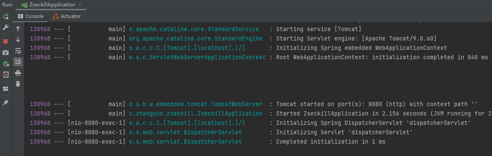

## 介绍

#### 技术点介绍


- 没有前后端分离，因为本项目主要是为了展示秒杀。
  - 我可以把他改成前后端分离的，体现工作量。

- 通过mybatis plus可以逆向生成代码到controller层；还可以继承swagger等。
  - 我：应该学一下
- RabittMQ做异步，队列缓冲，流量削峰；redis主要用作缓存。

#### 课程介绍


- 会做压测，查看秒杀的效果；然后针对碰到的问题再改进。
- 接口安全，把秒杀地址隐藏起来，防止黄牛。

## 学习目标


- 像搜索商品，这样的功能不会有，因为要突出秒杀功能；

## 如何设计一个秒杀系统

那么，如何才能更好地理解秒杀系统呢?我觉得作为一个程序员，你首先需要从高维度出发，从整体上思考问题。在我看来，**秒杀其实主要解决两个问题，一个是并发读，一个是并发写**。并发读的核心优化理念是尽量减少用户到服务端来"读"数据，或者让他们读更少的数据;并发写的处理原则也一样，它要求我们在数据库层面独立出来一个库，做特殊的处理。另外，我们还要针对秒杀系统做一些保护，针对意料之外的情况设计兜底方案，以防止最坏的情况发生。
其实，秒杀的整体架构可以概括为"稳、准、快"几个关键字。

所以从技术角度上看"稳、准、快”，就对应了我们架构上的**高可用、一致性和高性能**的要求

- 高性能。秒杀涉及大量的并发读和并发写，因此支持高并发访问这点非常关键。对应的方案比如动静分离方案、热点的发现与隔离、请求的削峰与分层过滤、服务端的极致优化
- 一致性。秒杀中商品减库存的实现方式同样关键。可想而知，有限数量的商品在同一时刻被很多倍的请求同时来减库存，减库存又分为"拍下减库存""付款减库存"以及预扣等几种，在大并发更新的过程中都要保证数据的准确性，其难度可想而知
- 高可用。现实中总难免出现一些我们考虑不到的情况，所以要保证系统的高可用和正确性，我们还要设计一个PlanB来兜底，以便在最坏情况发生时仍然能够从容应对。

## 项目搭建

#### 创建项目


- 还差一个mybatisplus依赖，一会直接去官网拷贝


- 删掉没用的文件夹，使项目清爽

#### 引入mybatisplus

1，访问官网：[安装 | MyBatis-Plus (baomidou.com)](https://baomidou.com/pages/bab2db/#release),选择springboot的依赖


```pom
<!--mybatisplus-->
        <dependency>
            <groupId>com.baomidou</groupId>
            <artifactId>mybatis-plus-boot-starter</artifactId>
            <version>3.4.0</version>
        </dependency>
```

- 选用了和视频教程相同的版本

2，复制进pom：


#### 编写springboot配置文件

1，把application.proiperties文件改成yml格式；其实两种配置文件都行：


2，按照[本文](https://blog.csdn.net/weixin_44018093/article/details/88641594)内容，把idea一切可以设置编码格式的地方设置为utf8。已经乱码的中文无法拯救。

3，编写yaml内容：

```yaml
spring:
  # thymeleaf配置
  thymeleaf:
    cache: false
  # 数据源配置
  datasource:
    # 如果用5.7版本的mysql，则name中没有cj
    driver-class-name: com.mysql.cj.jdbc.Driver
    url: jdbc:mysql://127.0.0.1:3306/seckill?useUnicode=true&characterEncoding=UTF-8&serverTimezone=Asia/Shanghai
    username: root
    password: 123456
    # hikari是springboot默认自带的，号称最快的连接池。连接池是什么：https://blog.csdn.net/cbmljs/article/details/87858536
    hikari:
      # 连接池名
      pool-name: DateHikariCP
      # 最小空闲连接数
      minimum-idle: 5
      # 空闲连接存活最大时间（ms），默认是10分钟
      idle-timeout: 1800000
      # 最大连接数，默认10
      maximum-pool-size: 10
      # 从连接池返回的连接自动提交
      auto-commit: true
      # 连接最大存活时间，0表示永久存活，默认1800000即30分钟
      max-lifetime: 1800000
      #连接超时时间30000即30秒
      connection-timeout: 30000
      # 类似心跳机制，查询连接是否可用的查询语句；如果查不出结果，说明连接是有问题的
      connection-test-query: SELECT 1
#mybatis-plus配置
mybatis-plus:
  # 配置mapper.xml映射文件的位置。mapper目录会放到resource下面，显得干净。
  mapper-locations: classpath*:/mapper/*Mapper.xml
  # 配置mybatis数据返回类型别名（默认别名是类名）：https://blog.csdn.net/daijiguo/article/details/82827430
  type-aliases-package: com.zhangyun.zseckill.pojo
# mybatis需要打印mysql，所以要准备一下日志。（注意要用方法接口所在的包，不是Mapper.xml所在的包）：https://blog.csdn.net/zlxls/article/details/77978281
logging:
  level:
    com.zhangyun.zsekill.mapper: debug

```

#### 把目录补充完整

1，因为mybatisplus设置了mapper-locations，所以要在resource目录下建立相应目录：


2，在springboot启动类的同级建立controller service等文件夹：


- service包下，一般还有一个用于实现的包。

#### 启动类处理

```java
package com.zhangyun.zseckill;

import org.mybatis.spring.annotation.MapperScan;
import org.springframework.boot.SpringApplication;
import org.springframework.boot.autoconfigure.SpringBootApplication;
//如果闲麻烦，不想在每个mapper上加@Mapper注解，就可以在启动类上加@MapperScan注解并标注需要编译生成实体类的路径(“cn.wenham.dao”)的注解。这样在编译之后都会生成相应的实现类。
@MapperScan("com.zhangyun.zseckill.mapper")
@SpringBootApplication
public class ZseckillApplication {

    public static void main(String[] args) {
        SpringApplication.run(ZseckillApplication.class, args);
    }

}
```

#### 测试项目搭建情况

1，编写controller


```java
package com.zhangyun.zseckill.controller;

import org.springframework.stereotype.Controller;
import org.springframework.ui.Model;
import org.springframework.web.bind.annotation.RequestMapping;
import org.springframework.web.bind.annotation.RequestMethod;

//测试
@Controller
@RequestMapping("zyjava")
public class DemoController {

    /**
     * 测试页面
     **/
    @RequestMapping(value = "/helloseckill", method = RequestMethod.GET)
    public String hello(Model model) {
        model.addAttribute("name", "value");
        //我：请求/zyjava/hello会被转送到本方法，本方法做视图处理后，会返回给对应thymeleaf页面展示
        return "hello";
    }
}
```

2，编写用于测试controller的页面：


```html
<!DOCTYPE html>
<!--要加上thymeleaf的命名空间-->
<html lang="en"
      xmlns:th="http://www.thymeleaf.org">
<head>
    <meta charset="UTF-8">
    <title>测试项目</title>
</head>
<body>
<!--这里显示controller传的一个参数名为“name”的参数值-->
<p th:text="'hello  '+${name}"></p>
</body>
</html>
```

- 既然用了**thymeleaf，所有页面在tempaltes中**

3,启动项目：


4，在浏览器访问`[测试项目]http://localhost:8080/zyjava/helloseckill`，可以成功看到期待的页面，说明项目底子没错：


## 分布式会话

### 实现登录功能

#### 创建用户表

通过navicat，创建数据库，以及用户表

1，新建连接本项目专属数据库连接：


- 密码为：123456

2，新建数据库：


- 数据库名，要和yml中的datasource.url中的数据库名一致。
- uft8能存的utf8mb4都能存

3，新建表：


运行建表语句：

```mysql
CREATE TABLE t_user(
	`id` BIGINT(20) NOT NULL COMMENT '手机号码，用作用户id',
	`nickname` VARCHAR(255) NOT NULL,
	`password` VARCHAR(32) DEFAULT NULL COMMENT 'MD5(MD5(pwd明文+固定salt)+salt)',
	`salt` VARCHAR(10) DEFAULT NULL,
	`head` VARCHAR(128) DEFAULT NULL COMMENT '头像',
	`register_date` datetime DEFAULT NULL COMMENT '注册时间',
	`last_login_date` datetime DEFAULT NULL COMMENT '最后一次登录时间',
	`login_count` int(11)DEFAULT '0' COMMENT'登录次数',
PRIMARY KEY(`id`)
)
```

- 注意列名用`而不是'。
- md5加密：两层MD5加密后，才会存到数据库；
  - 两次md5加密的原因，晚点细说。
- mysql5.7之后，引擎默认是innodb，可以不用设置
- 有些字段可能不会用上，只是习惯性的列在这里

运行成功，刷新数据库可以看到新建的表：


#### 两次MD5加密

1，用两次MD5加密：

- 原因：保证安全
- 第一次加密：前端进行加密，防止网络截获明文密码
- 第二次加密：服务端进行加密，加强安全性

2，为什么不把客户端加密的密码直接存入数据库？：

- 为了保障安全性
- 因为即使有盐，MD5本身安全性不是很高；比如防止万一黑客盗用了数据库，他可以根据已经加密的密文，和salt，反推出明文密码，这是很不安全的；这样就算反编译一次，得到的还是一个md5密文。

3，引入md5依赖：

```xml
        <!--        md5依赖-->
        <dependency>
            <groupId>commons-codec</groupId>
            <artifactId>commons-codec</artifactId>
        </dependency>
        <dependency>
            <groupId>org.apache.commons</groupId>
            <artifactId>commons-lang3</artifactId>
            <version>3.6</version>
        </dependency>
```

4，准备utils包专门写工具类：


5，utils包中，编写MD5工具类

```java
package com.zhangyun.zseckill.utils;

import org.apache.commons.codec.digest.DigestUtils;
import org.springframework.stereotype.Component;

//MD5工具类
@Component
public class MD5Util {
    /*
    * 进行md5加密；
    *
    * 注意这个方法是静态的，使用的时候不需要有实例
    * */
    public static String md5(String str) {
        //注意这里的类不要引错了，要用apache.commons.codec的
        return DigestUtils.md5Hex(str);
    }

    /*
    * 准备盐
    *
    * 这个盐需要和前端加密时用的盐相同
    * */
    private static final String salt = "1a2b3c4d";

    /*
    * 进行第一次加密
    *
    * 前端发送明文密码前要做的加密；这个方法应该在前端就处理了。
    * 我：不过看老师的inputPassToDBPass方法，应该是后端直接进行了两次加密，可能就算后端模拟了前端的工作量
    * */
    public static String inputPassToFromPass(String inputPass) {
        //这里salt.charAt是随意取的，个数随意，char的位置随意
        String str = ""+salt.charAt(0) + salt.charAt(2) + inputPass + salt.charAt(5) + salt.charAt(4);
        //被md5加密的是明文密码+盐的部分 所组成的字符串
        return md5(str);
    }

    /*
    * 进行第二次加密
    *
    * 后端把密文存入数据库前做的加密
    *
    * 这里形参里的salt，是后端拿到密文后，二次加密需要的盐；和前端加密用的盐不同；二次加密用的盐是自己随机出来的盐
    * */
    public static String fromPassToDBPass(String formPass, String salt) {
        String str = ""+salt.charAt(0) + salt.charAt(2) + formPass + salt.charAt(5) + salt.charAt(4);
        return md5(str);
    }

    /*
    * 后端真正执行的方法
    *
    * 我：代码是做了两次加密，没有用到前端；所以老师应该是用后端也把第一次加密做了，前端直接传输的就是明文密码。
    * */
    public static String inputPassToDBPass(String inputPass, String salt) {
        String fromPass = inputPassToFromPass(inputPass);
        String dbPass = fromPassToDBPass(fromPass, salt);
        return dbPass;
    }
      //自测MD5Util
    public static void main(String[] args) {
        //打印第一次加密后的密码:d3b1294a61a07da9b49b6e22b2cbd7f9
        System.out.println(inputPassToFromPass("123456"));
        //打印第二次加密后的密码:b7797cce01b4b131b433b6acf4add449
        //我理解：这里的salt最好和第一次加密的salt取不一样，但是老师这里取一样的salt
        System.out.println(fromPassToDBPass("d3b1294a61a07da9b49b6e22b2cbd7f9","1a2b3c4d"));
        //打印后端真正调用的：b7797cce01b4b131b433b6acf4add449,和第二行的打印相同，说明方法正确；这个字符串就是最后存入DB的
        System.out.println(inputPassToDBPass("123456","1a2b3c4d"));

    }
}

```

- 网友说：老师说这里是“习惯性的加上component注释”，但是其实工具类不用加@Component。工具类本来就使用方法就行了，根本不需要注入到容器里面

- 我和高赞网友：这里老师应该讲错了，老师之前讲的前端加密应该不是前端用javascript加密，而是前端明文传过来后端再进行两次加密

### 逆向工程

要通过逆向工程，对之前生成的t_user表单，生成对应的pojo mapper mapper.xml等文件。会使用MybatisPlus附带的逆向生成工具。

#### 再次创建一个项目

这个项目就是为了实现逆向工程。建议把逆向工程单独作为一个项目，因为后期会有很多项目需要生成不同的工具；比如不同的项目中有不同的数据库，数据库中有不同的表，每张表生成的都是不一样的。把逆向工程单独做项目的话，以后每次修改一下参数，就能逆向生成！

1，新建项目：


2，删掉不要的文件：


- 注意不要删掉iml文件。

#### 项目依赖

1，去mybatisplus官网，复制mybatis-plus依赖；黏贴到pom中:

```xml
<dependency>
    <groupId>com.baomidou</groupId>
    <artifactId>mybatis-plus-boot-starter</artifactId>
    <version>3.4.0</version>
</dependency>

```

- 使用和视频教程相同版本


2，添加代码生成器依赖：

```xml
<dependency>
    <groupId>com.baomidou</groupId>
    <artifactId>mybatis-plus-generator</artifactId>
    <version>3.4.0</version>
</dependency>
```

- 使用视频教程的版本

3，添加模板引擎的依赖：

```xml
<dependency>
    <groupId>org.freemarker</groupId>
    <artifactId>freemarker</artifactId>
    <version>2.3.30</version>
</dependency>

```

- 这里采用视频教程用的freemarker引擎；版本号保持一致。
- 模板引擎定义：[浅谈模板引擎 - 木的树 - 博客园 (cnblogs.com)](https://www.cnblogs.com/dojo-lzz/p/5518474.html)

4，添加数据库的依赖：

```xml
<!--		mysql驱动的依赖;设置范围为“运行时才生效”-->
		<dependency>
			<groupId>mysql</groupId>
			<artifactId>mysql-connector-java</artifactId>
			<scope>runtime</scope>
		</dependency>
```


#### 建立并使用 “实现逆向生成的工具类”

1，一般我们可以把官网的工具类改成我们自己想要的，修改官方工具类为如下：

```java
package com.zhangyun.generator;

import com.baomidou.mybatisplus.core.exceptions.MybatisPlusException;
import com.baomidou.mybatisplus.core.toolkit.StringPool;
import com.baomidou.mybatisplus.core.toolkit.StringUtils;
import com.baomidou.mybatisplus.generator.AutoGenerator;
import com.baomidou.mybatisplus.generator.InjectionConfig;
import com.baomidou.mybatisplus.generator.config.*;
import com.baomidou.mybatisplus.generator.config.po.TableInfo;
import com.baomidou.mybatisplus.generator.config.rules.DateType;
import com.baomidou.mybatisplus.generator.config.rules.NamingStrategy;
import com.baomidou.mybatisplus.generator.engine.FreemarkerTemplateEngine;

import java.util.*;

// 演示例子，执行 main 方法控制台输入模块表名回车自动生成对应项目目录中
public class CodeGenerator {

    /**
     * <p>
     * 读取控制台内容
     * </p>
     */
    public static String scanner(String tip) {
        //控制台输入
        Scanner scanner = new Scanner(System.in);
        StringBuilder help = new StringBuilder();
        help.append("请输入" + tip + "：");
        System.out.println(help.toString());
        if (scanner.hasNext()) {
            String ipt = scanner.next();
            if (StringUtils.isNotBlank(ipt)) {
                return ipt;
            }
        }
        throw new MybatisPlusException("请输入正确的" + tip + "！");
    }

    public static void main(String[] args) {
        // 代码生成器
        AutoGenerator mpg = new AutoGenerator();

        // 全局配置
        GlobalConfig gc = new GlobalConfig();
        //获取当前项目的路径
        String projectPath = System.getProperty("user.dir");
        //设置输出路径，在当前项目路径下
        gc.setOutputDir(projectPath + "/src/main/java");
        //作者
        gc.setAuthor("zhangyun");
        //打开输出目录
        gc.setOpen(false);
        //xml开启BaseResultMap
        gc.setBaseResultMap(true);
        //xml开启BaseColumnList
        gc.setBaseColumnList(true);
        //日期格式采用Date
        gc.setDateType(DateType.ONLY_DATE);
        // gc.setSwagger2(true); 实体属性 Swagger2 注解
        mpg.setGlobalConfig(gc);

        // 数据源配置
        DataSourceConfig dsc = new DataSourceConfig();
        //这里url中的数据库名必须为本教程之前建立的本地数据库名
        dsc.setUrl("jdbc:mysql://localhost:3306/seckill?useUnicode=true&characterEncoding=utf8&serverTimeZone=Asia"+"/Shanghai");
        // dsc.setSchemaName("public");
        dsc.setDriverName("com.mysql.cj.jdbc.Driver");//我：我在包路径中加上了cj，5.7及以后的mysql不需要cj
        dsc.setUsername("root");
        dsc.setPassword("123456");
        mpg.setDataSource(dsc);

        // 包配置
        PackageConfig pc = new PackageConfig();
        //pc.setModuleName(scanner("模块名"));
        //设置我们生成的Mapper Service等分别对应在哪个包下面：我们都放在com.zhangyun.zseckill下，这是我们秒杀项目的启动类所在目录
        pc.setParent("com.zhangyun.zseckill")
                .setEntity("pojo")
                .setMapper("mapper")
                .setService("service")
                .setServiceImpl("service.impl")
                .setController("controller");
        mpg.setPackageInfo(pc);

        // 自定义配置
        InjectionConfig cfg = new InjectionConfig() {
            @Override
            public void initMap() {
                // to do nothing
                Map<String,Object> map = new HashMap<>();
                map.put("date1","1.0.0");
                this.setMap(map);
            }
        };

        // 如果模板引擎是 freemarker
        String templatePath = "/templates/mapper.xml.ftl";
        // 如果模板引擎是 velocity
        // String templatePath = "/templates/mapper.xml.vm";

        // 自定义输出配置
        List<FileOutConfig> focList = new ArrayList<>();
        // 自定义配置会被优先输出
        focList.add(new FileOutConfig(templatePath) {
            @Override
            public String outputFile(TableInfo tableInfo) {
                // 自定义输出文件名 ， 如果你 Entity 设置了前后缀、此处注意 xml 的名称会跟着发生变化！！
                return projectPath + "/src/main/resources/mapper/" +  tableInfo.getEntityName() + "Mapper" + StringPool.DOT_XML;
            }
        });
        /*
        cfg.setFileCreate(new IFileCreate() {
            @Override
            public boolean isCreate(ConfigBuilder configBuilder, FileType fileType, String filePath) {
                // 判断自定义文件夹是否需要创建
                checkDir("调用默认方法创建的目录，自定义目录用");
                if (fileType == FileType.MAPPER) {
                    // 已经生成 mapper 文件判断存在，不想重新生成返回 false
                    return !new File(filePath).exists();
                }
                // 允许生成模板文件
                return true;
            }
        });
        */
        cfg.setFileOutConfigList(focList);
        mpg.setCfg(cfg);

        // 配置模板
        TemplateConfig templateConfig = new TemplateConfig()
        // 配置自定义输出模板
        //指定自定义模板路径，注意不要带上.ftl/.vm, 会根据使用的模板引擎自动识别
                //以下代表我们的Mapper层，service层等各层
                .setEntity("templates/entity2.java")
                .setMapper("templates/mapper2.java")
                .setService("templates/service2.java")
                .setServiceImpl("templates/serviceImpl2.java")
                .setController("templates/controller2.java");

        templateConfig.setXml(null);
        mpg.setTemplate(templateConfig);

        // 策略配置
        StrategyConfig strategy = new StrategyConfig();
        //数据库表映射到实体的命名策略：下划线转驼峰
        strategy.setNaming(NamingStrategy.underline_to_camel);
        //数据库表字段映射到实体的命名策略
        strategy.setColumnNaming(NamingStrategy.underline_to_camel);
        //lombok模型：因为整个seckill要用lombok，那么CodeGenerator就会在帮我们生成的pojo上面，附带上lombok的注解
        strategy.setEntityLombokModel(true);
        //生成 @RestController 控制器
        // strategy.setRestControllerStyle(true);
        //多个表之间可以用逗号分割，就是说它可以一下子生成一个数据库中的多张表
        strategy.setInclude(scanner("表名，多个英文逗号分割").split(","));
        strategy.setControllerMappingHyphenStyle(true);
        //表前缀：生成的pojo类会把前缀去掉，比如t_user表，就只会生成User类
        strategy.setTablePrefix("t_");
        mpg.setStrategy(strategy);
        mpg.setTemplateEngine(new FreemarkerTemplateEngine());
        mpg.execute();
    }

}

```

- 注意，数据库名，和mysql连接的账号密码必须为本地mysql有的。本文“实现登录功能”那做了数据库创建。

2，启动工具类，输入表名；发生错误：


- 这是因为正常来说，template中是entity1.java mapper1.java等，但是我这设置为2；也就是说它的模板我们可以自定义，但是我们刚刚没定义好。
- 想定义好模板，就得先找到模板

3，找模板：

把项目视图调为“project”：


在External Libraries中可以看到templates中有对应的ftl模板（即freemarker模板引擎的模板）：


4，把项目视图切换为project files，并把模板放到resource/template目录下


5，把模板名改成CodeGenerator中写的样子；并且发现CodeGenerator中没用Mapper.xml模板，所以删掉resource/template中的Mapper.xml模板：


- 网友说不用改也行，不过我还是改了

- 网友：老师这样做的意思是我们可以自定义想要的模板

6，尝试重新运行CodeGenerator；成功：


7，查看generator项目的com.zhangyun包下，能看到生成的文件：


8，把上图逆向工程项目中生成的文件，拷贝进zseckill项目：


- 直接在zseckill目录下黏贴，idea会智能自动把文件放入相应文件夹。

9，不要忘记，虽然CodeGenerator的模板没有指定Mapper.xml的模板，但Mapper.xml还是生成了，把它也拷贝进zseckill项目的对应目录：


10，检查复制进zseckill中的文件，包名是否都正常

11，我和网友理解：逆向工程就是代码生成器

### 功能开发前期准备工作

#### 登录-跳转到登录页面+静态资源准备

1，创建控制器LoginController：


```java
package com.zhangyun.zseckill.controller;

import lombok.extern.slf4j.Slf4j;
import org.springframework.stereotype.Controller;
import org.springframework.web.bind.annotation.RequestMapping;

@Controller
@RequestMapping("/login")
//用于打印日志；免去一系列复杂的日志设置
@Slf4j
public class LoginController {

    //跳转登录页面
    @RequestMapping("/toLogin")
    public String toLogin(){
        return "login";
    }
    
}
```

- 生成这么多类，不一定都会用；项目完成后，用不到的类会被删掉；这里生成这么多类，只是因为逆向工程统一生成了，但是我用不一定会用。

2，准备项目的静态资源，直接从开源项目拷贝：


3，编写前端；直接复制进来，不细说；重点是后端：


```html
<!DOCTYPE html>
<html lang="en"
      xmlns:th="http://www.thymeleaf.org">
<head>
    <meta charset="UTF-8">
    <title>登录</title>
<!--    引入一系列静态资源-->
    <!-- jquery -->
    <script type="text/javascript" th:src="@{/js/jquery.min.js}"></script>
    <!-- bootstrap -->
    <link rel="stylesheet" type="text/css" th:href="@{/bootstrap/css/bootstrap.min.css}"/>
    <script type="text/javascript" th:src="@{/bootstrap/js/bootstrap.min.js}"></script>
    <!-- jquery-validator：用于校验 -->
    <script type="text/javascript" th:src="@{/jquery-validation/jquery.validate.min.js}"></script>
    <script type="text/javascript" th:src="@{/jquery-validation/localization/messages_zh.min.js}"></script>
    <!-- layer：layui是做一些弹框的 -->
    <script type="text/javascript" th:src="@{/layer/layer.js}"></script>
    <!-- md5.js ：做加密-->
    <script type="text/javascript" th:src="@{/js/md5.min.js}"></script>
    <!-- common.js -->
    <script type="text/javascript" th:src="@{/js/common.js}"></script>
</head>
<body>
<!--表单-->
<form name="loginForm" id="loginForm" method="post" style="width:50%; margin:0 auto">

    <h2 style="text-align:center; margin-bottom: 20px">用户登录</h2>

    <div class="form-group">
        <div class="row">
            <label class="form-label col-md-4">请输入手机号码</label>
            <div class="col-md-5">
                <input id="mobile" name="mobile" class="form-control" type="text" placeholder="手机号码" required="true"
                />
                <!--             取消位数限制          minlength="11" maxlength="11"-->
            </div>
            <div class="col-md-1">
            </div>
        </div>
    </div>

    <div class="form-group">
        <div class="row">
            <label class="form-label col-md-4">请输入密码</label>
            <div class="col-md-5">
                <input id="password" name="password" class="form-control" type="password" placeholder="密码"
                       required="true"
                />
                <!--             取消位数限制            minlength="6" maxlength="16"-->
            </div>
        </div>
    </div>

    <div class="row">
        <div class="col-md-5">
            <button class="btn btn-primary btn-block" type="reset" onclick="reset()">重置</button>
        </div>
        <div class="col-md-5">
            <button class="btn btn-primary btn-block" type="submit" onclick="login()">登录</button>
        </div>
    </div>
</form>
</body>
<script>
    function login() {
        $("#loginForm").validate({
            submitHandler: function (form) {
                doLogin();
            }
        });
    }

    function doLogin() {
        //展示登录中
        g_showLoading();

        //拿到明文密码
        var inputPass = $("#password").val();
        //拿到盐
        var salt = g_passsword_salt;
        //拿到盐之后做第一次明文密码的加密
        var str = "" + salt.charAt(0) + salt.charAt(2) + inputPass + salt.charAt(5) + salt.charAt(4);
        var password = md5(str);

        //加密完成后，通过ajax调用后端的接口
        $.ajax({
            //注意url要和后端RequestMapping的完整路径一致
            url: "/login/doLogin",
            type: "POST",
            data: {
                mobile: $("#mobile").val(),
                password: password
            },
            //成功请求的话，查看后端返回的数据
            success: function (data) {
                layer.closeAll();
                //如果数据是200，说明成功，打印相关成功标识；否则打印失败
                if (data.code == 200) {
                    layer.msg("成功");
                    console.log(data);
                    document.cookie = "userTicket=" + data.object;
                    window.location.href = "/goods/toList";
                } else {
                    layer.msg(data.message);
                }
            },
            error: function () {
                layer.closeAll();
            }
        });
    }
</script>
</html>
```

- 本项目的各个html页面，依赖resource/static下导入的静态资源
- 可以看到静态资源里的common.js中的g_passsword_salt（盐）的值，和MD5加密中用得到的盐一致，这体现后端得有前端的盐。
  - 前端盐的用法，和后端也一样。
- 前端登录过程讲解：doLogin函数中有注释
  - 问答问：前端的确加密了，但是后端自己也做了两次加密是为什么？
    - 自答：可能两次加密时老师为了演示两次加密的效果；后端真实处理的时候，使用的是第二次加密的函数（而非做两次加密的函数）。


#### 登录-编写执行登录任务的准备

1，接下来应该在LoginController中编写dologin方法，dologin返回方法有返回值；不过在编写dologin之前我们要先编写公用的返回对象，在启动类同级新建vo包，vo包中有我们想要返回的一些vo对象：


2，编写respBean，即公共返回对象：


```java
package com.zhangyun.zseckill.vo;

import lombok.AllArgsConstructor;
import lombok.Data;
import lombok.NoArgsConstructor;

//getsettostring，无参构造，有参构造
@Data
@NoArgsConstructor
@AllArgsConstructor
public class RespBean {
    private long code;
    private String message;
    //返回的时候可能需要带一个对象
    private Object obj;

    //成功返回结果，这是最简单的，后续可能会加内容
    public static RespBean success() {
        return new RespBean(RespBeanEnum.SUCCESS.getCode(), RespBeanEnum.SUCCESS.getMessage(), null);
    }
    public static RespBean success(Object object) {
        return new RespBean(RespBeanEnum.SUCCESS.getCode(), RespBeanEnum.SUCCESS.getMessage(), object);
    }
    /*
    * 失败返回结果
    *
    * 为什么成功不用传枚举，失败要传呢？：成功只有200；失败各有不同，如403 404 502等
    * */
    public static RespBean error(RespBeanEnum respBeanEnum) {
        return new RespBean(respBeanEnum.getCode(), respBeanEnum.getMessage(), null);
    }
    public static RespBean error(RespBeanEnum respBeanEnum, Object object) {
        return new RespBean(respBeanEnum.getCode(), respBeanEnum.getMessage(), object);
    }

}

```

- 本服务端执行前端的请求成功的话，会给前端返回success

3，编写公共返回对象respBean的枚举：


```java
package com.zhangyun.zseckill.vo;

import lombok.AllArgsConstructor;
import lombok.Getter;
import lombok.ToString;

//get方法,toString方法，全参构造
@Getter
@ToString
@AllArgsConstructor
public enum RespBeanEnum {
    //编写枚举成员
    SUCCESS(200,"SUCCESS"),
    ERROR(500,"服务端异常");

    //准备 状态码，状态码相应信息
    private final Integer code;
    private final String message;
}

```

- 这个枚举对整个代码是更加有帮助的一个东西
- 枚举里面的东西是状态，包含：
  - 状态码
  - 常用的信息提示

- 这里使用了lombok，如果lombok注解爆红，要在idea中安装lombok插件，并且要让项目启用插件。

- 这里枚举用了成员变量；枚举成员小括号中的值从左到右，是成员变量从上到下的顺序；可以参考[(22条消息) Java enum常见的用法_浮生夢的博客-CSDN博客_enum java](https://blog.csdn.net/echizao1839/article/details/80890490)

#### 测试跳转到登录页

1，先看看页面跳转能用吗，启动项目；报错：

```
org.springframework.beans.factory.UnsatisfiedDependencyException: Error creating bean with name 'userServiceImpl': Unsatisfied dependency expressed through field 'baseMapper'; nested exception is org.springframework.beans.factory.NoSuchBeanDefinitionException: No qualifying bean of type 'com.zhangyun.zseckill.mapper.UserMapper' available: expected at least 1 bean which qualifies as autowire candidate. Dependency annotations: {@org.springframework.beans.factory.annotation.Autowired(required=true)}

Caused by: org.springframework.beans.factory.NoSuchBeanDefinitionException: No qualifying bean of type 'com.zhangyun.zseckill.mapper.UserMapper' available: expected at least 1 bean which qualifies as autowire candidate. Dependency annotations: {@org.springframework.beans.factory.annotation.Autowired(required=true)}
```

- 报错：UserMapper没有找到，至少需要一个bean；但我们已经在启动类上加了Mapper.scan啊，这是为什么？

2，这是因为启动类的MapperScan注解中把bean偶在的包名写错了：


3，改成如下就好：


- 本文代码已同步修改

4，重新启动项目，成功：


5，访问`http://localhost:8080/login/toLogin`，但是没有返回页面，只显示了一个字符串：


6，这是因为LoginController的@restcontroller注解直接把返回值写进httpresponse中了：


- restcontroler默认给这个类的所有方法加上responsebody，这样return就返回对象，而不是做页面跳转。

7，把注解改成前后端不分离的@Controller即可：


- 本文代码已同步修改

8，重启项目，访问`http://localhost:8080/login/toLogin`:


- 成功来到登录页面。

### 开发登录任务

#### dologin基本功能与前端盐的作用

1，编写dologin方法的参数所需要的vo：


```java
package com.zhangyun.zseckill.vo;

import lombok.Data;

@Data
public class LoginVo {
    
    private String mobile;
    
    private String password;
}

```

2，编写dologin方法，先返回null，测试盐的功能：

```java
    /*
    * 用于处理账号密码登录的登录功能
    * */
    @RequestMapping("/doLogin")
    //既然是返回respbean，那么这里必须加上responsebody
    @ResponseBody
    //要传递参数如手机号和密码进来，就要编写一个参数vo
    public RespBean doLogin(LoginVo loginVo){
        //这里能直接使用log，是因为本类使用了lombok+sl4j注解
        log.info("{}",loginVo);
        return null;
    }
```

3，输入密码123456，手机号任意；点击登录：


4，在idea控制台，可以看到dologin方法打印的接收到的，从前端发来的一次MD5加密后的密码：


5，打开MD5UTIL，运行自测用的main函数，看第一次加密后的密码；发现和前端不一致：


6，经过检查发现，前端拿盐加密时，最开头有一个空字符串，而后端没有：


- 网友：警惕两个char 类型的直接相加！

7，把MD5UTIL中的加密，也加上空字符串：


- 本位代码已同步更新

8，重新启动MD5UTIL的main函数测试，这回第一次加密后的密码和前端加密的结果对上了：


- 这说明前端传送的MD5加密密码，传到后端后处理应该不会有太大问题的。

#### 实现登录逻辑

1，找到service层，看到有IUserService；有它就可以直接在Controller中注入它。


2，在logincontroller中注入service层


3，修改logincontroller中的dologin方法，让他调用service层：


4，在IUserService接口中创建doLogin方法声明：


5，在service的实现类中实现service层关于dologin的方法;service层涉及了登录逻辑：

```java
package com.zhangyun.zseckill.service.impl;

import com.baomidou.mybatisplus.extension.service.impl.ServiceImpl;
import com.zhangyun.zseckill.mapper.UserMapper;
import com.zhangyun.zseckill.pojo.User;
import com.zhangyun.zseckill.service.IUserService;
import com.zhangyun.zseckill.utils.MD5Util;
import com.zhangyun.zseckill.utils.ValidatorUtil;
import com.zhangyun.zseckill.vo.LoginVo;
import com.zhangyun.zseckill.vo.RespBean;
import com.zhangyun.zseckill.vo.RespBeanEnum;
//import org.apache.commons.lang3.StringUtils;
import org.springframework.beans.factory.annotation.Autowired;
import org.springframework.stereotype.Service;
import org.springframework.util.StringUtils;

/**
 * <p>
 *  服务实现类
 * </p>
 *
 * @author zhangyun
 * @since 2022-03-26
 */
@Service
public class UserServiceImpl extends ServiceImpl<UserMapper, User> implements IUserService {

    //注入userMapper用于数据库操作
    /*
    * idea中userMapper爆红并提示“Could not autowire. No beans of 'UserMapper' type found”的话，没事，
    * 因为项目的启动类加了注解@MapperScan("com.zhangyun.zseckill.mapper")，会扫描到mapper作为bean的
    * 这个红色波浪线可以忽略
    * */
    @Autowired
    private UserMapper userMapper;

    /*
    * 登录
    * */
    @Override
    public RespBean doLogin(LoginVo loginVo) {
        String mobile = loginVo.getMobile();
        String password=loginVo.getPassword();

        /*
        * 虽然前端已经做了初步校验，但是后端还要再做一遍，因为后端是最后防线;
        * */
        // 判断用户名密码是否为空；老师用的spring框架的，我也跟着吧
        if (StringUtils.isEmpty(mobile) || StringUtils.isEmpty(password)) {
            return RespBean.error(RespBeanEnum.LOGIN_ERROR);
        }
        //判断手机号合法性
        if (!ValidatorUtil.isMobile(mobile)) {
            return RespBean.error(RespBeanEnum.MOBILE_ERROR);
        }

        /*
        * 合法性都没问题的话，就进行数据库查询了
        * */
        //根据手机号获取用户
        User user = userMapper.selectById(mobile);
        if(null==user){
            return RespBean.error(RespBeanEnum.LOGIN_ERROR);
        }
        //判断密码是否正确：即对收到的前端一次加密的密码，在本服务端再次加密，查看二次加密后的结果是否与数据库存储的二次加密效果相同
        if (!MD5Util.fromPassToDBPass(password, user.getSalt()).equals(user.getPassword())) {
            return RespBean.error(RespBeanEnum.LOGIN_ERROR);
        }

        //service层做的一切校验都ok，就返回成功
        return RespBean.success();
    }
}

```

6，在RespBeanEnum中添加，登录相关的枚举：


- 登录还是要显示一些登录的信息，不要直接写服务端异常，这样对用户的体验度比较好。

7，新建一个用于手机号码校验的工具类：


```java
package com.zhangyun.zseckill.utils;

import org.thymeleaf.util.StringUtils;

import java.util.regex.Matcher;
import java.util.regex.Pattern;

/**
 * 手机号码校验类
 *
 * @author: zhangyun
 * @ClassName: ValidatorUtil
 */
public class ValidatorUtil {

    //使用正则表达式限制手机号的形式
    private static final Pattern mobile_patten = Pattern.compile("[1]([3-9])[0-9]{9}$");

    /**
     * 手机号码校验
     * @author zhangyun
     * @operation add
     * @param mobile
     * @return boolean
     **/
    public static boolean isMobile(String mobile) {
        //手机为空是无法校验的
        if (StringUtils.isEmpty(mobile)) {
            return false;
        }
        //手机号不为空则用正则表达式校验
        Matcher matcher = mobile_patten.matcher(mobile);
        return matcher.matches();
    }
}

```

8，登录本地数据库，在t_user中加入一条数据：


- 密码填MD5对123456二次加密后的密码`b7797cce01b4b131b433b6acf4add449`。

- 数据库这填入盐为密码在后端第二次加密时用的盐；只是本项目中第二次和第一次加密用的盐一样。

- 暂没填入的数据先不管。

- 我们相当于有了一条用户数据。

#### 测试登录功能的逻辑

1，重启项目：


2，测试手机格式，成功：


3，测试用户名密码不匹配的情况


4，演示正确登录的情况；输入数据库中有的手机号，和对应的明文密码（123456）；成功登录：


- 还没编写tolist跳转，所以404；

  

- 不过正是登录成功了才会去跳转到tolist。

5，所以登录功能是没问题的。


### 自定义注解参数校验

#### 使用非自定义注解

1，登录过程中做了很多的参数校验，可能在其他类中也可能有类似这些参数校验的健壮性判断；如果每个类都去准备这些健壮性判断的话，会显得很麻烦；所以我们用js303做参数校验，从而简化代码。

2，pom导入validation组件的依赖：

```xml
<!--        validation组件-->
        <dependency>
            <groupId>org.springframework.boot</groupId>
            <artifactId>spring-boot-starter-validation</artifactId>
        </dependency>
```

- 记住复制进依赖后，点击idea右上角的蓝色m，把依赖导入项目

3，在`LoginController.java`中，方法的参数处加上注解`@Valid`；有了这个注解后，方法的入参就会被进行相应的校验:


4，进入参数loginvo所属的类`LoginVo`中，添加注解：


- 注意：@notnull导包的时候不要导错了。

5，constrain包点进去，可以看到有各种可用注解：


#### 自定义注解

1，现在尝试自定义注解来实现校验；在LoginVo.java的mobile参数上，加一个@IsMobile()注解；我们将实现该注解，来自动完成原先由ValidatorUtil.java完成的功能：


2，新建包，再新建注解`IsMobile`：


- 注意：注解名大写

3，自定义注解其实很简单，把@notnull注解中有用的的东西，拷贝进IsMobile注解：


- @Repeatable没用，就别拷贝来

4，编写自定义的IsMobile注解的内容：

```java
package com.zhangyun.zseckill.validator;

import javax.validation.Constraint;
import javax.validation.Payload;
import java.lang.annotation.*;

/**
 * 验证手机号
 * */
@Target({ElementType.METHOD, ElementType.FIELD, ElementType.ANNOTATION_TYPE, ElementType.CONSTRUCTOR, ElementType.PARAMETER, ElementType.TYPE_USE})
@Retention(RetentionPolicy.RUNTIME)
@Documented
@Constraint(
        //准备一个对应的校验的类，类中定义自己校验的规则
        validatedBy = {IsMobileValidator.class}
)
public @interface IsMobile {
    //自己加一个属性，要求是否必填；默认必填
    boolean required() default true;

    //消息就是报错的消息
    String message() default "手机号码格式错误";

    Class<?>[] groups() default {};

    Class<? extends Payload>[] payload() default {};
}

```

5，编写validatedBy需要的指定自定义校验规则的类IsMobileValidator：


```java
package com.zhangyun.zseckill.validator;

import com.zhangyun.zseckill.utils.ValidatorUtil;
import org.thymeleaf.util.StringUtils;

import javax.validation.ConstraintValidator;
import javax.validation.ConstraintValidatorContext;

/**
 * 手机号码校验规则
 *
 * @author: 张云
 * @ClassName: IsMobileValidator
 */
public class IsMobileValidator implements ConstraintValidator<IsMobile, String> {

    //记录是否是必填的
    private boolean required = false;

    //初始化参数，即拿到使用注解时填的参数的值
    @Override
    public void initialize(IsMobile constraintAnnotation) {
//        ConstraintValidator.super.initialize(constraintAnnotation);
        //获取到使用注解时填的required值为true或false
        required = constraintAnnotation.required();
    }

    //（根据参数）编写校验规则
    @Override
    public boolean isValid(String s, ConstraintValidatorContext constraintValidatorContext) {
        if (required) {//如果写注解时设置的是必填，那么通过之前自己编写的校验类工具ValidatorUtil来返回是否是合格手机号
            return ValidatorUtil.isMobile(s);
        } else {//非必填的话
            if (StringUtils.isEmpty(s)) {//因为是非必填，如果是空就可以直接返回true
                return true;
            } else {//非必填，但是填了，那么就需要通过之前自己编写的校验类工具ValidatorUtil来返回是否是合格手机号
                return ValidatorUtil.isMobile(s);
            }
        }
    }
}

```

6，注释掉service层关于电话号码校验的代码，因为自定义的IsMobile注解已经实现相应功能：


7，重启项目，输入不合法的电话号，执行登录操作：

前端可以看到doLogin请求失败了：


后台idea报warning，这个warning正是我们加注解的结果，打印的也是IsMobile注解规定的值：

```
2022-03-28 21:14:58.428  WARN 69052 --- [nio-8080-exec-8] .w.s.m.s.DefaultHandlerExceptionResolver : Resolved [org.springframework.validation.BindException: org.springframework.validation.BeanPropertyBindingResult: 1 errors<EOL>Field error in object 'loginVo' on field 'mobile': rejected value [111]; codes [IsMobile.loginVo.mobile,IsMobile.mobile,IsMobile.java.lang.String,IsMobile]; arguments [org.springframework.context.support.DefaultMessageSourceResolvable: codes [loginVo.mobile,mobile]; arguments []; default message [mobile],true]; default message [手机号码格式错误]]
```

8，现在错误提示没在页面上展示，而是在控制输出台展示：

- 因为异常只是普通抛出，没有正确处理并让前端显示
- 后面我们要定义异常，把这个异常信息正确地展示到前端页面

#### 异常处理

1，上一小节的BindException，应该被捕获，然后抛出对应的信息，并让前端展示；我们通过ControllerAdvice和ExceptionHandler两个组合注解来处理，因为虽然这两个组合注解只能处理控制器抛出的异常，但是这两个组合注解的自由度更大。

- 有人想用ErrorException类处理的话，也可以；errorcontroller类可以处理所有位置的异常，包括未进入控制器的异常。
- ControllerAdvice可以定义多个拦截方法，拦截不同的异常类，并抛出对应的异常信息，自由度更高。

2，创建处理异常的包exception，包中定义一个类GlobalException（全局异常）：


```java
package com.zhangyun.zseckill.exception;

import com.zhangyun.zseckill.vo.RespBeanEnum;
import lombok.AllArgsConstructor;
import lombok.Data;
import lombok.NoArgsConstructor;

/**
 * 全局异常
 *
 * @author: zhangyun
 * @ClassName: GlobalException
 */
@Data
@NoArgsConstructor
@AllArgsConstructor
public class GlobalException extends RuntimeException {

    //全局异常中放返回的responsebean的枚举，因为该枚举里存了相应的状态码和对应的信息，有它就够了。
    private RespBeanEnum respBeanEnum;

}
```

2，创建异常处理类GlobalExceptionHandler：

```java
package com.zhangyun.zseckill.exception;

import com.zhangyun.zseckill.vo.RespBean;
import com.zhangyun.zseckill.vo.RespBeanEnum;
import org.springframework.validation.BindException;
import org.springframework.web.bind.annotation.ExceptionHandler;
import org.springframework.web.bind.annotation.RestControllerAdvice;


/**
 * 全局异常处理类
 *
 * @author: zhangyun
 * @ClassName: GlobalExceptionHandler
 */
//类上加了@RestControllerAdvice，那么返回的就是一个responsebody，就不用在方法上具体返回
@RestControllerAdvice
//我：类名虽然叫GlobalExceptionHandler，但我认为它除了GlobalException，也会在Controller层处理其他所有各种异常
public class GlobalExceptionHandler {

    //@ExceptionHandler()括号中填入要处理的异常的类；这里选Exception.class（所有异常的父类），表示处理所有异常
    @ExceptionHandler(Exception.class)
    public RespBean ExceptionHandler(Exception e) {
        //如果捕捉到的异常，属于刚刚定义的全局的异常，就返回该全局异常中的存的RespBeanEnum
        if (e instanceof GlobalException) {
            GlobalException exception = (GlobalException) e;
            return RespBean.error(exception.getRespBeanEnum());
        } else if (e instanceof BindException) {//如果捕捉到的异常是绑定异常，就返回该绑定异常的信息
            BindException bindException = (BindException) e;//把e强制转换为BindException，好从BindException中获取前端需要的错误提示信息“手机号码格式错误”
            //拿到一个bind_error对应的respbean；但是这个信息不够，这里的信息只是RespBeanEnum中绑定的信息“参数校验异常”，不是很符合；我们想把绑定异常抛出来的信息“手机号码格式错误”拿到
            RespBean respBean = RespBean.error(RespBeanEnum.BIND_ERROR);
            //之前报错提示“1 errors”，所以直接get(0)可以得到第一个也即是唯一的异常；getDefaultMessage()可以获取到默认的信息即报错打印的“手机号码格式错误”；这样就把respBean存的信息详细化了
            respBean.setMessage("参数校验异常：" + bindException.getBindingResult().getAllErrors().get(0).getDefaultMessage());
            //我推测：让controller层的LoginController类的doLogin，把含有BindException中的提示信息的respBean，返回给前端
            return respBean;
        }
        //如果之前的异常匹配都没匹配上，就抛出RespBeanEnum中定义的默认ERROR异常（500异常是个框，服务器有问题都可以往里装）
        System.out.println("异常信息" + e);
        return RespBean.error(RespBeanEnum.ERROR);
    }
}

```

- 我强调：ExceptionHandler会在controller层处理 所有层发生的所有异常，前提是异常要被传到controller层。
- ExceptionHandler的处理异常的能力来源于@RestControllerAdvice
- 我推测：调用doLogin导致的错误，所以会让controller层的LoginController类的doLogin，把含有BindException中的提示信息的respBean，返回给前端；让前端展示错误提示。

3，RespBeanEnum中添加BIND_ERROR：


4，之前UserServiceImpl代码，负责业务逻辑，也可以对他做修改：


- 但是这两处修改与bindexception无关；所以这两处修改与使用注解校验手机号后，前端无法显示Ismobile的message无关

5，测试，使用错误电话号：

前端收到对应message：


因为代码ExceptionHandler处理了异常，后端控制台不会打印异常：



6，测试，使用正确电话号+错误密码：

前端收到对应message：


后端也没打印异常。

7，我分析：

- 之前前端无法显示message，并报bindingexception，所以在GlobalExceptionHandler中人为处理了bindingexception异常；
- 发生bindingexception时，且bindingexception被传到controller层时，ExceptionHandler会返回一个message被修改过的respBean；修改的内容就是为了在message中加上之前报错提示的“手机号码格式错误“；
- 调用doLogin引发bindingexception，导致ExceptionHandler返回的respBean，会被doLogin返回给前端，这样前端就能从respBean中解读出信息并显示在自己的页面上了。
  - 之前bindingexception发生后，没有被处理，所以bindingexception的message无法被装进respBean传递给前端，所以前端没有错误提示。
  - 不使用注解而只使用ValidatorUtil时，`!ValidatorUtil.isMobile(mobile)`判断手机号不合法时，会直接返回包含`RespBeanEnum.MOBILE_ERROR`信息的respBean给前端，所以前端能展示提示。
  - 所以**重点**是：前端登录页面必须收到后端发的respBean才能正确打印各类提示信息；如果由于发生bindingexception导致respbean无法发送的话，就会导致前端无法显示，所以要手动处理bindingexception使发生bindingexception时也能给前端返回respbean。


### 完善登录功能

#### cookie处理

1，商品秒杀抢购页面需要判断当前用户是否登录了，没登录则不让参与秒杀；所以登陆成功后要给用户一个状态，最简单的实现就是给cookie一个Session。

2，编写cookie工具类：


```java
package com.zhangyun.zseckill.utils;

import javax.servlet.http.Cookie;
import javax.servlet.http.HttpServletRequest;
import javax.servlet.http.HttpServletResponse;
import java.io.UnsupportedEncodingException;
import java.net.URLDecoder;
import java.net.URLEncoder;

/**
 * Cookie工具类
 *
 * @author: zhangyun
 * @ClassName: CookieUtil
 */
public final class CookieUtil {

    /**
     * 得到Cookie的值, 不编码
     *
     * @param request
     * @param cookieName
     * @return
     */
    public static String getCookieValue(HttpServletRequest request, String cookieName) {
        return getCookieValue(request, cookieName, false);
    }

    /**
     * 得到Cookie的值,
     *
     * @param request
     * @param cookieName
     * @return
     */
    public static String getCookieValue(HttpServletRequest request, String cookieName, boolean isDecoder) {
        Cookie[] cookieList = request.getCookies();
        if (cookieList == null || cookieName == null) {
            return null;
        }
        String retValue = null;
        try {
            for (int i = 0; i < cookieList.length; i++) {
                if (cookieList[i].getName().equals(cookieName)) {
                    if (isDecoder) {
                        retValue = URLDecoder.decode(cookieList[i].getValue(), "UTF-8");
                    } else {
                        retValue = cookieList[i].getValue();
                    }
                    break;
                }
            }
        } catch (UnsupportedEncodingException e) {
            e.printStackTrace();
        }
        return retValue;
    }

    /**
     * 得到Cookie的值,
     *
     * @param request
     * @param cookieName
     * @return
     */
    public static String getCookieValue(HttpServletRequest request, String cookieName, String encodeString) {
        Cookie[] cookieList = request.getCookies();
        if (cookieList == null || cookieName == null) {
            return null;
        }
        String retValue = null;
        try {
            for (int i = 0; i < cookieList.length; i++) {
                if (cookieList[i].getName().equals(cookieName)) {
                    retValue = URLDecoder.decode(cookieList[i].getValue(), encodeString);
                    break;
                }
            }
        } catch (UnsupportedEncodingException e) {
            e.printStackTrace();
        }
        return retValue;
    }

    /**
     * 设置Cookie的值 不设置生效时间默认浏览器关闭即失效,也不编码
     */
    public static void setCookie(HttpServletRequest request, HttpServletResponse response, String cookieName,
                                 String cookieValue) {
        setCookie(request, response, cookieName, cookieValue, -1);
    }

    /**
     * 设置Cookie的值 在指定时间内生效,但不编码
     */
    public static void setCookie(HttpServletRequest request, HttpServletResponse response, String cookieName,
                                 String cookieValue, int cookieMaxage) {
        setCookie(request, response, cookieName, cookieValue, cookieMaxage, false);
    }

    /**
     * 设置Cookie的值 不设置生效时间,但编码
     */
    public static void setCookie(HttpServletRequest request, HttpServletResponse response, String cookieName,
                                 String cookieValue, boolean isEncode) {
        setCookie(request, response, cookieName, cookieValue, -1, isEncode);
    }

    /**
     * 设置Cookie的值 在指定时间内生效, 编码参数
     */
    public static void setCookie(HttpServletRequest request, HttpServletResponse response, String cookieName,
                                 String cookieValue, int cookieMaxage, boolean isEncode) {
        doSetCookie(request, response, cookieName, cookieValue, cookieMaxage, isEncode);
    }

    /**
     * 设置Cookie的值 在指定时间内生效, 编码参数(指定编码)
     */
    public static void setCookie(HttpServletRequest request, HttpServletResponse response, String cookieName,
                                 String cookieValue, int cookieMaxage, String encodeString) {
        doSetCookie(request, response, cookieName, cookieValue, cookieMaxage, encodeString);
    }

    /**
     * 删除Cookie带cookie域名
     */
    public static void deleteCookie(HttpServletRequest request, HttpServletResponse response,
                                    String cookieName) {
        doSetCookie(request, response, cookieName, "", -1, false);
    }

    /**
     * 设置Cookie的值，并使其在指定时间内生效
     *
     * @param cookieMaxage cookie生效的最大秒数
     */
    private static final void doSetCookie(HttpServletRequest request, HttpServletResponse response,
                                          String cookieName, String cookieValue, int cookieMaxage, boolean isEncode) {
        try {
            if (cookieValue == null) {
                cookieValue = "";
            } else if (isEncode) {
                cookieValue = URLEncoder.encode(cookieValue, "utf-8");
            }
            Cookie cookie = new Cookie(cookieName, cookieValue);
            if (cookieMaxage > 0)
                cookie.setMaxAge(cookieMaxage);
            if (null != request) {// 设置域名的cookie
                String domainName = getDomainName(request);
                System.out.println(domainName);
                if (!"localhost".equals(domainName)) {
                    cookie.setDomain(domainName);
                }
            }
            cookie.setPath("/");
            response.addCookie(cookie);
        } catch (Exception e) {
            e.printStackTrace();
        }
    }

    /**
     * 设置Cookie的值，并使其在指定时间内生效
     *
     * @param cookieMaxage cookie生效的最大秒数
     */
    private static final void doSetCookie(HttpServletRequest request, HttpServletResponse response,
                                          String cookieName, String cookieValue, int cookieMaxage, String encodeString) {
        try {
            if (cookieValue == null) {
                cookieValue = "";
            } else {
                cookieValue = URLEncoder.encode(cookieValue, encodeString);
            }
            Cookie cookie = new Cookie(cookieName, cookieValue);
            if (cookieMaxage > 0) {
                cookie.setMaxAge(cookieMaxage);
            }
            if (null != request) {// 设置域名的cookie
                String domainName = getDomainName(request);
                System.out.println(domainName);
                if (!"localhost".equals(domainName)) {
                    cookie.setDomain(domainName);
                }
            }
            cookie.setPath("/");
            response.addCookie(cookie);
        } catch (Exception e) {
            e.printStackTrace();
        }
    }

    /**
     * 得到cookie的域名
     */
    private static final String getDomainName(HttpServletRequest request) {
        String domainName = null;
        // 通过request对象获取访问的url地址
        String serverName = request.getRequestURL().toString();
        if (serverName == null || serverName.equals("")) {
            domainName = "";
        } else {
            // 将url地下转换为小写
            serverName = serverName.toLowerCase();
            // 如果url地址是以http://开头  将http://截取
            if (serverName.startsWith("http://")) {
                serverName = serverName.substring(7);
            }
            int end = serverName.length();
            // 判断url地址是否包含"/"
            if (serverName.contains("/")) {
                //得到第一个"/"出现的位置
                end = serverName.indexOf("/");
            }

            // 截取
            serverName = serverName.substring(0, end);
            // 根据"."进行分割
            final String[] domains = serverName.split("\\.");
            int len = domains.length;
            if (len > 3) {
                // www.xxx.com.cn
                domainName = domains[len - 3] + "." + domains[len - 2] + "." + domains[len - 1];
            } else if (len <= 3 && len > 1) {
                // xxx.com or xxx.cn
                domainName = domains[len - 2] + "." + domains[len - 1];
            } else {
                domainName = serverName;
            }
        }

        if (domainName != null && domainName.indexOf(":") > 0) {
            String[] ary = domainName.split("\\:");
            domainName = ary[0];
        }
        return domainName;
    }
}

```

3，编写uuid工具类，本工具类用来生成cookie：

```java
package com.zhangyun.zseckill.utils;

import java.util.UUID;

/**
 * UUID工具类
 *
 * @author: zhangyun
 * @ClassName: UUIDUtil
 */
public class UUIDUtil {

    //生成uuid，并把-替换掉
    public static String uuid() {
        return UUID.randomUUID().toString().replace("-", "");
    }
}

```

4，在service层，添加逻辑服务的代码：


- 前端收到代表成功的respBean时，就能根据respBean中的message和code做前端的工作。
- 问答问：像cookie和session等信息，是往req中传还是往resp中？
  - 我：我记得是放到resp返回给客户端


5，在LoginController中添加添加两个入参req resp，好把用户信息+用户cookie存入session：


同时修改IUserService接口的内容：


#### 跳往商品页

1，登录成功后就到商品列表页面，点击“选中商品”就可以去进行秒杀的活动

2，在前端的login.html加上登录成功后的跳转请求：


3，既然要跳往商品页，就需要新建一个GoodsController来处理`/goods/toList`请求：


```java
package com.zhangyun.zseckill.controller;

import com.zhangyun.zseckill.pojo.User;
import org.springframework.stereotype.Controller;
import org.springframework.ui.Model;
import org.springframework.web.bind.annotation.CookieValue;
import org.springframework.web.bind.annotation.RequestMapping;
import org.thymeleaf.util.StringUtils;

import javax.servlet.http.HttpSession;

@Controller
@RequestMapping("/goods")
public class GoodsController {

    /**
     * 跳转到商品列表页
     * */
    @RequestMapping("/toList")
    //session获取用户信息和cookie；model做页面跳转时，把商品信息传给前端；传入userTicket即为cookieValue,可以通过@CookieValue拿到，@CookieValue括号中指定的是cookieName
    public String toList(HttpSession session, Model model,@CookieValue("userTicket") String userTicket){
        /*
        * 刚刚登录的时候，把相应的用户信息存储起来了，这里就可以获取用户信息
        * */
        //如果ticket为空就登录（防止用户直接访问toList尝试来到商品页）
        if(StringUtils.isEmpty(userTicket)){
            return "login";
        }
        /*
        * session中通过kv存储了userTicket（即cookieValue）和User，这里通过userTicket拿到user；
        * 我推测：getAttribute拿到的object本身就是一个User，所以才能强转为User
        *
        * session中没有用户的值，即用户未登录，跳往登录页面
        * */
        User user = (User)session.getAttribute(userTicket);
        if(user==null){
            return "login";
        }

        //把用户信息传入到前端
        model.addAttribute("user",user);
        return "goodsList";
    }
}

```

- 注意：`return "goodsList";`不要写成`return "goodList";`，否则goodsList页面会显示”无法识别user“

4，编写商品列表页（极简实例）：


```html
<!DOCTYPE html>
<html lang="en"
      xmlns:th="http://www.thymeleaf.org">
<head>
    <meta charset="UTF-8">
    <title>商品列表</title>
</head>
<body>
    <p th:text="'hello'+${user.nickname}"></p>
</body>
</html>
```

#### 测试

1，启动项目，输入本地数据库中存在数据，点击登录；成功把数据库中的内容展示到前端：


- 我记得好像：user会被自动被转成json传给前端，前端就能自动识别user结构，并根据前端指令从user中拿到nickname。

### 分布式session问题

#### 问题定义与解决思路

1，一个tomcat可以承担几百条的访问量，但是秒杀可能有几十万的瞬时访问量，所以就要用多台tomcat，并用Nginx做请求转发（Nginx默认负载均衡策略为轮询）；Nginx可能请求转发给tomcat1让tomcat1上有用户的登录session，但是过会把请求转发给tomcat2，此时tomcat2上没有用户的session，就得重新登录，很麻烦；这就是所谓的“分布式session问题”。


2，分布式session的解决方案：

- Session复制
  - 优点
    - 无需修改代码，只需要修改Tomcat配置。
  - 缺点
    - Session同步传输占用内网带宽
    - 多台Tomcat同步性能指数级下降 
    - Session占用内存，无法有效水平扩展
- 前端存储
  - 优点
    - 不占用服务端内存。
  - 缺点
    - 存在安全风险:cookie在前端且是明文。
    - 数据大小受cookie限制
    - 占用外网带宽（前端传到后端，发送cookie存的session对象，占用外网带宽）
-  Session粘滞
  - 优点
    - 无需修改代码
    - 服务端可以水平扩展。
  - 缺点
    - 增加新机器，会重新Hash，导致重新登录
    - 应用重启，需要重新登录

- 后端集中存储。 
  - 优点
    - 安全(不用把数据存在前端，前端看不到)
    - 容易水平扩展。
  - 缺点
    - 增加复杂度
    - 需要修改代码

- redis

3，本项目解决分布式Session问题：使用redis！

- redis是在内存里存储数据结构，操作速度比关系型数据库如MySQL oracle高。
- redis可以做数据库，缓存，消息中间件
- 本项目redis只有单体，没做集群（可以后期自己改进）。

#### 安装redis

1，要安装redis5.0.5，原因：

- 5版本是比较主流的
- 虽然6版本引入了多线程，但是6版本的多线程是针对网络传输套接字，对数据操作没太大影响；用5就性能不错了。
  - [参考阅读Redis单线程为什么这么快？看完秒懂了... - 小姜姜 - 博客园 (cnblogs.com)](https://www.cnblogs.com/linkeke/p/15683355.html)

2，登录[官网](https://download.redis.io/releases/)下载


3，把压缩包通过xshell上传到本地虚拟机，并解压`tar zxvf redis-5.0.5.tar.gz `：


3，redis是c编写的，所以要先安装一些依赖：

```
yum -y install gcc-c++ automake autoconf
```


4，编译：

```
make
```


5，自定义安装目录地安装redis：

```
 make PREFIX=/usr/local/redis install
```


6，进入安装了redis的位置，再进入bin目录，可以看到很多关于启动的命令：


- 重点关注redisserver

7，到redis解压文件，复制`redis.conf`到redis安装目录：


```
cp redis.conf /usr/local/redis/bin
```


8，修改redis.conf：


- 学习阶段不绑定网络


- 关闭保护模式


- 设置redis为后台启动

其他的部分就不修改了`ESC`退出输入模式，`:wq`保存并退出。

9，让redisserver以redisconf规定的方式启动：

```
./redis-server redis.conf
```


- 启动后没有图标，说明是按照redisconf配置的后台启动方式启动。

10，可以用下面命令检查redis是否启动成功：

```
ps -ef|grep redis
```


11，使用rediscli去连接已经启动的redisserver：

```
./redis-cli
```


- redisserver回复了pong，说明连接成功

12，[安装](http://docs.redisdesktop.com/en/docs/install/)redis可视化客户端工具“redis desktop manager”：

略。。官方版本要钱。

#### redis操作命令

1，略，详情见redis转门的笔记。

2，注意：

- redis的nx xx命令，可以设置分布式锁。

#### SpringSession实现分布式Session

1，可以通过redis实现分布式session，有两种方案：

- 第一种为springsession：简单，且不太需要变更代码。

- 第二种：redis存储用户信息

本节先使用第一种springsession的方法！

2，项目pom中添加依赖，

```xml
<!--        spring data redis的依赖：因为我们要通过redis实现分布式session，这个是必备的！-->
        <dependency>
            <groupId>org.springframework.boot</groupId>
            <artifactId>spring-boot-starter-data-redis</artifactId>
        </dependency>
<!--        对象池的依赖。redis2.0使用lettuce的客户端，lettuce是线程安全的，lettuce需要对象池-->
        <dependency>
            <groupId>org.apache.commons</groupId>
            <artifactId>commons-pool2</artifactId>
        </dependency>
<!--        springsession的依赖；springsession默认用的就是redis，其实用jdbc和mongodb也可以，原理都一样：把session存在一个单独的第三方去处理-->
        <dependency>
            <groupId>org.springframework.session</groupId>
            <artifactId>spring-session-data-redis</artifactId>
        </dependency>
```

3，引入了SpringSession的依赖，就要去yml配置它:

```yml
spring:
  # redis配置
  redis:
    # 服务器地址
    host: 120.53.244.17
    # 端口号
    port: 6379
    # 默认操作的数据库号
    database: 0
    # 超时时间
    timeout: 10000ms
    # 对lettuce连接池配置
    lettuce:
      pool:
        #最大连接数 默认8
        max-active: 8
        #最大连接阻塞等待时间，默认-1
        max-wait: 1000ms
        #最大空闲连接，默认8
        max-idle: 200
        # 最小空闲连接，默认0
        min-idle: 5
```

4，**确保redisserver已启动**

5，执行登录操作，可以看到helloadmin，说明session已经存起来了：


6，来到使用rediscli连接redisserver，查看redisserver中存的键值对；可以看到本地程序成功把session存入到远程服务器上的redisserver中：


#### redis存储用户信息

[优极限【完整项目实战】半天带你用-springBoot、Redis轻松实现Java高并发秒杀系统-我们要能够撑住100W级压力_哔哩哔哩_bilibili](https://www.bilibili.com/video/BV1sf4y1L7KE?p=17&spm_id_from=pageDriver)